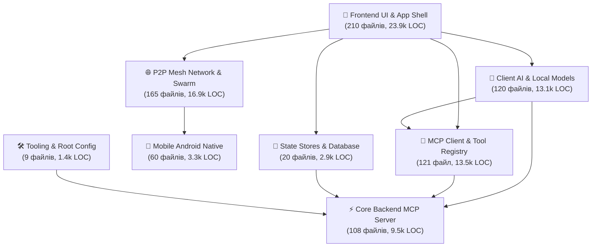

# 🏛️ Архітектурна таксономія проєкту: Повний реєстр файлів за категоріями та зв'язаними модулями

> 📌 **Методологія та критерії аналізу:**
> - **Аналіз графа зв'язності (Coupling & Cohesion Graph):** Побудовано орієнтований граф імпортів та залежностей для **всіх 813 файлів** вихідного коду проєкту.
> - **Пріоритет інтерфейсу користувача (UI First):** Структура починається з повного детального розбору рівня **🎨 Frontend UI & Application Shell**, де кожен UI-файл рознесено по функціональних модулях.
> - **100% покриття кодової бази:** Кожен окремий файл класифіковано за його роллю, мовою, обсягом (LOC/SLOC) та ступенем зв'язаності.
> - **Виключено згідно з правилами:** `.json`, `.md`/`.mb`, `.sh`, а також всі тестові файли (зі словом `test` у назві) та службові директорії збірки (`node_modules`, `.next`, `build`, `dist`, `out`, `.gradle`, `.git`).

## 📊 1. Зведена таблиця за категоріями системи

| № | Архітектурна категорія | Модулів | Файлів | Рядків (Total LOC) | Чистий код (SLOC) | % від коду | Загальний обсяг |
| :-: | :--- | :-: | :-: | :-: | :-: | :-: | :-: |
| 1 | **1. 🎨 Frontend UI & Application Shell** | 13 | **242** | **29,863** | 26,293 | **35.2%** | 1.14 MB |
| 2 | **2. 🌐 P2P Mesh Network & Swarm Subsystem** | 4 | **99** | **10,357** | 7,821 | **12.2%** | 323.9 KB |
| 3 | **3. 🔌 MCP Client Ecosystem & Tool Registry** | 4 | **78** | **8,220** | 6,930 | **9.7%** | 328.7 KB |
| 4 | **4. 🧠 Client AI Intelligence & Local Models** | 3 | **144** | **14,605** | 11,866 | **17.2%** | 491.6 KB |
| 5 | **5. 💾 State Stores & Data Persistence** | 2 | **45** | **4,455** | 3,873 | **5.2%** | 152.0 KB |
| 6 | **6. 📱 Mobile Android Native Subsystem** | 8 | **60** | **3,293** | 2,777 | **3.9%** | 122.0 KB |
| 7 | **7. ⚡ Core Backend MCP Server & Scripture Engine** | 6 | **108** | **9,453** | 7,837 | **11.1%** | 334.0 KB |
| 8 | **8. 🛠️ Project Tooling, Data Migration & Root Config** | 2 | **42** | **4,621** | 3,753 | **5.4%** | 207.3 KB |
| | **РАЗОМ** | **42** | **818** | **84,867** | **71,150** | **100%** | **3.06 MB** |

---

## 1. 🎨 Frontend UI & Application Shell

> 📊 **Метрики категорії:** `242` файлів | `29,863` рядків LOC (`26,293` SLOC) | `1.14 MB` | `13` модулів

| Функціональний модуль | Файлів | Рядків (LOC) | Чистий код | Внутрішня зв'язаність (Cohesion) | Призначення модуля |
| :--- | :-: | :-: | :-: | :-: | :--- |
| **1.1 Chat Interface, Message Streaming & Markdown Renderer** | 62 | 8,302 | 7,397 | `40.1%` (69 int / 103 ext) | Компоненти чату, бульбашки повідомлень, Markdown & LaTeX рендерінг, інпут-композер, автоскрол та взаємодія з викликами інструментів |
| **1.10 App Routing, Page Layouts & Global Styles** | 9 | 1,237 | 874 | `6.7%` (1 int / 14 ext) | Next.js сторінки (App Router), локалізовані лейаути, глобальні CSS стилі |
| **1.11 React Custom Hooks & UI Lifecycle** | 8 | 1,013 | 843 | `0.0%` (0 int / 11 ext) | Кастомні React хуки для скролу, розмірів вікна, медіа-запитів та клавіатурних скорочень |
| **1.12 Internationalization (i18n) Engine** | 2 | 36 | 24 | `100.0%` (1 int / 0 ext) | Конфігурація багатомовності, routing request handlers та словники перекладу |
| **1.13 Client Utilities, Formatters & Document Parsers** | 2 | 144 | 98 | `100.0%` (0 int / 0 ext) | Утиліти обробки тексту, форматування дат, парсери PDF/DOCX/XLSX та стилістичні хелпери |
| **1.2 P2P Mesh Network UI & Visualizers** | 44 | 4,771 | 4,212 | `32.2%` (29 int / 61 ext) | Модальні вікна керування P2P, топологія мережі, статус синхронізації та QR-код сполучення |
| **1.3 MCP Server & Tool Marketplace UI** | 34 | 3,899 | 3,539 | `67.7%` (42 int / 20 ext) | Каталог серверів MCP, маркетплейс інструментів, модалки додавання серверів та конфігуратор |
| **1.4 Provider Settings, API Keys & Diagnostics UI** | 29 | 4,714 | 4,350 | `26.4%` (19 int / 53 ext) | Екрани налаштувань ШІ провайдерів, локальних моделей, ключів API та діагностики пристрою |
| **1.5 Navigation, Shell, Sidebar & Sessions UI** | 15 | 1,918 | 1,717 | `29.0%` (9 int / 22 ext) | Головна навігація, бічна панель, список сесій діалогів, хедер та системний шелл |
| **1.6 Audio, Voice & Media UI Components** | 3 | 359 | 289 | `0.0%` (0 int / 2 ext) | Аудіо-плеєр, візуалізатор голосу, інтерфейс сканера документів та камери |
| **1.7 Design System Primitives & Base UI** | 13 | 928 | 803 | `10.0%` (1 int / 9 ext) | Базові UI-примітиви (кнопки, діалоги, селекти, тултіпи, таби, акордеони, тогл) |
| **1.8 Shared & Composite UI Components** | 3 | 292 | 251 | `0.0%` (0 int / 6 ext) | Загальні допоміжні React-компоненти та віджети клієнтської частини |
| **1.9 Next.js Server API Routes & Telemetry Handlers** | 18 | 2,250 | 1,896 | `0.0%` (0 int / 30 ext) | Next.js API ендпоінти для телеметрії, завантаження файлів та серверного проксі |

### 📂 Детальний перелік файлів за модулями категорії:

#### 📦 Модуль: 1.1 Chat Interface, Message Streaming & Markdown Renderer

> ℹ️ **Опис:** Компоненти чату, бульбашки повідомлень, Markdown & LaTeX рендерінг, інпут-композер, автоскрол та взаємодія з викликами інструментів  
> 📈 **Метрики модуля:** `62` файлів | `8,302` рядків коду | Cohesion: `40.1%`

| № | Шлях до файлу | Мова | Рядків (LOC) | Чистий код | Розмір | Залежності (In / Out) |
| :-: | :--- | :--- | :-: | :-: | :-: | :-: |
| 1 | `client/src/components/chat/MessageList.tsx` | TypeScript (React) | **444** | 384 | 16.44 KB | 📥 2 in / 📤 5 out |
| 2 | `client/src/components/chat/ChatHeader.tsx` | TypeScript (React) | **400** | 353 | 18.44 KB | 📥 2 in / 📤 9 out |
| 3 | `client/src/components/chat/InputDock.tsx` | TypeScript (React) | **375** | 341 | 14.86 KB | 📥 2 in / 📤 16 out |
| 4 | `client/src/components/chat/message/MessageItem.tsx` | TypeScript (React) | **282** | 254 | 11.92 KB | 📥 4 in / 📤 7 out |
| 5 | `client/src/components/chat/McpActivityIndicator.tsx` | TypeScript (React) | **278** | 229 | 8.22 KB | 📥 1 in / 📤 2 out |
| 6 | `client/src/components/chat/AttachmentDock.tsx` | TypeScript (React) | **269** | 247 | 11.51 KB | 📥 1 in / 📤 3 out |
| 7 | `client/src/components/chat/hooks/useChatMessages.ts` | TypeScript | **268** | 223 | 10.07 KB | 📥 1 in / 📤 4 out |
| 8 | `client/src/components/chat/VoiceAssistantOverlay.tsx` | TypeScript (React) | **251** | 214 | 9.05 KB | 📥 0 in / 📤 3 out |
| 9 | `client/src/components/chat/dock/source/useSourceSelector.ts` | TypeScript | **248** | 218 | 9.66 KB | 📥 1 in / 📤 6 out |
| 10 | `client/src/components/chat/header/DetailModal.tsx` | TypeScript (React) | **236** | 225 | 11.79 KB | 📥 1 in / 📤 3 out |
| 11 | `client/src/components/chat/CitationCard.tsx` | TypeScript (React) | **209** | 183 | 7.61 KB | 📥 1 in / 📤 2 out |
| 12 | `client/src/components/chat/header/hooks/useHeaderMcpData.ts` | TypeScript | **206** | 183 | 8.82 KB | 📥 0 in / 📤 3 out |
| 13 | `client/src/components/chat/ChatView.tsx` | TypeScript (React) | **204** | 181 | 7.92 KB | 📥 1 in / 📤 11 out |
| 14 | `client/src/components/chat/renderer/segment-parser.ts` | TypeScript | **203** | 170 | 6.87 KB | 📥 3 in / 📤 2 out |
| 15 | `client/src/components/chat/dock/SourceSelectorModal.tsx` | TypeScript (React) | **191** | 177 | 7.81 KB | 📥 1 in / 📤 3 out |
| 16 | `client/src/components/chat/MetricsCard.tsx` | TypeScript (React) | **190** | 165 | 7.71 KB | 📥 1 in / 📤 3 out |
| 17 | `client/src/components/chat/dock/source/SourceProviderRow.tsx` | TypeScript (React) | **190** | 180 | 9.07 KB | 📥 1 in / 📤 4 out |
| 18 | `client/src/components/chat/background/useFluidCanvasRenderer.ts` | TypeScript | **183** | 153 | 5.85 KB | 📥 1 in / 📤 0 out |
| 19 | `client/src/components/chat/dock/source/SourceModelFilterBar.tsx` | TypeScript (React) | **175** | 168 | 6.99 KB | 📥 1 in / 📤 3 out |
| 20 | `client/src/components/chat/header/WarmthModal.tsx` | TypeScript (React) | **170** | 158 | 6.87 KB | 📥 1 in / 📤 5 out |
| 21 | `client/src/components/chat/renderer/markdown-components.tsx` | TypeScript (React) | **169** | 162 | 8.06 KB | 📥 1 in / 📤 0 out |
| 22 | `client/src/components/chat/dock/PowerSourceSwitcher.tsx` | TypeScript (React) | **166** | 155 | 7.13 KB | 📥 1 in / 📤 4 out |
| 23 | `client/src/components/chat/message/MessageTagsHeader.tsx` | TypeScript (React) | **161** | 148 | 7.23 KB | 📥 1 in / 📤 1 out |
| 24 | `client/src/components/chat/RichTextRenderer.tsx` | TypeScript (React) | **140** | 121 | 5.34 KB | 📥 2 in / 📤 6 out |
| 25 | `client/src/components/chat/export/ExportChatModal.tsx` | TypeScript (React) | **140** | 129 | 6.32 KB | 📥 0 in / 📤 2 out |
| 26 | `client/src/components/chat/EmptyState.tsx` | TypeScript (React) | **139** | 124 | 7.1 KB | 📥 3 in / 📤 1 out |
| 27 | `client/src/components/chat/header/warmth/WarmthSliderControl.tsx` | TypeScript (React) | **138** | 129 | 6.08 KB | 📥 1 in / 📤 2 out |
| 28 | `client/src/components/chat/dock/source/ModelCardItem.tsx` | TypeScript (React) | **121** | 116 | 5.39 KB | 📥 1 in / 📤 4 out |
| 29 | `client/src/components/chat/dock/useAutoDiscovery.ts` | TypeScript | **120** | 106 | 5.19 KB | 📥 1 in / 📤 4 out |
| 30 | `client/src/components/chat/dock/source/SourceModelCardGrid.tsx` | TypeScript (React) | **118** | 110 | 4.77 KB | 📥 1 in / 📤 3 out |
| 31 | `client/src/components/chat/dock/source/SourceP2PBanner.tsx` | TypeScript (React) | **116** | 106 | 5.68 KB | 📥 1 in / 📤 2 out |
| 32 | `client/src/components/chat/renderer/rehype-safe-html.ts` | TypeScript | **115** | 84 | 3.43 KB | 📥 0 in / 📤 0 out |
| 33 | `client/src/components/chat/ScrollToBottomPill.tsx` | TypeScript (React) | **103** | 93 | 4.26 KB | 📥 2 in / 📤 2 out |
| 34 | `client/src/components/chat/ChatMessagesContainer.tsx` | TypeScript (React) | **98** | 82 | 3.05 KB | 📥 0 in / 📤 6 out |
| 35 | `client/src/components/chat/dock/source/SourceChannelTabs.tsx` | TypeScript (React) | **94** | 87 | 3.94 KB | 📥 1 in / 📤 3 out |
| 36 | `client/src/components/chat/renderer/ThinkingWidget.tsx` | TypeScript (React) | **92** | 84 | 3.77 KB | 📥 1 in / 📤 0 out |
| 37 | `client/src/components/chat/dock/InputDockActionButtons.tsx` | TypeScript (React) | **87** | 80 | 2.71 KB | 📥 1 in / 📤 1 out |
| 38 | `client/src/components/chat/message/StreamingMessageSlot.tsx` | TypeScript (React) | **86** | 74 | 3.27 KB | 📥 1 in / 📤 4 out |
| 39 | `client/src/components/chat/dock/InputDockSourceHeader.tsx` | TypeScript (React) | **80** | 75 | 3.16 KB | 📥 1 in / 📤 3 out |
| 40 | `client/src/components/chat/dock/VoiceRecorderDock.tsx` | TypeScript (React) | **80** | 76 | 3.46 KB | 📥 1 in / 📤 2 out |
| 41 | `client/src/components/chat/hooks/useAsyncMessageParser.ts` | TypeScript | **79** | 65 | 2.28 KB | 📥 0 in / 📤 1 out |
| 42 | `client/src/components/chat/dock/ModelBadges.tsx` | TypeScript (React) | **69** | 65 | 3.49 KB | 📥 1 in / 📤 2 out |
| 43 | `client/src/components/chat/header/ChatActionMenu.tsx` | TypeScript (React) | **68** | 57 | 1.96 KB | 📥 0 in / 📤 1 out |
| 44 | `client/src/components/chat/renderer/parser/markdown-normalizer.ts` | TypeScript | **67** | 59 | 4.34 KB | 📥 1 in / 📤 0 out |
| 45 | `client/src/components/chat/indicator/StatusIcon.tsx` | TypeScript (React) | **65** | 57 | 2.68 KB | 📥 1 in / 📤 1 out |
| 46 | `client/src/components/chat/AiThinkingIndicator.tsx` | TypeScript (React) | **64** | 55 | 2.29 KB | 📥 2 in / 📤 5 out |
| 47 | `client/src/components/chat/header/HeaderModeTrigger.tsx` | TypeScript (React) | **63** | 58 | 2.66 KB | 📥 0 in / 📤 1 out |
| 48 | `client/src/components/chat/header/warmth/WarmthServerSelector.tsx` | TypeScript (React) | **63** | 60 | 2.95 KB | 📥 1 in / 📤 0 out |
| 49 | `client/src/components/chat/dock/source/types.ts` | TypeScript | **48** | 43 | 1.54 KB | 📥 9 in / 📤 1 out |
| 50 | `client/src/components/chat/renderer/parser/verse-citation-parser.ts` | TypeScript | **47** | 37 | 1.02 KB | 📥 1 in / 📤 1 out |
| 51 | `client/src/components/chat/dock/source/SourceApiKeyWarning.tsx` | TypeScript (React) | **45** | 41 | 1.74 KB | 📥 1 in / 📤 1 out |
| 52 | `client/src/components/chat/message/MessageAttachments.tsx` | TypeScript (React) | **45** | 41 | 1.94 KB | 📥 1 in / 📤 0 out |
| 53 | `client/src/components/chat/header/HeaderTitleBar.tsx` | TypeScript (React) | **39** | 35 | 1.32 KB | 📥 0 in / 📤 0 out |
| 54 | `client/src/components/chat/dock/source/SourceModalHeader.tsx` | TypeScript (React) | **36** | 32 | 1.19 KB | 📥 1 in / 📤 2 out |
| 55 | `client/src/components/chat/AmbientFluidBackground.tsx` | TypeScript (React) | **32** | 28 | 1.33 KB | 📥 2 in / 📤 1 out |
| 56 | `client/src/components/chat/dock/FileDropZone.tsx` | TypeScript (React) | **31** | 28 | 1.24 KB | 📥 1 in / 📤 0 out |
| 57 | `client/src/components/chat/header/HeaderWarmthTrigger.tsx` | TypeScript (React) | **31** | 27 | 1.13 KB | 📥 0 in / 📤 0 out |
| 58 | `client/src/components/chat/dock/useTextareaAutoHeight.ts` | TypeScript | **22** | 16 | 0.63 KB | 📥 1 in / 📤 0 out |
| 59 | `client/src/components/chat/indicator/status-resolver.ts` | TypeScript | **22** | 18 | 1.35 KB | 📥 1 in / 📤 0 out |
| 60 | `client/src/components/chat/header/palette-utils.ts` | TypeScript | **21** | 18 | 2.65 KB | 📥 7 in / 📤 1 out |
| 61 | `client/src/components/chat/dock/source/index.ts` | TypeScript | **9** | 9 | 0.32 KB | 📥 1 in / 📤 9 out |
| 62 | `client/src/components/chat/renderer/markdown-ast-cache.ts` | TypeScript | **1** | 1 | 0.05 KB | 📥 0 in / 📤 1 out |

---

#### 📦 Модуль: 1.10 App Routing, Page Layouts & Global Styles

> ℹ️ **Опис:** Next.js сторінки (App Router), локалізовані лейаути, глобальні CSS стилі  
> 📈 **Метрики модуля:** `9` файлів | `1,237` рядків коду | Cohesion: `6.7%`

| № | Шлях до файлу | Мова | Рядків (LOC) | Чистий код | Розмір | Залежності (In / Out) |
| :-: | :--- | :--- | :-: | :-: | :-: | :-: |
| 1 | `client/src/app/globals.css` | CSS | **887** | 622 | 23.24 KB | 📥 1 in / 📤 0 out |
| 2 | `client/src/app/[locale]/page.tsx` | TypeScript (React) | **84** | 69 | 3.15 KB | 📥 0 in / 📤 9 out |
| 3 | `client/src/app/[locale]/layout.tsx` | TypeScript (React) | **81** | 74 | 4.01 KB | 📥 0 in / 📤 6 out |
| 4 | `client/src/app/styles/theme.css` | CSS | **48** | 4 | 1.08 KB | 📥 0 in / 📤 0 out |
| 5 | `client/src/app/styles/animations.css` | CSS | **36** | 28 | 0.61 KB | 📥 0 in / 📤 0 out |
| 6 | `client/src/app/styles/glassmorphism.css` | CSS | **33** | 26 | 0.87 KB | 📥 0 in / 📤 0 out |
| 7 | `client/src/app/styles/markdown-prose.css` | CSS | **26** | 20 | 0.55 KB | 📥 0 in / 📤 0 out |
| 8 | `client/src/app/styles/mcp.css` | CSS | **24** | 21 | 0.54 KB | 📥 0 in / 📤 0 out |
| 9 | `client/src/app/styles/mobile.css` | CSS | **18** | 10 | 0.55 KB | 📥 0 in / 📤 0 out |

---

#### 📦 Модуль: 1.11 React Custom Hooks & UI Lifecycle

> ℹ️ **Опис:** Кастомні React хуки для скролу, розмірів вікна, медіа-запитів та клавіатурних скорочень  
> 📈 **Метрики модуля:** `8` файлів | `1,013` рядків коду | Cohesion: `0.0%`

| № | Шлях до файлу | Мова | Рядків (LOC) | Чистий код | Розмір | Залежності (In / Out) |
| :-: | :--- | :--- | :-: | :-: | :-: | :-: |
| 1 | `client/src/hooks/useAudioRecorder.ts` | TypeScript | **288** | 243 | 9.49 KB | 📥 2 in / 📤 0 out |
| 2 | `client/src/hooks/useOnDeviceModelManager.ts` | TypeScript | **257** | 229 | 7.75 KB | 📥 1 in / 📤 4 out |
| 3 | `client/src/hooks/useFileUpload.ts` | TypeScript | **179** | 157 | 5.58 KB | 📥 2 in / 📤 1 out |
| 4 | `client/src/hooks/useOptimisticMcpToggle.ts` | TypeScript | **124** | 93 | 4.19 KB | 📥 0 in / 📤 3 out |
| 5 | `client/src/hooks/useDecoupledAudioLevel.ts` | TypeScript | **60** | 44 | 1.7 KB | 📥 0 in / 📤 0 out |
| 6 | `client/src/hooks/useLocalModelPull.ts` | TypeScript | **49** | 41 | 1.4 KB | 📥 3 in / 📤 3 out |
| 7 | `client/src/hooks/useStatusHysteresis.ts` | TypeScript | **35** | 23 | 1.2 KB | 📥 0 in / 📤 0 out |
| 8 | `client/src/hooks/useDebounce.ts` | TypeScript | **21** | 13 | 0.54 KB | 📥 0 in / 📤 0 out |

---

#### 📦 Модуль: 1.12 Internationalization (i18n) Engine

> ℹ️ **Опис:** Конфігурація багатомовності, routing request handlers та словники перекладу  
> 📈 **Метрики модуля:** `2` файлів | `36` рядків коду | Cohesion: `100.0%`

| № | Шлях до файлу | Мова | Рядків (LOC) | Чистий код | Розмір | Залежності (In / Out) |
| :-: | :--- | :--- | :-: | :-: | :-: | :-: |
| 1 | `client/src/i18n/request.ts` | TypeScript | **21** | 16 | 0.54 KB | 📥 0 in / 📤 1 out |
| 2 | `client/src/i18n/routing.ts` | TypeScript | **15** | 8 | 0.48 KB | 📥 3 in / 📤 0 out |

---

#### 📦 Модуль: 1.13 Client Utilities, Formatters & Document Parsers

> ℹ️ **Опис:** Утиліти обробки тексту, форматування дат, парсери PDF/DOCX/XLSX та стилістичні хелпери  
> 📈 **Метрики модуля:** `2` файлів | `144` рядків коду | Cohesion: `100.0%`

| № | Шлях до файлу | Мова | Рядків (LOC) | Чистий код | Розмір | Залежності (In / Out) |
| :-: | :--- | :--- | :-: | :-: | :-: | :-: |
| 1 | `client/src/lib/utils/CrossPlatformPath.ts` | TypeScript | **130** | 86 | 4.16 KB | 📥 0 in / 📤 0 out |
| 2 | `client/src/lib/utils.ts` | TypeScript | **14** | 12 | 0.41 KB | 📥 70 in / 📤 0 out |

---

#### 📦 Модуль: 1.2 P2P Mesh Network UI & Visualizers

> ℹ️ **Опис:** Модальні вікна керування P2P, топологія мережі, статус синхронізації та QR-код сполучення  
> 📈 **Метрики модуля:** `44` файлів | `4,771` рядків коду | Cohesion: `32.2%`

| № | Шлях до файлу | Мова | Рядків (LOC) | Чистий код | Розмір | Залежності (In / Out) |
| :-: | :--- | :--- | :-: | :-: | :-: | :-: |
| 1 | `client/src/components/p2p/P2pClientModal.tsx` | TypeScript (React) | **641** | 573 | 23.88 KB | 📥 4 in / 📤 11 out |
| 2 | `client/src/components/p2p/P2pNodeDetailsModal.tsx` | TypeScript (React) | **600** | 543 | 26.13 KB | 📥 1 in / 📤 12 out |
| 3 | `client/src/components/p2p/P2pHostModal.tsx` | TypeScript (React) | **375** | 336 | 14.78 KB | 📥 3 in / 📤 11 out |
| 4 | `client/src/components/p2p/client/P2pQrScannerView.tsx` | TypeScript (React) | **350** | 326 | 16.33 KB | 📥 4 in / 📤 1 out |
| 5 | `client/src/components/p2p/P2pPairingConfirmModal.tsx` | TypeScript (React) | **260** | 231 | 11.79 KB | 📥 0 in / 📤 6 out |
| 6 | `client/src/components/p2p/host/P2pHostGovernor.tsx` | TypeScript (React) | **208** | 197 | 10.37 KB | 📥 2 in / 📤 4 out |
| 7 | `client/src/components/p2p/details/NodeTelemetryGrid.tsx` | TypeScript (React) | **184** | 174 | 7.82 KB | 📥 2 in / 📤 3 out |
| 8 | `client/src/components/p2p/details/NodePerformanceStats.tsx` | TypeScript (React) | **175** | 161 | 7.78 KB | 📥 2 in / 📤 2 out |
| 9 | `client/src/components/p2p/DeviceIdentityCard.tsx` | TypeScript (React) | **149** | 127 | 5.74 KB | 📥 0 in / 📤 6 out |
| 10 | `client/src/components/p2p/P2pJoinModal.tsx` | TypeScript (React) | **141** | 122 | 5.73 KB | 📥 0 in / 📤 3 out |
| 11 | `client/src/components/p2p/client/P2pPairedNodesList.tsx` | TypeScript (React) | **131** | 123 | 6.23 KB | 📥 2 in / 📤 3 out |
| 12 | `client/src/components/p2p/WebGpuTelemetryHud.tsx` | TypeScript (React) | **128** | 103 | 3.93 KB | 📥 0 in / 📤 0 out |
| 13 | `client/src/components/p2p/P2pMeshTelemetryHud.tsx` | TypeScript (React) | **127** | 107 | 5.93 KB | 📥 0 in / 📤 2 out |
| 14 | `client/src/components/p2p/host/P2pConnectedGuestsList.tsx` | TypeScript (React) | **124** | 118 | 5.96 KB | 📥 2 in / 📤 1 out |
| 15 | `client/src/components/p2p/details/NodeSecurityCard.tsx` | TypeScript (React) | **92** | 86 | 4.61 KB | 📥 2 in / 📤 1 out |
| 16 | `client/src/components/p2p/host/P2pHostQrCard.tsx` | TypeScript (React) | **91** | 84 | 3.62 KB | 📥 2 in / 📤 1 out |
| 17 | `client/src/components/p2p/client/P2pManualConnect.tsx` | TypeScript (React) | **90** | 83 | 3.42 KB | 📥 2 in / 📤 1 out |
| 18 | `client/src/components/p2p/P2pWaveformCanvas.tsx` | TypeScript (React) | **82** | 65 | 2.34 KB | 📥 2 in / 📤 0 out |
| 19 | `client/src/components/p2p/details/NodeHardwareGpuSpecs.tsx` | TypeScript (React) | **78** | 67 | 2.69 KB | 📥 0 in / 📤 0 out |
| 20 | `client/src/components/p2p/client/hooks/useQrCameraStream.ts` | TypeScript | **71** | 65 | 2.3 KB | 📥 0 in / 📤 3 out |
| 21 | `client/src/components/p2p/client/P2pPairingStateProgress.tsx` | TypeScript (React) | **67** | 55 | 2.13 KB | 📥 0 in / 📤 0 out |
| 22 | `client/src/components/p2p/client/P2pPinInputView.tsx` | TypeScript (React) | **65** | 51 | 1.93 KB | 📥 0 in / 📤 1 out |
| 23 | `client/src/components/p2p/details/NodePingHistoryChart.tsx` | TypeScript (React) | **62** | 44 | 1.81 KB | 📥 0 in / 📤 0 out |
| 24 | `client/src/components/p2p/client/feedback-effects.ts` | TypeScript | **59** | 46 | 1.59 KB | 📥 2 in / 📤 2 out |
| 25 | `client/src/components/p2p/details/NodeQuotaGovernorSlider.tsx` | TypeScript (React) | **58** | 47 | 1.95 KB | 📥 0 in / 📤 1 out |
| 26 | `client/src/components/p2p/details/NodeBlacklistActions.tsx` | TypeScript (React) | **49** | 39 | 1.55 KB | 📥 0 in / 📤 1 out |
| 27 | `client/src/components/p2p/client/hooks/useOpticalDecoder.ts` | TypeScript | **47** | 41 | 1.45 KB | 📥 0 in / 📤 1 out |
| 28 | `client/src/components/p2p/details/NodeHeaderCard.tsx` | TypeScript (React) | **47** | 45 | 1.63 KB | 📥 0 in / 📤 1 out |
| 29 | `client/src/components/p2p/client/P2pClientConnectionSummary.tsx` | TypeScript (React) | **45** | 35 | 1.4 KB | 📥 0 in / 📤 0 out |
| 30 | `client/src/components/p2p/pairing/SasSecurityBadge.tsx` | TypeScript (React) | **42** | 37 | 1.89 KB | 📥 1 in / 📤 0 out |
| 31 | `client/src/components/p2p/pairing/DeviceTypeBadge.tsx` | TypeScript (React) | **28** | 24 | 1.37 KB | 📥 1 in / 📤 0 out |
| 32 | `client/src/components/p2p/P2pClientSheet.tsx` | TypeScript (React) | **19** | 10 | 0.46 KB | 📥 0 in / 📤 1 out |
| 33 | `client/src/components/p2p/P2pHostSheet.tsx` | TypeScript (React) | **19** | 10 | 0.44 KB | 📥 0 in / 📤 1 out |
| 34 | `client/src/components/p2p/client/P2pDecodeProgressBanner.tsx` | TypeScript (React) | **18** | 16 | 0.51 KB | 📥 0 in / 📤 0 out |
| 35 | `client/src/components/p2p/client/P2pCameraScannerView.tsx` | TypeScript (React) | **10** | 3 | 0.27 KB | 📥 0 in / 📤 1 out |
| 36 | `client/src/components/p2p/host/HostConnectedGuestsTable.tsx` | TypeScript (React) | **9** | 2 | 0.26 KB | 📥 0 in / 📤 1 out |
| 37 | `client/src/components/p2p/host/HostQrTokenGenerator.tsx` | TypeScript (React) | **9** | 2 | 0.24 KB | 📥 0 in / 📤 1 out |
| 38 | `client/src/components/p2p/host/HostResourceQuotaControls.tsx` | TypeScript (React) | **9** | 2 | 0.25 KB | 📥 0 in / 📤 1 out |
| 39 | `client/src/components/p2p/details/NodeOverviewTab.tsx` | TypeScript (React) | **2** | 2 | 0.12 KB | 📥 0 in / 📤 1 out |
| 40 | `client/src/components/p2p/details/NodeSecurityTab.tsx` | TypeScript (React) | **2** | 2 | 0.11 KB | 📥 0 in / 📤 1 out |
| 41 | `client/src/components/p2p/details/NodeTelemetryTab.tsx` | TypeScript (React) | **2** | 2 | 0.11 KB | 📥 0 in / 📤 1 out |
| 42 | `client/src/components/p2p/tabs/P2pManualConnectTab.tsx` | TypeScript (React) | **2** | 2 | 0.13 KB | 📥 0 in / 📤 1 out |
| 43 | `client/src/components/p2p/tabs/P2pPairedNodesTab.tsx` | TypeScript (React) | **2** | 2 | 0.13 KB | 📥 0 in / 📤 1 out |
| 44 | `client/src/components/p2p/tabs/P2pScannerTab.tsx` | TypeScript (React) | **2** | 2 | 0.12 KB | 📥 0 in / 📤 1 out |

---

#### 📦 Модуль: 1.3 MCP Server & Tool Marketplace UI

> ℹ️ **Опис:** Каталог серверів MCP, маркетплейс інструментів, модалки додавання серверів та конфігуратор  
> 📈 **Метрики модуля:** `34` файлів | `3,899` рядків коду | Cohesion: `67.7%`

| № | Шлях до файлу | Мова | Рядків (LOC) | Чистий код | Розмір | Залежності (In / Out) |
| :-: | :--- | :--- | :-: | :-: | :-: | :-: |
| 1 | `client/src/components/mcp/McpServerCard.tsx` | TypeScript (React) | **514** | 478 | 23.7 KB | 📥 2 in / 📤 10 out |
| 2 | `client/src/components/mcp/McpAddChoiceModal.tsx` | TypeScript (React) | **510** | 472 | 25.97 KB | 📥 1 in / 📤 3 out |
| 3 | `client/src/components/mcp/McpServerSettingsModal.tsx` | TypeScript (React) | **347** | 328 | 20.84 KB | 📥 1 in / 📤 2 out |
| 4 | `client/src/components/mcp/McpDashboard.tsx` | TypeScript (React) | **322** | 289 | 10.67 KB | 📥 0 in / 📤 12 out |
| 5 | `client/src/components/mcp/presets.ts` | TypeScript | **219** | 218 | 8.42 KB | 📥 4 in / 📤 0 out |
| 6 | `client/src/components/mcp/McpServerEditModal.tsx` | TypeScript (React) | **208** | 192 | 8.96 KB | 📥 1 in / 📤 1 out |
| 7 | `client/src/components/mcp/cards/ServerActionButtons.tsx` | TypeScript (React) | **182** | 170 | 8.16 KB | 📥 2 in / 📤 3 out |
| 8 | `client/src/components/mcp/McpCustomServerTab.tsx` | TypeScript (React) | **179** | 159 | 6.22 KB | 📥 1 in / 📤 0 out |
| 9 | `client/src/components/mcp/McpPredefinedCatalogTab.tsx` | TypeScript (React) | **144** | 126 | 5.1 KB | 📥 1 in / 📤 0 out |
| 10 | `client/src/components/mcp/hooks/useMcpRuntimeEnvironment.ts` | TypeScript | **129** | 110 | 4.34 KB | 📥 6 in / 📤 4 out |
| 11 | `client/src/components/mcp/cards/ServerStatusBadge.tsx` | TypeScript (React) | **106** | 93 | 5.14 KB | 📥 2 in / 📤 3 out |
| 12 | `client/src/components/mcp/dashboard/McpToolCatalog.tsx` | TypeScript (React) | **101** | 92 | 3.81 KB | 📥 2 in / 📤 1 out |
| 13 | `client/src/components/mcp/dashboard/McpConfigDrawer.tsx` | TypeScript (React) | **95** | 86 | 3.52 KB | 📥 1 in / 📤 2 out |
| 14 | `client/src/components/mcp/McpServerListGrid.tsx` | TypeScript (React) | **88** | 84 | 3.21 KB | 📥 0 in / 📤 2 out |
| 15 | `client/src/components/mcp/dashboard/McpServerGrid.tsx` | TypeScript (React) | **88** | 84 | 3.19 KB | 📥 2 in / 📤 2 out |
| 16 | `client/src/components/mcp/McpHeaderToolbar.tsx` | TypeScript (React) | **84** | 78 | 3.05 KB | 📥 1 in / 📤 1 out |
| 17 | `client/src/components/mcp/dashboard/McpMetricsHeader.tsx` | TypeScript (React) | **75** | 68 | 3.12 KB | 📥 2 in / 📤 0 out |
| 18 | `client/src/components/mcp/modals/McpPresetCard.tsx` | TypeScript (React) | **70** | 64 | 2.43 KB | 📥 0 in / 📤 1 out |
| 19 | `client/src/components/mcp/modals/McpManualImportOptions.tsx` | TypeScript (React) | **62** | 56 | 2.96 KB | 📥 0 in / 📤 0 out |
| 20 | `client/src/components/mcp/cards/ServerStatusHeader.tsx` | TypeScript (React) | **60** | 50 | 1.82 KB | 📥 0 in / 📤 2 out |
| 21 | `client/src/components/mcp/hooks/useMcpPolling.ts` | TypeScript | **55** | 48 | 1.87 KB | 📥 1 in / 📤 3 out |
| 22 | `client/src/components/mcp/cards/ServerToolsList.tsx` | TypeScript (React) | **53** | 48 | 1.84 KB | 📥 2 in / 📤 1 out |
| 23 | `client/src/components/mcp/modals/ValidationStatusView.tsx` | TypeScript (React) | **51** | 39 | 1.76 KB | 📥 0 in / 📤 0 out |
| 24 | `client/src/components/mcp/types.ts` | TypeScript | **51** | 49 | 1.53 KB | 📥 13 in / 📤 0 out |
| 25 | `client/src/components/mcp/modals/DockerContainerTab.tsx` | TypeScript (React) | **40** | 30 | 1.33 KB | 📥 0 in / 📤 0 out |
| 26 | `client/src/components/mcp/cards/ServerPingLatencyBadge.tsx` | TypeScript (React) | **26** | 16 | 0.81 KB | 📥 0 in / 📤 1 out |
| 27 | `client/src/components/mcp/cards/ServerConfigMenu.tsx` | TypeScript (React) | **9** | 2 | 0.25 KB | 📥 0 in / 📤 1 out |
| 28 | `client/src/components/mcp/cards/ServerToolsAccordion.tsx` | TypeScript (React) | **9** | 2 | 0.23 KB | 📥 0 in / 📤 1 out |
| 29 | `client/src/components/mcp/modals/CustomCommandTab.tsx` | TypeScript (React) | **9** | 2 | 0.24 KB | 📥 0 in / 📤 1 out |
| 30 | `client/src/components/mcp/modals/NpmSearchTab.tsx` | TypeScript (React) | **9** | 2 | 0.24 KB | 📥 0 in / 📤 1 out |
| 31 | `client/src/components/mcp/McpConfigDrawer.tsx` | TypeScript (React) | **1** | 1 | 0.04 KB | 📥 0 in / 📤 1 out |
| 32 | `client/src/components/mcp/McpMetricsHeader.tsx` | TypeScript (React) | **1** | 1 | 0.04 KB | 📥 0 in / 📤 1 out |
| 33 | `client/src/components/mcp/McpServerGrid.tsx` | TypeScript (React) | **1** | 1 | 0.04 KB | 📥 0 in / 📤 1 out |
| 34 | `client/src/components/mcp/McpToolCatalog.tsx` | TypeScript (React) | **1** | 1 | 0.04 KB | 📥 0 in / 📤 1 out |

---

#### 📦 Модуль: 1.4 Provider Settings, API Keys & Diagnostics UI

> ℹ️ **Опис:** Екрани налаштувань ШІ провайдерів, локальних моделей, ключів API та діагностики пристрою  
> 📈 **Метрики модуля:** `29` файлів | `4,714` рядків коду | Cohesion: `26.4%`

| № | Шлях до файлу | Мова | Рядків (LOC) | Чистий код | Розмір | Залежності (In / Out) |
| :-: | :--- | :--- | :-: | :-: | :-: | :-: |
| 1 | `client/src/components/settings/providers/LocalProvidersSection.tsx` | TypeScript (React) | **585** | 548 | 30.91 KB | 📥 1 in / 📤 10 out |
| 2 | `client/src/components/settings/DeviceDiagnosticsSection.tsx` | TypeScript (React) | **480** | 444 | 25.17 KB | 📥 1 in / 📤 4 out |
| 3 | `client/src/components/settings/providers/CloudProvidersSection.tsx` | TypeScript (React) | **386** | 370 | 20.62 KB | 📥 1 in / 📤 3 out |
| 4 | `client/src/components/settings/ProvidersSettingsPanel.tsx` | TypeScript (React) | **366** | 343 | 13.67 KB | 📥 0 in / 📤 8 out |
| 5 | `client/src/components/settings/providers/card/LocalProviderPullProgress.tsx` | TypeScript (React) | **293** | 265 | 12.85 KB | 📥 2 in / 📤 3 out |
| 6 | `client/src/components/settings/SettingsModal.tsx` | TypeScript (React) | **283** | 260 | 12.72 KB | 📥 0 in / 📤 4 out |
| 7 | `client/src/components/settings/providers/CloudProviderModal.tsx` | TypeScript (React) | **203** | 189 | 8.52 KB | 📥 1 in / 📤 3 out |
| 8 | `client/src/components/settings/providers/LocalProviderModal.tsx` | TypeScript (React) | **186** | 172 | 7.72 KB | 📥 1 in / 📤 3 out |
| 9 | `client/src/components/settings/profile/AvatarEditor.tsx` | TypeScript (React) | **162** | 146 | 5.86 KB | 📥 1 in / 📤 1 out |
| 10 | `client/src/components/settings/providers/card/LocalProviderModelList.tsx` | TypeScript (React) | **159** | 152 | 6.74 KB | 📥 1 in / 📤 2 out |
| 11 | `client/src/components/settings/LocalModelCard.tsx` | TypeScript (React) | **145** | 138 | 5.91 KB | 📥 0 in / 📤 2 out |
| 12 | `client/src/components/settings/providers/LocalProviderCard.tsx` | TypeScript (React) | **145** | 132 | 4.98 KB | 📥 1 in / 📤 8 out |
| 13 | `client/src/components/settings/providers/OnDeviceStorageQuota.tsx` | TypeScript (React) | **139** | 125 | 5.87 KB | 📥 1 in / 📤 2 out |
| 14 | `client/src/components/settings/providers/card/LocalProviderHeader.tsx` | TypeScript (React) | **121** | 116 | 5.01 KB | 📥 1 in / 📤 2 out |
| 15 | `client/src/components/settings/UserProfileSection.tsx` | TypeScript (React) | **113** | 98 | 3.93 KB | 📥 1 in / 📤 4 out |
| 16 | `client/src/components/settings/local-providers/LocalHardwareMonitor.tsx` | TypeScript (React) | **105** | 87 | 3.12 KB | 📥 0 in / 📤 0 out |
| 17 | `client/src/components/settings/providers/ProvidersHeaderFilter.tsx` | TypeScript (React) | **99** | 93 | 4.14 KB | 📥 1 in / 📤 1 out |
| 18 | `client/src/components/settings/local-providers/LocalModelPicker.tsx` | TypeScript (React) | **95** | 83 | 3.76 KB | 📥 0 in / 📤 1 out |
| 19 | `client/src/components/settings/providers/local/P2pMeshStatusBanner.tsx` | TypeScript (React) | **93** | 85 | 4.61 KB | 📥 0 in / 📤 0 out |
| 20 | `client/src/components/settings/providers/local/PairedPeersListCard.tsx` | TypeScript (React) | **90** | 83 | 3.83 KB | 📥 0 in / 📤 0 out |
| 21 | `client/src/components/settings/SegmentedControl.tsx` | TypeScript (React) | **84** | 79 | 3.22 KB | 📥 2 in / 📤 1 out |
| 22 | `client/src/components/settings/providers/card/LocalProviderInputDock.tsx` | TypeScript (React) | **82** | 76 | 2.84 KB | 📥 1 in / 📤 1 out |
| 23 | `client/src/components/settings/providers/local/LocalP2pMeshCard.tsx` | TypeScript (React) | **76** | 73 | 2.79 KB | 📥 0 in / 📤 2 out |
| 24 | `client/src/components/settings/profile/LanguageSelector.tsx` | TypeScript (React) | **54** | 43 | 1.85 KB | 📥 1 in / 📤 2 out |
| 25 | `client/src/components/settings/diagnostics/BatteryDiagnosticsCard.tsx` | TypeScript (React) | **52** | 45 | 2.26 KB | 📥 0 in / 📤 1 out |
| 26 | `client/src/components/settings/diagnostics/NetworkBenchmarkCard.tsx` | TypeScript (React) | **45** | 39 | 2.11 KB | 📥 0 in / 📤 1 out |
| 27 | `client/src/components/settings/diagnostics/HardwareCpuGpuCard.tsx` | TypeScript (React) | **41** | 37 | 1.81 KB | 📥 0 in / 📤 1 out |
| 28 | `client/src/components/settings/profile/ThemeSelector.tsx` | TypeScript (React) | **30** | 27 | 1.07 KB | 📥 1 in / 📤 1 out |
| 29 | `client/src/components/settings/providers/LocalProviderPullProgress.tsx` | TypeScript (React) | **2** | 2 | 0.12 KB | 📥 0 in / 📤 1 out |

---

#### 📦 Модуль: 1.5 Navigation, Shell, Sidebar & Sessions UI

> ℹ️ **Опис:** Головна навігація, бічна панель, список сесій діалогів, хедер та системний шелл  
> 📈 **Метрики модуля:** `15` файлів | `1,918` рядків коду | Cohesion: `29.0%`

| № | Шлях до файлу | Мова | Рядків (LOC) | Чистий код | Розмір | Залежності (In / Out) |
| :-: | :--- | :--- | :-: | :-: | :-: | :-: |
| 1 | `client/src/components/sidebar/Sidebar.tsx` | TypeScript (React) | **374** | 338 | 13.94 KB | 📥 1 in / 📤 14 out |
| 2 | `client/src/components/sidebar/SidebarChatItem.tsx` | TypeScript (React) | **346** | 321 | 13.71 KB | 📥 2 in / 📤 1 out |
| 3 | `client/src/components/sidebar/SidebarUserCard.tsx` | TypeScript (React) | **129** | 116 | 4.85 KB | 📥 1 in / 📤 3 out |
| 4 | `client/src/components/sidebar/NavItem.tsx` | TypeScript (React) | **122** | 115 | 4.94 KB | 📥 0 in / 📤 1 out |
| 5 | `client/src/components/sidebar/SidebarChatActionMenu.tsx` | TypeScript (React) | **100** | 89 | 3.97 KB | 📥 0 in / 📤 1 out |
| 6 | `client/src/components/sidebar/MobileSidebarDrawer.tsx` | TypeScript (React) | **98** | 87 | 3.16 KB | 📥 1 in / 📤 0 out |
| 7 | `client/src/components/sidebar/SidebarSearchResults.tsx` | TypeScript (React) | **95** | 89 | 3.86 KB | 📥 1 in / 📤 2 out |
| 8 | `client/src/components/sidebar/SidebarSearchInput.tsx` | TypeScript (React) | **94** | 87 | 4.34 KB | 📥 1 in / 📤 2 out |
| 9 | `client/src/components/sidebar/SidebarVirtualChatList.tsx` | TypeScript (React) | **93** | 82 | 3.21 KB | 📥 0 in / 📤 2 out |
| 10 | `client/src/components/sidebar/sidebar-utils.ts` | TypeScript | **90** | 77 | 2.83 KB | 📥 1 in / 📤 0 out |
| 11 | `client/src/components/sidebar/SidebarHeader.tsx` | TypeScript (React) | **88** | 75 | 3.37 KB | 📥 1 in / 📤 1 out |
| 12 | `client/src/components/layout/DesktopFrame.tsx` | TypeScript (React) | **80** | 66 | 3.12 KB | 📥 1 in / 📤 3 out |
| 13 | `client/src/components/sidebar/useSidebarChatList.ts` | TypeScript | **75** | 58 | 1.87 KB | 📥 0 in / 📤 0 out |
| 14 | `client/src/components/sidebar/SidebarChatTitleEditor.tsx` | TypeScript (React) | **72** | 60 | 2.14 KB | 📥 0 in / 📤 0 out |
| 15 | `client/src/components/sidebar/SidebarNewChatButton.tsx` | TypeScript (React) | **62** | 57 | 2.39 KB | 📥 1 in / 📤 1 out |

---

#### 📦 Модуль: 1.6 Audio, Voice & Media UI Components

> ℹ️ **Опис:** Аудіо-плеєр, візуалізатор голосу, інтерфейс сканера документів та камери  
> 📈 **Метрики модуля:** `3` файлів | `359` рядків коду | Cohesion: `0.0%`

| № | Шлях до файлу | Мова | Рядків (LOC) | Чистий код | Розмір | Залежності (In / Out) |
| :-: | :--- | :--- | :-: | :-: | :-: | :-: |
| 1 | `client/src/components/audio/AudioMessagePlayer.tsx` | TypeScript (React) | **167** | 139 | 4.75 KB | 📥 0 in / 📤 1 out |
| 2 | `client/src/components/audio/AudioWaveformCanvas.tsx` | TypeScript (React) | **108** | 84 | 3.08 KB | 📥 0 in / 📤 0 out |
| 3 | `client/src/components/audio/VoiceRecordingOverlay.tsx` | TypeScript (React) | **84** | 66 | 2.73 KB | 📥 0 in / 📤 1 out |

---

#### 📦 Модуль: 1.7 Design System Primitives & Base UI

> ℹ️ **Опис:** Базові UI-примітиви (кнопки, діалоги, селекти, тултіпи, таби, акордеони, тогл)  
> 📈 **Метрики модуля:** `13` файлів | `928` рядків коду | Cohesion: `10.0%`

| № | Шлях до файлу | Мова | Рядків (LOC) | Чистий код | Розмір | Залежності (In / Out) |
| :-: | :--- | :--- | :-: | :-: | :-: | :-: |
| 1 | `client/src/components/ui/RadixModalWrapper.tsx` | TypeScript (React) | **152** | 123 | 4.6 KB | 📥 0 in / 📤 0 out |
| 2 | `client/src/components/ui/icon-registry.tsx` | TypeScript (React) | **123** | 121 | 1.52 KB | 📥 4 in / 📤 0 out |
| 3 | `client/src/components/ui/tabs.tsx` | TypeScript (React) | **82** | 70 | 2.31 KB | 📥 0 in / 📤 1 out |
| 4 | `client/src/components/ui/glass.tsx` | TypeScript (React) | **78** | 61 | 3.16 KB | 📥 23 in / 📤 1 out |
| 5 | `client/src/components/ui/dialog.tsx` | TypeScript (React) | **76** | 65 | 2.39 KB | 📥 0 in / 📤 1 out |
| 6 | `client/src/components/ui/ErrorBoundary.tsx` | TypeScript (React) | **70** | 61 | 2.3 KB | 📥 2 in / 📤 1 out |
| 7 | `client/src/components/ui/sheet.tsx` | TypeScript (React) | **69** | 61 | 2.06 KB | 📥 0 in / 📤 1 out |
| 8 | `client/src/components/ui/button.tsx` | TypeScript (React) | **58** | 54 | 3.16 KB | 📥 0 in / 📤 1 out |
| 9 | `client/src/components/ui/focus-trap.ts` | TypeScript | **56** | 41 | 1.6 KB | 📥 0 in / 📤 0 out |
| 10 | `client/src/components/ui/popover.tsx` | TypeScript (React) | **51** | 44 | 1.4 KB | 📥 0 in / 📤 1 out |
| 11 | `client/src/components/ui/badge.tsx` | TypeScript (React) | **39** | 35 | 1.29 KB | 📥 0 in / 📤 1 out |
| 12 | `client/src/components/ui/slider.tsx` | TypeScript (React) | **38** | 35 | 0.78 KB | 📥 0 in / 📤 1 out |
| 13 | `client/src/components/ui/tooltip.tsx` | TypeScript (React) | **36** | 32 | 0.98 KB | 📥 0 in / 📤 1 out |

---

#### 📦 Модуль: 1.8 Shared & Composite UI Components

> ℹ️ **Опис:** Загальні допоміжні React-компоненти та віджети клієнтської частини  
> 📈 **Метрики модуля:** `3` файлів | `292` рядків коду | Cohesion: `0.0%`

| № | Шлях до файлу | Мова | Рядків (LOC) | Чистий код | Розмір | Залежності (In / Out) |
| :-: | :--- | :--- | :-: | :-: | :-: | :-: |
| 1 | `client/src/components/providers/ExtensionShield.tsx` | TypeScript (React) | **174** | 151 | 5.56 KB | 📥 1 in / 📤 3 out |
| 2 | `client/src/components/theme-provider.tsx` | TypeScript (React) | **67** | 59 | 1.79 KB | 📥 1 in / 📤 2 out |
| 3 | `client/src/components/providers/ClientIntlProvider.tsx` | TypeScript (React) | **51** | 41 | 1.59 KB | 📥 1 in / 📤 1 out |

---

#### 📦 Модуль: 1.9 Next.js Server API Routes & Telemetry Handlers

> ℹ️ **Опис:** Next.js API ендпоінти для телеметрії, завантаження файлів та серверного проксі  
> 📈 **Метрики модуля:** `18` файлів | `2,250` рядків коду | Cohesion: `0.0%`

| № | Шлях до файлу | Мова | Рядків (LOC) | Чистий код | Розмір | Залежності (In / Out) |
| :-: | :--- | :--- | :-: | :-: | :-: | :-: |
| 1 | `client/src/app/api/mcp/install-code/route.ts` | TypeScript | **375** | 319 | 14.56 KB | 📥 0 in / 📤 4 out |
| 2 | `client/src/app/api/mcp/download-db/route.ts` | TypeScript | **343** | 295 | 11.97 KB | 📥 0 in / 📤 5 out |
| 3 | `client/src/app/api/verse/route.ts` | TypeScript | **220** | 186 | 6.84 KB | 📥 0 in / 📤 1 out |
| 4 | `client/src/app/api/mcp/delete-code/route.ts` | TypeScript | **180** | 158 | 6.56 KB | 📥 0 in / 📤 2 out |
| 5 | `client/src/app/api/models/pull/route.ts` | TypeScript | **168** | 138 | 5.23 KB | 📥 0 in / 📤 1 out |
| 6 | `client/src/app/api/mcp/route.ts` | TypeScript | **137** | 119 | 4.95 KB | 📥 0 in / 📤 2 out |
| 7 | `client/src/app/api/p2p/signal/route.ts` | TypeScript | **121** | 101 | 3.2 KB | 📥 0 in / 📤 0 out |
| 8 | `client/src/app/api/mcp/registry/route.ts` | TypeScript | **120** | 101 | 3.44 KB | 📥 1 in / 📤 1 out |
| 9 | `client/src/app/api/mcp/open-folder/route.ts` | TypeScript | **116** | 93 | 4.43 KB | 📥 0 in / 📤 3 out |
| 10 | `client/src/app/api/chats/route.ts` | TypeScript | **94** | 83 | 2.88 KB | 📥 0 in / 📤 1 out |
| 11 | `client/src/app/api/system-diagnostics/route.ts` | TypeScript | **82** | 64 | 3.23 KB | 📥 0 in / 📤 1 out |
| 12 | `client/src/app/api/settings/route.ts` | TypeScript | **80** | 65 | 2.74 KB | 📥 0 in / 📤 2 out |
| 13 | `client/src/app/api/upload/route.ts` | TypeScript | **69** | 56 | 2.56 KB | 📥 0 in / 📤 3 out |
| 14 | `client/src/app/api/ping/route.ts` | TypeScript | **48** | 38 | 1.35 KB | 📥 0 in / 📤 0 out |
| 15 | `client/src/app/api/chats/[id]/messages/route.ts` | TypeScript | **46** | 37 | 1.48 KB | 📥 0 in / 📤 1 out |
| 16 | `client/src/app/api/mcp/context/route.ts` | TypeScript | **34** | 30 | 1.26 KB | 📥 0 in / 📤 1 out |
| 17 | `client/src/app/api/chat/route.ts` | TypeScript | **10** | 7 | 0.35 KB | 📥 0 in / 📤 1 out |
| 18 | `client/src/app/api/mcp/configs/route.ts` | TypeScript | **7** | 6 | 0.21 KB | 📥 0 in / 📤 1 out |

---

## 2. 🌐 P2P Mesh Network & Swarm Subsystem

> 📊 **Метрики категорії:** `99` файлів | `10,357` рядків LOC (`7,821` SLOC) | `323.9 KB` | `4` модулів

| Функціональний модуль | Файлів | Рядків (LOC) | Чистий код | Внутрішня зв'язаність (Cohesion) | Призначення модуля |
| :--- | :-: | :-: | :-: | :-: | :--- |
| **2.1 WebRTC Transport, Signaling & ICE Management** | 24 | 2,547 | 1,947 | `56.0%` (14 int / 11 ext) | Низькорівневий WebRTC транспорт, обробка SDP сигналів, ICE кандидатів та DataChannels |
| **2.3 P2P Sync Engine, CRDT & State Replication** | 1 | 186 | 148 | `100.0%` (0 int / 0 ext) | Рушій реплікації даних без конфліктів (CRDT), обмін дельтами та синхронізація баз |
| **2.4 P2P Cryptography, Handshake & Node Identity** | 32 | 2,884 | 2,098 | `100.0%` (34 int / 0 ext) | Шифрування каналів зв'язку (Curve25519/ChaCha20), цифрові підписи вузлів та аутентифікація |
| **2.5 P2P Mesh Core Orchestrator & Channel Adapters** | 42 | 4,740 | 3,628 | `80.0%` (28 int / 7 ext) | Головний фасадний оркестратор P2P мережі, шина подій та диспетчер каналів |

### 📂 Детальний перелік файлів за модулями категорії:

#### 📦 Модуль: 2.1 WebRTC Transport, Signaling & ICE Management

> ℹ️ **Опис:** Низькорівневий WebRTC транспорт, обробка SDP сигналів, ICE кандидатів та DataChannels  
> 📈 **Метрики модуля:** `24` файлів | `2,547` рядків коду | Cohesion: `56.0%`

| № | Шлях до файлу | Мова | Рядків (LOC) | Чистий код | Розмір | Залежності (In / Out) |
| :-: | :--- | :--- | :-: | :-: | :-: | :-: |
| 1 | `client/src/lib/p2p/transport/webrtc-mesh-transport.ts` | TypeScript | **303** | 249 | 10.37 KB | 📥 4 in / 📤 9 out |
| 2 | `client/src/lib/p2p/transports/webrtc-transport.ts` | TypeScript | **270** | 210 | 7.82 KB | 📥 0 in / 📤 1 out |
| 3 | `client/src/lib/p2p/transport/host-priority/host-priority-fsm.ts` | TypeScript | **185** | 149 | 5.77 KB | 📥 2 in / 📤 0 out |
| 4 | `client/src/lib/p2p/transport/p2p-worker-bridge.ts` | TypeScript | **181** | 129 | 5.05 KB | 📥 0 in / 📤 1 out |
| 5 | `client/src/lib/p2p/transport/host-priority-mutex.ts` | TypeScript | **145** | 92 | 4.58 KB | 📥 0 in / 📤 4 out |
| 6 | `client/src/lib/p2p/transport/webrtc/IceSessionLifecycle.ts` | TypeScript | **145** | 117 | 4.9 KB | 📥 1 in / 📤 2 out |
| 7 | `client/src/lib/p2p/transports/ohttp-gateway.ts` | TypeScript | **145** | 102 | 4.34 KB | 📥 0 in / 📤 1 out |
| 8 | `client/src/lib/p2p/transports/confer-transport.ts` | TypeScript | **138** | 114 | 3.98 KB | 📥 0 in / 📤 0 out |
| 9 | `client/src/lib/p2p/transport/p2p-transport.service.ts` | TypeScript | **127** | 103 | 3.39 KB | 📥 0 in / 📤 0 out |
| 10 | `client/src/lib/p2p/transport/binary-framing.ts` | TypeScript | **124** | 83 | 3.88 KB | 📥 0 in / 📤 0 out |
| 11 | `client/src/lib/p2p/transport/lockfree-ringbuffer.ts` | TypeScript | **115** | 75 | 4.23 KB | 📥 0 in / 📤 0 out |
| 12 | `client/src/lib/p2p/transport/mobile-lifecycle-guard.ts` | TypeScript | **100** | 69 | 2.95 KB | 📥 0 in / 📤 1 out |
| 13 | `client/src/lib/p2p/transport/host-priority/lease-expiry-coordinator.ts` | TypeScript | **93** | 74 | 2.82 KB | 📥 1 in / 📤 1 out |
| 14 | `client/src/lib/p2p/transport/host-priority/circular-token-buffer.ts` | TypeScript | **62** | 39 | 1.52 KB | 📥 1 in / 📤 1 out |
| 15 | `client/src/lib/p2p/transport/webrtc/DataChannelMultiplexer.ts` | TypeScript | **62** | 54 | 1.62 KB | 📥 0 in / 📤 1 out |
| 16 | `client/src/lib/p2p/transport/native-lifecycle.bridge.ts` | TypeScript | **58** | 40 | 1.82 KB | 📥 1 in / 📤 0 out |
| 17 | `client/src/lib/p2p/transport/webrtc/channel-multiplexer.ts` | TypeScript | **52** | 46 | 1.73 KB | 📥 1 in / 📤 1 out |
| 18 | `client/src/lib/p2p/transport/webrtc/rtt-pinger.ts` | TypeScript | **44** | 38 | 1.07 KB | 📥 1 in / 📤 0 out |
| 19 | `client/src/lib/p2p/transport/nat-traversal-manager.ts` | TypeScript | **42** | 28 | 1.22 KB | 📥 1 in / 📤 0 out |
| 20 | `client/src/lib/p2p/transport/webrtc/ZeroCopyFrameCodec.ts` | TypeScript | **34** | 31 | 0.8 KB | 📥 1 in / 📤 1 out |
| 21 | `client/src/lib/p2p/transport/webrtc/metrics-tracker.ts` | TypeScript | **33** | 25 | 0.97 KB | 📥 0 in / 📤 0 out |
| 22 | `client/src/lib/p2p/transport/webrtc/backpressure-controller.ts` | TypeScript | **31** | 26 | 1.21 KB | 📥 2 in / 📤 0 out |
| 23 | `client/src/lib/p2p/transport/webrtc/ice-connection-manager.ts` | TypeScript | **30** | 28 | 0.96 KB | 📥 1 in / 📤 0 out |
| 24 | `client/src/lib/p2p/transport/webrtc/types.ts` | TypeScript | **28** | 26 | 0.98 KB | 📥 1 in / 📤 1 out |

---

#### 📦 Модуль: 2.3 P2P Sync Engine, CRDT & State Replication

> ℹ️ **Опис:** Рушій реплікації даних без конфліктів (CRDT), обмін дельтами та синхронізація баз  
> 📈 **Метрики модуля:** `1` файлів | `186` рядків коду | Cohesion: `100.0%`

| № | Шлях до файлу | Мова | Рядків (LOC) | Чистий код | Розмір | Залежності (In / Out) |
| :-: | :--- | :--- | :-: | :-: | :-: | :-: |
| 1 | `client/src/lib/p2p/sync/yjs-crdt-sync-provider.ts` | TypeScript | **186** | 148 | 5.01 KB | 📥 0 in / 📤 0 out |

---

#### 📦 Модуль: 2.4 P2P Cryptography, Handshake & Node Identity

> ℹ️ **Опис:** Шифрування каналів зв'язку (Curve25519/ChaCha20), цифрові підписи вузлів та аутентифікація  
> 📈 **Метрики модуля:** `32` файлів | `2,884` рядків коду | Cohesion: `100.0%`

| № | Шлях до файлу | Мова | Рядків (LOC) | Чистий код | Розмір | Залежності (In / Out) |
| :-: | :--- | :--- | :-: | :-: | :-: | :-: |
| 1 | `client/src/lib/p2p/crypto/noble-crypto-suite.ts` | TypeScript | **311** | 201 | 9.27 KB | 📥 10 in / 📤 0 out |
| 2 | `client/src/lib/p2p/crypto/mlkem-postquantum-adapter.ts` | TypeScript | **243** | 155 | 8.79 KB | 📥 1 in / 📤 0 out |
| 3 | `client/src/lib/p2p/crypto/ratchet/ratchet-aead-cipher.ts` | TypeScript | **225** | 179 | 7.18 KB | 📥 2 in / 📤 2 out |
| 4 | `client/src/lib/p2p/crypto/payload-compressor.ts` | TypeScript | **156** | 115 | 4.8 KB | 📥 0 in / 📤 1 out |
| 5 | `client/src/lib/p2p/crypto/traffic-chaffing-scheduler.ts` | TypeScript | **152** | 104 | 4.53 KB | 📥 0 in / 📤 0 out |
| 6 | `client/src/lib/p2p/crypto/qr-decoder/image-filters.ts` | TypeScript | **149** | 117 | 4.25 KB | 📥 2 in / 📤 0 out |
| 7 | `client/src/lib/p2p/crypto/pq-hybrid-ratchet.ts` | TypeScript | **143** | 102 | 5.27 KB | 📥 0 in / 📤 5 out |
| 8 | `client/src/lib/p2p/crypto/qr-decoder/decoder-pipeline.ts` | TypeScript | **138** | 106 | 5.72 KB | 📥 1 in / 📤 3 out |
| 9 | `client/src/lib/p2p/identity/device-identity.ts` | TypeScript | **128** | 82 | 4.55 KB | 📥 4 in / 📤 0 out |
| 10 | `client/src/lib/p2p/crypto/key-exchange.ts` | TypeScript | **115** | 80 | 3.59 KB | 📥 4 in / 📤 3 out |
| 11 | `client/src/lib/p2p/crypto/post-quantum-suite.ts` | TypeScript | **100** | 66 | 3.08 KB | 📥 2 in / 📤 2 out |
| 12 | `client/src/lib/p2p/crypto/primitives/aes-gcm.ts` | TypeScript | **100** | 91 | 3.29 KB | 📥 1 in / 📤 0 out |
| 13 | `client/src/lib/p2p/identity/SessionTicketManager.ts` | TypeScript | **92** | 81 | 2.58 KB | 📥 0 in / 📤 1 out |
| 14 | `client/src/lib/p2p/crypto/qr-decoder/pyramid-scaler.ts` | TypeScript | **90** | 69 | 2.98 KB | 📥 2 in / 📤 0 out |
| 15 | `client/src/lib/p2p/crypto/qr-generator.ts` | TypeScript | **88** | 60 | 2.73 KB | 📥 2 in / 📤 0 out |
| 16 | `client/src/lib/p2p/crypto/kdf-engine.ts` | TypeScript | **86** | 67 | 2.94 KB | 📥 2 in / 📤 1 out |
| 17 | `client/src/lib/p2p/crypto/primitives/sha256.ts` | TypeScript | **74** | 61 | 2.92 KB | 📥 2 in / 📤 0 out |
| 18 | `client/src/lib/p2p/crypto/qr/qr-version-specs.ts` | TypeScript | **67** | 60 | 4.67 KB | 📥 0 in / 📤 0 out |
| 19 | `client/src/lib/p2p/crypto/sas-engine.ts` | TypeScript | **58** | 42 | 2.23 KB | 📥 4 in / 📤 0 out |
| 20 | `client/src/lib/p2p/crypto/primitives/hmac-hkdf.ts` | TypeScript | **52** | 39 | 1.38 KB | 📥 1 in / 📤 1 out |
| 21 | `client/src/lib/p2p/crypto/pq/kdf-chain-ratchet.ts` | TypeScript | **45** | 31 | 1.56 KB | 📥 1 in / 📤 1 out |
| 22 | `client/src/lib/p2p/crypto/ratchet/replay-sliding-window.ts` | TypeScript | **38** | 28 | 0.88 KB | 📥 3 in / 📤 0 out |
| 23 | `client/src/lib/p2p/crypto/primitives/curve25519.ts` | TypeScript | **33** | 24 | 1.16 KB | 📥 1 in / 📤 1 out |
| 24 | `client/src/lib/p2p/crypto/primitives/csprng.ts` | TypeScript | **31** | 20 | 1.16 KB | 📥 2 in / 📤 0 out |
| 25 | `client/src/lib/p2p/crypto/ratchet/traffic-padding.ts` | TypeScript | **29** | 23 | 1.18 KB | 📥 2 in / 📤 0 out |
| 26 | `client/src/lib/p2p/crypto/pq/pq-types.ts` | TypeScript | **26** | 21 | 0.67 KB | 📥 2 in / 📤 0 out |
| 27 | `client/src/lib/p2p/crypto/qr-decoder/jsqr-loader.ts` | TypeScript | **25** | 19 | 0.78 KB | 📥 2 in / 📤 0 out |
| 28 | `client/src/lib/p2p/crypto/qr-decoder.ts` | TypeScript | **22** | 14 | 0.47 KB | 📥 2 in / 📤 4 out |
| 29 | `client/src/lib/p2p/crypto/pq/pq-frame-codec.ts` | TypeScript | **21** | 17 | 0.68 KB | 📥 1 in / 📤 0 out |
| 30 | `client/src/lib/p2p/crypto/pure-crypto-fallback.ts` | TypeScript | **17** | 6 | 0.66 KB | 📥 1 in / 📤 6 out |
| 31 | `client/src/lib/p2p/crypto/primitives/crypto-worker-types.ts` | TypeScript | **16** | 11 | 1.07 KB | 📥 1 in / 📤 0 out |
| 32 | `client/src/lib/p2p/crypto/ratchet-cipher.ts` | TypeScript | **14** | 7 | 0.56 KB | 📥 1 in / 📤 3 out |

---

#### 📦 Модуль: 2.5 P2P Mesh Core Orchestrator & Channel Adapters

> ℹ️ **Опис:** Головний фасадний оркестратор P2P мережі, шина подій та диспетчер каналів  
> 📈 **Метрики модуля:** `42` файлів | `4,740` рядків коду | Cohesion: `80.0%`

| № | Шлях до файлу | Мова | Рядків (LOC) | Чистий код | Розмір | Залежності (In / Out) |
| :-: | :--- | :--- | :-: | :-: | :-: | :-: |
| 1 | `client/src/lib/p2p/types.ts` | TypeScript | **286** | 248 | 7.03 KB | 📥 28 in / 📤 0 out |
| 2 | `client/src/lib/p2p/mesh/gossipsub-mesh-engine.ts` | TypeScript | **244** | 197 | 7.15 KB | 📥 0 in / 📤 2 out |
| 3 | `client/src/lib/p2p/mesh/gossipsub-engine.ts` | TypeScript | **233** | 164 | 6.47 KB | 📥 0 in / 📤 1 out |
| 4 | `client/src/lib/p2p/state/yjs-sync-mesh.ts` | TypeScript | **228** | 164 | 6.38 KB | 📥 0 in / 📤 1 out |
| 5 | `client/src/lib/p2p/mesh/kademlia-dht.ts` | TypeScript | **201** | 143 | 6.01 KB | 📥 0 in / 📤 1 out |
| 6 | `client/src/lib/p2p/telemetry/resource-governor.ts` | TypeScript | **186** | 137 | 6.82 KB | 📥 3 in / 📤 2 out |
| 7 | `client/src/lib/p2p/telemetry/host-hardware-collector.ts` | TypeScript | **177** | 154 | 6.86 KB | 📥 2 in / 📤 1 out |
| 8 | `client/src/lib/p2p/files/opfs-blob-streamer.ts` | TypeScript | **169** | 126 | 4.8 KB | 📥 0 in / 📤 0 out |
| 9 | `client/src/lib/p2p/mesh/failover-manager.ts` | TypeScript | **160** | 116 | 4.92 KB | 📥 0 in / 📤 1 out |
| 10 | `client/src/lib/p2p/search/hybrid-search-engine.ts` | TypeScript | **157** | 120 | 5.37 KB | 📥 0 in / 📤 0 out |
| 11 | `client/src/lib/p2p/mesh/p2p-worker-bridge.ts` | TypeScript | **154** | 127 | 3.89 KB | 📥 0 in / 📤 0 out |
| 12 | `client/src/lib/p2p/orchestrator/p2p-mcp-router.ts` | TypeScript | **152** | 133 | 5.14 KB | 📥 1 in / 📤 8 out |
| 13 | `client/src/lib/p2p/protocol-standards.ts` | TypeScript | **134** | 104 | 4.81 KB | 📥 4 in / 📤 0 out |
| 14 | `client/src/lib/p2p/inference/tensor-quantizer.ts` | TypeScript | **133** | 99 | 4.17 KB | 📥 0 in / 📤 1 out |
| 15 | `client/src/lib/p2p/engines/universal-engine-manager.ts` | TypeScript | **127** | 89 | 3.66 KB | 📥 0 in / 📤 2 out |
| 16 | `client/src/lib/p2p/files/p2p-blob-streamer.ts` | TypeScript | **127** | 100 | 3.99 KB | 📥 0 in / 📤 4 out |
| 17 | `client/src/lib/p2p/mesh/qos-router.ts` | TypeScript | **127** | 84 | 4.53 KB | 📥 0 in / 📤 1 out |
| 18 | `client/src/lib/p2p/orchestrator/p2p-remote-provider.adapter.ts` | TypeScript | **118** | 100 | 4.06 KB | 📥 1 in / 📤 4 out |
| 19 | `client/src/lib/p2p/storage/orama-vector-db.ts` | TypeScript | **112** | 80 | 2.95 KB | 📥 0 in / 📤 0 out |
| 20 | `client/src/lib/p2p/engines/model-metadata-normalizer.ts` | TypeScript | **111** | 88 | 4.01 KB | 📥 1 in / 📤 1 out |
| 21 | `client/src/lib/p2p/mobile/spatial-handoff-bus.ts` | TypeScript | **107** | 84 | 3.21 KB | 📥 0 in / 📤 0 out |
| 22 | `client/src/lib/p2p/inference/speculative-decoding-engine.ts` | TypeScript | **106** | 73 | 3.82 KB | 📥 0 in / 📤 1 out |
| 23 | `client/src/lib/p2p/state/hlc-clock.ts` | TypeScript | **102** | 68 | 2.77 KB | 📥 0 in / 📤 0 out |
| 24 | `client/src/lib/p2p/workers/crypto-pipeline.worker.ts` | TypeScript | **100** | 84 | 2.62 KB | 📥 0 in / 📤 0 out |
| 25 | `client/src/lib/p2p/mesh/backpressure-controller.ts` | TypeScript | **98** | 70 | 2.7 KB | 📥 2 in / 📤 0 out |
| 26 | `client/src/lib/p2p/privacy/surrogate-anonymizer.ts` | TypeScript | **91** | 59 | 3.05 KB | 📥 1 in / 📤 0 out |
| 27 | `client/src/lib/p2p/mobile/web-push-manager.ts` | TypeScript | **86** | 65 | 2.76 KB | 📥 0 in / 📤 0 out |
| 28 | `client/src/lib/p2p/orchestrator/hybrid-mcp-resolver.ts` | TypeScript | **85** | 61 | 2.9 KB | 📥 1 in / 📤 1 out |
| 29 | `client/src/lib/p2p/mesh/types.ts` | TypeScript | **82** | 70 | 1.94 KB | 📥 5 in / 📤 1 out |
| 30 | `client/src/lib/p2p/workers/stream-codec.worker.ts` | TypeScript | **70** | 55 | 1.45 KB | 📥 0 in / 📤 0 out |
| 31 | `client/src/lib/p2p/files/multimodal-packager.ts` | TypeScript | **68** | 49 | 2.01 KB | 📥 0 in / 📤 0 out |
| 32 | `client/src/lib/p2p/orchestrator/McpRequestDispatcher.ts` | TypeScript | **68** | 55 | 2.0 KB | 📥 1 in / 📤 1 out |
| 33 | `client/src/lib/p2p/telemetry/thermal-battery-guard.ts` | TypeScript | **47** | 29 | 1.59 KB | 📥 1 in / 📤 1 out |
| 34 | `client/src/lib/p2p/files/StreamReassemblyBuffer.ts` | TypeScript | **45** | 38 | 1.23 KB | 📥 1 in / 📤 0 out |
| 35 | `client/src/lib/p2p/events/p2p-stream-event-bus.ts` | TypeScript | **41** | 30 | 1.01 KB | 📥 2 in / 📤 0 out |
| 36 | `client/src/lib/p2p/files/BlobChunker.ts` | TypeScript | **40** | 31 | 0.93 KB | 📥 1 in / 📤 0 out |
| 37 | `client/src/lib/p2p/orchestrator/NodeCapabilityRegistry.ts` | TypeScript | **40** | 30 | 0.91 KB | 📥 1 in / 📤 0 out |
| 38 | `client/src/lib/p2p/inference/types.ts` | TypeScript | **39** | 32 | 1.01 KB | 📥 2 in / 📤 0 out |
| 39 | `client/src/lib/p2p/orchestrator/McpTierPolicyEngine.ts` | TypeScript | **30** | 25 | 0.73 KB | 📥 1 in / 📤 0 out |
| 40 | `client/src/lib/p2p/orchestrator/McpRpcProtocol.ts` | TypeScript | **24** | 19 | 0.46 KB | 📥 2 in / 📤 0 out |
| 41 | `client/src/lib/p2p/files/DataChannelFlowController.ts` | TypeScript | **23** | 17 | 0.7 KB | 📥 0 in / 📤 0 out |
| 42 | `client/src/lib/p2p/files/ChunkChecksumEngine.ts` | TypeScript | **12** | 11 | 0.56 KB | 📥 1 in / 📤 0 out |

---

## 3. 🔌 MCP Client Ecosystem & Tool Registry

> 📊 **Метрики категорії:** `78` файлів | `8,220` рядків LOC (`6,930` SLOC) | `328.7 KB` | `4` модулів

| Функціональний модуль | Файлів | Рядків (LOC) | Чистий код | Внутрішня зв'язаність (Cohesion) | Призначення модуля |
| :--- | :-: | :-: | :-: | :-: | :--- |
| **3.1 MCP Client Protocol & Transport Bridge** | 2 | 375 | 304 | `0.0%` (0 int / 4 ext) | Підтримка протоколів MCP (SSE, Stdio, WebWorker, In-Memory), JSON-RPC транспорт |
| **3.3 MCP Tool & Prompt Catalog / Marketplace Registry** | 16 | 1,923 | 1,736 | `89.7%` (26 int / 3 ext) | Вбудований каталог інструментів, сид-дані популярних MCP серверів та динамічний реєстр |
| **3.4 MCP Memory Graph & Context Aggregation** | 1 | 125 | 113 | `0.0%` (0 int / 5 ext) | Граф пам'яті моделі, семантична агрегація контексту та зв'язування сутностей |
| **3.5 MCP Core Client Architecture & Lifecycle** | 59 | 5,797 | 4,777 | `95.8%` (69 int / 3 ext) | Життєвий цикл MCP клієнтів, обробка помилок та стан підключень |

### 📂 Детальний перелік файлів за модулями категорії:

#### 📦 Модуль: 3.1 MCP Client Protocol & Transport Bridge

> ℹ️ **Опис:** Підтримка протоколів MCP (SSE, Stdio, WebWorker, In-Memory), JSON-RPC транспорт  
> 📈 **Метрики модуля:** `2` файлів | `375` рядків коду | Cohesion: `0.0%`

| № | Шлях до файлу | Мова | Рядків (LOC) | Чистий код | Розмір | Залежності (In / Out) |
| :-: | :--- | :--- | :-: | :-: | :-: | :-: |
| 1 | `client/src/lib/mcp/client-storage.ts` | TypeScript | **219** | 179 | 7.07 KB | 📥 4 in / 📤 3 out |
| 2 | `client/src/lib/mcp/client-pool/mcp-client-pool.ts` | TypeScript | **156** | 125 | 4.23 KB | 📥 0 in / 📤 1 out |

---

#### 📦 Модуль: 3.3 MCP Tool & Prompt Catalog / Marketplace Registry

> ℹ️ **Опис:** Вбудований каталог інструментів, сид-дані популярних MCP серверів та динамічний реєстр  
> 📈 **Метрики модуля:** `16` файлів | `1,923` рядків коду | Cohesion: `89.7%`

| № | Шлях до файлу | Мова | Рядків (LOC) | Чистий код | Розмір | Залежності (In / Out) |
| :-: | :--- | :--- | :-: | :-: | :-: | :-: |
| 1 | `client/src/lib/mcp-registry/catalog/seed-data.ts` | TypeScript | **446** | 385 | 65.01 KB | 📥 1 in / 📤 1 out |
| 2 | `client/src/lib/mcp-registry/catalog/productivity.ts` | TypeScript | **199** | 198 | 6.02 KB | 📥 1 in / 📤 1 out |
| 3 | `client/src/lib/mcp-registry/catalog/databases.ts` | TypeScript | **173** | 172 | 5.29 KB | 📥 1 in / 📤 1 out |
| 4 | `client/src/lib/mcp-registry/db.ts` | TypeScript | **171** | 141 | 5.21 KB | 📥 2 in / 📤 2 out |
| 5 | `client/src/lib/mcp-registry/catalog/devtools.ts` | TypeScript | **160** | 159 | 4.86 KB | 📥 1 in / 📤 1 out |
| 6 | `client/src/lib/mcp-registry/npm-search.ts` | TypeScript | **141** | 115 | 6.73 KB | 📥 1 in / 📤 2 out |
| 7 | `client/src/lib/mcp-registry/catalog/search.ts` | TypeScript | **134** | 133 | 4.05 KB | 📥 1 in / 📤 1 out |
| 8 | `client/src/lib/mcp/registry-store.ts` | TypeScript | **131** | 111 | 4.26 KB | 📥 0 in / 📤 3 out |
| 9 | `client/src/lib/mcp-registry/index.ts` | TypeScript | **104** | 77 | 3.76 KB | 📥 1 in / 📤 4 out |
| 10 | `client/src/lib/mcp-registry/catalog/ai-memory.ts` | TypeScript | **82** | 81 | 2.55 KB | 📥 1 in / 📤 1 out |
| 11 | `client/src/lib/mcp-registry/types.ts` | TypeScript | **52** | 49 | 0.93 KB | 📥 12 in / 📤 0 out |
| 12 | `client/src/lib/mcp-registry/catalog/browser.ts` | TypeScript | **43** | 42 | 1.43 KB | 📥 1 in / 📤 1 out |
| 13 | `client/src/lib/mcp-registry/catalog/index.ts` | TypeScript | **26** | 23 | 0.9 KB | 📥 1 in / 📤 9 out |
| 14 | `client/src/lib/mcp/registry/config-path-resolver.ts` | TypeScript | **23** | 18 | 0.64 KB | 📥 1 in / 📤 0 out |
| 15 | `client/src/lib/mcp/registry/config-normalizer.ts` | TypeScript | **20** | 15 | 0.95 KB | 📥 1 in / 📤 1 out |
| 16 | `client/src/lib/mcp-registry/catalog/biblical.ts` | TypeScript | **18** | 17 | 0.66 KB | 📥 1 in / 📤 1 out |

---

#### 📦 Модуль: 3.4 MCP Memory Graph & Context Aggregation

> ℹ️ **Опис:** Граф пам'яті моделі, семантична агрегація контексту та зв'язування сутностей  
> 📈 **Метрики модуля:** `1` файлів | `125` рядків коду | Cohesion: `0.0%`

| № | Шлях до файлу | Мова | Рядків (LOC) | Чистий код | Розмір | Залежності (In / Out) |
| :-: | :--- | :--- | :-: | :-: | :-: | :-: |
| 1 | `client/src/lib/mcp/context-aggregator.ts` | TypeScript | **125** | 113 | 4.69 KB | 📥 1 in / 📤 5 out |

---

#### 📦 Модуль: 3.5 MCP Core Client Architecture & Lifecycle

> ℹ️ **Опис:** Життєвий цикл MCP клієнтів, обробка помилок та стан підключень  
> 📈 **Метрики модуля:** `59` файлів | `5,797` рядків коду | Cohesion: `95.8%`

| № | Шлях до файлу | Мова | Рядків (LOC) | Чистий код | Розмір | Залежності (In / Out) |
| :-: | :--- | :--- | :-: | :-: | :-: | :-: |
| 1 | `client/src/lib/mcp/routing/UniversalSchemaMapper.ts` | TypeScript | **313** | 254 | 11.67 KB | 📥 2 in / 📤 0 out |
| 2 | `client/src/lib/mcp/cache/LruTtlCache.ts` | TypeScript | **208** | 174 | 5.21 KB | 📥 1 in / 📤 0 out |
| 3 | `client/src/lib/mcp/disk-analyzer.ts` | TypeScript | **201** | 155 | 5.77 KB | 📥 4 in / 📤 0 out |
| 4 | `client/src/lib/mcp/mcp-manager.ts` | TypeScript | **194** | 171 | 6.22 KB | 📥 12 in / 📤 4 out |
| 5 | `client/src/lib/mcp/lifecycle/heartbeat-monitor.ts` | TypeScript | **188** | 154 | 5.62 KB | 📥 1 in / 📤 1 out |
| 6 | `client/src/lib/mcp/storage/browser-stream-downloader.ts` | TypeScript | **185** | 147 | 6.54 KB | 📥 1 in / 📤 2 out |
| 7 | `client/src/lib/mcp/lifecycle/capability-inspector.ts` | TypeScript | **175** | 140 | 7.58 KB | 📥 2 in / 📤 1 out |
| 8 | `client/src/lib/mcp/process-manager.ts` | TypeScript | **174** | 149 | 6.54 KB | 📥 1 in / 📤 7 out |
| 9 | `client/src/lib/mcp/routing/NamespacedToolRegistry.ts` | TypeScript | **174** | 135 | 5.64 KB | 📥 2 in / 📤 0 out |
| 10 | `client/src/lib/mcp/vector-context.ts` | TypeScript | **171** | 127 | 5.19 KB | 📥 1 in / 📤 0 out |
| 11 | `client/src/lib/mcp/remote-size-resolver.ts` | TypeScript | **167** | 137 | 6.73 KB | 📥 5 in / 📤 0 out |
| 12 | `client/src/lib/mcp/downloader/chunk-streamer.ts` | TypeScript | **156** | 130 | 4.32 KB | 📥 1 in / 📤 1 out |
| 13 | `client/src/lib/mcp/extractors/intent-extractor.ts` | TypeScript | **155** | 139 | 5.84 KB | 📥 1 in / 📤 0 out |
| 14 | `client/src/lib/mcp/code-detector.ts` | TypeScript | **146** | 119 | 6.65 KB | 📥 2 in / 📤 2 out |
| 15 | `client/src/lib/mcp/lifecycle/security-sandbox.ts` | TypeScript | **140** | 102 | 4.5 KB | 📥 2 in / 📤 1 out |
| 16 | `client/src/lib/mcp/routing/SmartIntentRouter.ts` | TypeScript | **138** | 110 | 5.17 KB | 📥 1 in / 📤 0 out |
| 17 | `client/src/lib/mcp/dynamic-mcp-inspector.ts` | TypeScript | **137** | 109 | 4.37 KB | 📥 1 in / 📤 0 out |
| 18 | `client/src/lib/mcp/mcp-cli-parser.ts` | TypeScript | **137** | 112 | 4.84 KB | 📥 0 in / 📤 1 out |
| 19 | `client/src/lib/mcp/routing/MultiTurnToolOrchestrator.ts` | TypeScript | **133** | 105 | 4.51 KB | 📥 1 in / 📤 2 out |
| 20 | `client/src/lib/mcp/engine/aggregation-engine.ts` | TypeScript | **126** | 111 | 5.13 KB | 📥 1 in / 📤 5 out |
| 21 | `client/src/lib/mcp/verse-sanitizer.ts` | TypeScript | **125** | 108 | 3.88 KB | 📥 0 in / 📤 0 out |
| 22 | `client/src/lib/mcp/resolvers/runtime-resolver.ts` | TypeScript | **105** | 88 | 3.89 KB | 📥 1 in / 📤 6 out |
| 23 | `client/src/lib/mcp/lifecycle/orphan-sweeper.ts` | TypeScript | **99** | 80 | 2.93 KB | 📥 3 in / 📤 1 out |
| 24 | `client/src/lib/mcp/resolvers/runtime/NpxRuntimeResolver.ts` | TypeScript | **95** | 85 | 3.39 KB | 📥 1 in / 📤 1 out |
| 25 | `client/src/lib/mcp/routing/McpArchitectureV2Integration.ts` | TypeScript | **95** | 67 | 3.04 KB | 📥 0 in / 📤 4 out |
| 26 | `client/src/lib/mcp/types.ts` | TypeScript | **93** | 87 | 2.14 KB | 📥 25 in / 📤 0 out |
| 27 | `client/src/lib/mcp/wasm-loader.ts` | TypeScript | **89** | 73 | 3.23 KB | 📥 2 in / 📤 1 out |
| 28 | `client/src/lib/mcp/lifecycle/server-cleaner.ts` | TypeScript | **88** | 80 | 3.04 KB | 📥 1 in / 📤 1 out |
| 29 | `client/src/lib/mcp/database-detector.ts` | TypeScript | **79** | 67 | 2.87 KB | 📥 1 in / 📤 3 out |
| 30 | `client/src/lib/mcp/lifecycle/exit-handler.ts` | TypeScript | **78** | 68 | 2.62 KB | 📥 1 in / 📤 2 out |
| 31 | `client/src/lib/mcp/biblical-intelligence.ts` | TypeScript | **76** | 58 | 2.72 KB | 📥 0 in / 📤 2 out |
| 32 | `client/src/lib/mcp/lifecycle/process-tree-killer.ts` | TypeScript | **75** | 48 | 2.03 KB | 📥 2 in / 📤 0 out |
| 33 | `client/src/lib/mcp/lifecycle/stdio-transport.ts` | TypeScript | **75** | 62 | 2.42 KB | 📥 2 in / 📤 6 out |
| 34 | `client/src/lib/mcp/resolvers/self-healing-interceptor.ts` | TypeScript | **75** | 57 | 2.34 KB | 📥 0 in / 📤 0 out |
| 35 | `client/src/lib/mcp/engine/pipelines/ResponseTransformer.ts` | TypeScript | **73** | 70 | 3.54 KB | 📥 0 in / 📤 0 out |
| 36 | `client/src/lib/mcp/evaluators/accuracy-evaluator.ts` | TypeScript | **73** | 60 | 2.15 KB | 📥 2 in / 📤 0 out |
| 37 | `client/src/lib/mcp/resolvers/runtime/NodeRuntimeResolver.ts` | TypeScript | **72** | 67 | 2.62 KB | 📥 1 in / 📤 0 out |
| 38 | `client/src/lib/mcp/downloader/manifest-resolver.ts` | TypeScript | **64** | 56 | 2.17 KB | 📥 1 in / 📤 2 out |
| 39 | `client/src/lib/mcp/server-list.ts` | TypeScript | **63** | 53 | 2.29 KB | 📥 5 in / 📤 5 out |
| 40 | `client/src/lib/mcp/resolvers/runtime/ExecutableFinder.ts` | TypeScript | **59** | 53 | 1.96 KB | 📥 2 in / 📤 0 out |
| 41 | `client/src/lib/mcp/logger.ts` | TypeScript | **56** | 48 | 1.94 KB | 📥 2 in / 📤 0 out |
| 42 | `client/src/lib/mcp/storage/opfs-storage-driver.ts` | TypeScript | **55** | 46 | 1.8 KB | 📥 2 in / 📤 1 out |
| 43 | `client/src/lib/mcp/cas-engine.ts` | TypeScript | **53** | 39 | 1.68 KB | 📥 1 in / 📤 0 out |
| 44 | `client/src/lib/mcp/downloader/download-state-manager.ts` | TypeScript | **53** | 48 | 1.39 KB | 📥 2 in / 📤 0 out |
| 45 | `client/src/lib/mcp/heuristics/prompt-complexity.ts` | TypeScript | **53** | 42 | 3.64 KB | 📥 3 in / 📤 0 out |
| 46 | `client/src/lib/mcp/evaluator.ts` | TypeScript | **49** | 46 | 1.88 KB | 📥 0 in / 📤 2 out |
| 47 | `client/src/lib/mcp/engine/stages/ToolInvocationPlanner.ts` | TypeScript | **45** | 40 | 1.54 KB | 📥 1 in / 📤 2 out |
| 48 | `client/src/lib/mcp/engine/stages/ToolOutputEvaluator.ts` | TypeScript | **38** | 34 | 1.3 KB | 📥 1 in / 📤 2 out |
| 49 | `client/src/lib/mcp/resolvers/runtime/PythonRuntimeResolver.ts` | TypeScript | **37** | 34 | 1.39 KB | 📥 1 in / 📤 0 out |
| 50 | `client/src/lib/mcp/sanitizers/context-sanitizer.ts` | TypeScript | **35** | 26 | 1.24 KB | 📥 2 in / 📤 0 out |
| 51 | `client/src/lib/mcp/streams/stream-guard.ts` | TypeScript | **34** | 20 | 1.03 KB | 📥 1 in / 📤 0 out |
| 52 | `client/src/lib/mcp/engine/stages/PromptComplexityClassifier.ts` | TypeScript | **33** | 26 | 1.16 KB | 📥 1 in / 📤 1 out |
| 53 | `client/src/lib/mcp/downloader/database-verifier.ts` | TypeScript | **31** | 27 | 1.07 KB | 📥 1 in / 📤 0 out |
| 54 | `client/src/lib/mcp/downloader/ApfsCloneEngine.ts` | TypeScript | **30** | 28 | 1.13 KB | 📥 0 in / 📤 1 out |
| 55 | `client/src/lib/mcp/mcp-client.ts` | TypeScript | **30** | 18 | 0.99 KB | 📥 2 in / 📤 1 out |
| 56 | `client/src/lib/mcp/downloader/BackpressuredStreamWriter.ts` | TypeScript | **28** | 26 | 1.01 KB | 📥 0 in / 📤 0 out |
| 57 | `client/src/lib/mcp/engine/pipelines/ComplexityPipeline.ts` | TypeScript | **28** | 26 | 0.83 KB | 📥 0 in / 📤 1 out |
| 58 | `client/src/lib/mcp/storage/storage-types.ts` | TypeScript | **27** | 24 | 0.64 KB | 📥 3 in / 📤 0 out |
| 59 | `client/src/lib/mcp/engine/stages/ContextSynthesisPipeline.ts` | TypeScript | **13** | 12 | 0.44 KB | 📥 1 in / 📤 0 out |

---

## 4. 🧠 Client AI Intelligence & Local Models

> 📊 **Метрики категорії:** `144` файлів | `14,605` рядків LOC (`11,866` SLOC) | `491.6 KB` | `3` модулів

| Функціональний модуль | Файлів | Рядків (LOC) | Чистий код | Внутрішня зв'язаність (Cohesion) | Призначення модуля |
| :--- | :-: | :-: | :-: | :-: | :--- |
| **4.2 Multi-Provider AI Orchestrator & Fallback Routing** | 3 | 258 | 213 | `100.0%` (0 int / 0 ext) | Уніфікований адаптер для OpenAI, Anthropic, Ollama, DeepSeek та маршрутизація запитів |
| **4.5 AI Context Window & Prompt Pipelines** | 69 | 6,680 | 5,521 | `87.5%` (98 int / 14 ext) | Управління контекстним вікном, обрізка токенів та пайплайни формування системних промптів |
| **4.6 Shared Client Libraries & Processing Helpers** | 72 | 7,667 | 6,132 | `81.4%` (70 int / 16 ext) | Загальні клієнтські хелпери, криптографія, черги обробки та утиліти |

### 📂 Детальний перелік файлів за модулями категорії:

#### 📦 Модуль: 4.2 Multi-Provider AI Orchestrator & Fallback Routing

> ℹ️ **Опис:** Уніфікований адаптер для OpenAI, Anthropic, Ollama, DeepSeek та маршрутизація запитів  
> 📈 **Метрики модуля:** `3` файлів | `258` рядків коду | Cohesion: `100.0%`

| № | Шлях до файлу | Мова | Рядків (LOC) | Чистий код | Розмір | Залежності (In / Out) |
| :-: | :--- | :--- | :-: | :-: | :-: | :-: |
| 1 | `client/src/lib/ai/providers/anthropic-ai-adapter.ts` | TypeScript | **95** | 79 | 2.49 KB | 📥 0 in / 📤 0 out |
| 2 | `client/src/lib/ai/providers/openai-ai-adapter.ts` | TypeScript | **87** | 72 | 2.19 KB | 📥 0 in / 📤 0 out |
| 3 | `client/src/lib/ai/providers/ollama-ai-adapter.ts` | TypeScript | **76** | 62 | 1.93 KB | 📥 0 in / 📤 0 out |

---

#### 📦 Модуль: 4.5 AI Context Window & Prompt Pipelines

> ℹ️ **Опис:** Управління контекстним вікном, обрізка токенів та пайплайни формування системних промптів  
> 📈 **Метрики модуля:** `69` файлів | `6,680` рядків коду | Cohesion: `87.5%`

| № | Шлях до файлу | Мова | Рядків (LOC) | Чистий код | Розмір | Залежності (In / Out) |
| :-: | :--- | :--- | :-: | :-: | :-: | :-: |
| 1 | `client/src/lib/ai/on-device/worker-pool/inference-worker-proxy.ts` | TypeScript | **321** | 237 | 9.19 KB | 📥 1 in / 📤 1 out |
| 2 | `client/src/lib/ai/on-device/storage/storage-quota.service.ts` | TypeScript | **212** | 183 | 7.3 KB | 📥 1 in / 📤 1 out |
| 3 | `client/src/lib/ai/on-device/workers/opfs-downloader.worker.ts` | TypeScript | **197** | 168 | 6.59 KB | 📥 0 in / 📤 1 out |
| 4 | `client/src/lib/ai/on-device/catalog/catalog-matcher.ts` | TypeScript | **194** | 137 | 6.31 KB | 📥 1 in / 📤 2 out |
| 5 | `client/src/lib/ai/streaming/executors/remote-http-stream-executor.ts` | TypeScript | **191** | 170 | 6.43 KB | 📥 1 in / 📤 3 out |
| 6 | `client/src/lib/ai/on-device/workers/webgpu-engine.worker.ts` | TypeScript | **187** | 168 | 5.2 KB | 📥 0 in / 📤 1 out |
| 7 | `client/src/lib/ai/adapters/ollama.adapter.ts` | TypeScript | **178** | 156 | 6.68 KB | 📥 3 in / 📤 2 out |
| 8 | `client/src/lib/ai/on-device/workers/wasm-engine.worker.ts` | TypeScript | **177** | 151 | 5.48 KB | 📥 0 in / 📤 2 out |
| 9 | `client/src/lib/ai/adapters/anthropic.adapter.ts` | TypeScript | **171** | 149 | 5.83 KB | 📥 2 in / 📤 2 out |
| 10 | `client/src/lib/ai/on-device/catalog/catalog-data.ts` | TypeScript | **168** | 163 | 5.35 KB | 📥 2 in / 📤 1 out |
| 11 | `client/src/lib/ai/on-device/storage/opfs-storage.driver.ts` | TypeScript | **167** | 141 | 4.52 KB | 📥 2 in / 📤 0 out |
| 12 | `client/src/lib/ai/adapters/openai-compatible.adapter.ts` | TypeScript | **166** | 145 | 6.4 KB | 📥 4 in / 📤 3 out |
| 13 | `client/src/lib/ai/on-device/opfs-resilient-downloader.ts` | TypeScript | **158** | 124 | 4.96 KB | 📥 0 in / 📤 2 out |
| 14 | `client/src/lib/ai/streaming/chat-stream-client.ts` | TypeScript | **142** | 117 | 4.4 KB | 📥 2 in / 📤 5 out |
| 15 | `client/src/lib/ai/on-device/on-device-engine.service.ts` | TypeScript | **140** | 111 | 4.14 KB | 📥 6 in / 📤 5 out |
| 16 | `client/src/lib/ai/streaming/unified-transient-stream-store.ts` | TypeScript | **139** | 113 | 4.18 KB | 📥 0 in / 📤 0 out |
| 17 | `client/src/lib/ai/adapters/gemini.adapter.ts` | TypeScript | **138** | 120 | 5.12 KB | 📥 2 in / 📤 2 out |
| 18 | `client/src/lib/ai/on-device/catalog/dynamic-model-resolver.ts` | TypeScript | **138** | 122 | 5.36 KB | 📥 1 in / 📤 3 out |
| 19 | `client/src/lib/ai/stream/stream-transformer.ts` | TypeScript | **133** | 114 | 4.63 KB | 📥 3 in / 📤 6 out |
| 20 | `client/src/lib/ai/on-device/webgpu-engine.service.ts` | TypeScript | **132** | 101 | 3.78 KB | 📥 0 in / 📤 1 out |
| 21 | `client/src/lib/ai/on-device/hooks/useWebGpuChatEngine.ts` | TypeScript | **124** | 103 | 3.57 KB | 📥 0 in / 📤 2 out |
| 22 | `client/src/lib/ai/on-device/streaming-thought-fsm.ts` | TypeScript | **123** | 94 | 3.22 KB | 📥 0 in / 📤 0 out |
| 23 | `client/src/lib/ai/core/pipeline/stream-execution-pipeline.ts` | TypeScript | **121** | 110 | 3.71 KB | 📥 1 in / 📤 4 out |
| 24 | `client/src/lib/ai/on-device/types.ts` | TypeScript | **121** | 106 | 3.94 KB | 📥 18 in / 📤 0 out |
| 25 | `client/src/lib/ai/stream/reasoning-tag-fsm.ts` | TypeScript | **115** | 92 | 3.96 KB | 📥 2 in / 📤 0 out |
| 26 | `client/src/lib/ai/core/error-guidance.ts` | TypeScript | **114** | 91 | 11.85 KB | 📥 2 in / 📤 0 out |
| 27 | `client/src/lib/ai/core/orchestrator.ts` | TypeScript | **114** | 101 | 4.63 KB | 📥 2 in / 📤 7 out |
| 28 | `client/src/lib/ai/on-device/storage-manager.ts` | TypeScript | **111** | 87 | 3.82 KB | 📥 4 in / 📤 7 out |
| 29 | `client/src/lib/ai/on-device/polyfills/cache-storage.polyfill.ts` | TypeScript | **107** | 83 | 3.18 KB | 📥 1 in / 📤 0 out |
| 30 | `client/src/lib/ai/streaming/chat-stream-orchestrator.ts` | TypeScript | **106** | 97 | 3.78 KB | 📥 1 in / 📤 2 out |
| 31 | `client/src/lib/ai/chat/jinja-chat-template.service.ts` | TypeScript | **103** | 89 | 3.25 KB | 📥 1 in / 📤 0 out |
| 32 | `client/src/lib/ai/core/mcp-context-bridge.ts` | TypeScript | **97** | 84 | 4.34 KB | 📥 0 in / 📤 3 out |
| 33 | `client/src/lib/ai/on-device/prompt/prompt-formatters.ts` | TypeScript | **94** | 72 | 2.66 KB | 📥 2 in / 📤 0 out |
| 34 | `client/src/lib/ai/on-device/gpu-recovery-handler.ts` | TypeScript | **93** | 65 | 2.7 KB | 📥 0 in / 📤 0 out |
| 35 | `client/src/lib/ai/on-device/universal-on-device-engine.ts` | TypeScript | **93** | 68 | 2.82 KB | 📥 0 in / 📤 3 out |
| 36 | `client/src/lib/ai/on-device/storage/storage-cleaner.ts` | TypeScript | **92** | 76 | 3.14 KB | 📥 1 in / 📤 3 out |
| 37 | `client/src/lib/ai/core/prompt-composer.ts` | TypeScript | **90** | 67 | 3.57 KB | 📥 1 in / 📤 0 out |
| 38 | `client/src/lib/ai/core/pipeline/mcp-context-resolver.ts` | TypeScript | **84** | 74 | 3.09 KB | 📥 1 in / 📤 2 out |
| 39 | `client/src/lib/ai/streaming/executors/on-device-stream-executor.ts` | TypeScript | **83** | 66 | 2.53 KB | 📥 1 in / 📤 3 out |
| 40 | `client/src/lib/ai/on-device/range-chunk-fetcher.ts` | TypeScript | **82** | 63 | 2.5 KB | 📥 1 in / 📤 0 out |
| 41 | `client/src/lib/ai/rag/shared-vector-memory.ts` | TypeScript | **79** | 58 | 2.73 KB | 📥 0 in / 📤 0 out |
| 42 | `client/src/lib/ai/adapters/streams/SseParserTransformStream.ts` | TypeScript | **78** | 73 | 2.33 KB | 📥 1 in / 📤 1 out |
| 43 | `client/src/lib/ai/dynamic-resolver/quantization-shard-picker.ts` | TypeScript | **73** | 62 | 2.63 KB | 📥 1 in / 📤 0 out |
| 44 | `client/src/lib/ai/on-device/workers/webgpu-tab-broker.ts` | TypeScript | **73** | 63 | 2.12 KB | 📥 0 in / 📤 0 out |
| 45 | `client/src/lib/ai/adapters/on-device.adapter.ts` | TypeScript | **69** | 57 | 2.32 KB | 📥 1 in / 📤 3 out |
| 46 | `client/src/lib/ai/on-device/storage/webllm-cache.adapter.ts` | TypeScript | **68** | 59 | 2.11 KB | 📥 2 in / 📤 0 out |
| 47 | `client/src/lib/ai/stream/loop-breaker.ts` | TypeScript | **53** | 36 | 1.35 KB | 📥 1 in / 📤 0 out |
| 48 | `client/src/lib/ai/stream/StreamCheckpointManager.ts` | TypeScript | **52** | 43 | 1.37 KB | 📥 0 in / 📤 0 out |
| 49 | `client/src/lib/ai/core/types.ts` | TypeScript | **46** | 43 | 1.38 KB | 📥 17 in / 📤 0 out |
| 50 | `client/src/lib/ai/stream/stream-render-batcher.ts` | TypeScript | **46** | 36 | 1.21 KB | 📥 2 in / 📤 0 out |
| 51 | `client/src/lib/ai/streaming/executors/p2p-stream-executor.ts` | TypeScript | **44** | 37 | 1.32 KB | 📥 1 in / 📤 0 out |
| 52 | `client/src/lib/ai/on-device/rpc.types.ts` | TypeScript | **41** | 33 | 1.67 KB | 📥 0 in / 📤 1 out |
| 53 | `client/src/lib/ai/core/FailoverPolicyEngine.ts` | TypeScript | **39** | 29 | 0.88 KB | 📥 1 in / 📤 1 out |
| 54 | `client/src/lib/ai/on-device/on-device-engine.worker.ts` | TypeScript | **37** | 25 | 1.0 KB | 📥 0 in / 📤 1 out |
| 55 | `client/src/lib/ai/dynamic-resolver/hf-api-cached-client.ts` | TypeScript | **34** | 28 | 1.03 KB | 📥 1 in / 📤 0 out |
| 56 | `client/src/lib/ai/stream/thinking-budget-limiter.ts` | TypeScript | **33** | 24 | 0.86 KB | 📥 1 in / 📤 0 out |
| 57 | `client/src/lib/ai/adapters/openrouter.adapter.ts` | TypeScript | **32** | 26 | 1.16 KB | 📥 2 in / 📤 2 out |
| 58 | `client/src/lib/ai/on-device/prompt/throttled-token-streamer.ts` | TypeScript | **30** | 23 | 0.81 KB | 📥 0 in / 📤 0 out |
| 59 | `client/src/lib/ai/stream/SseChunkParser.ts` | TypeScript | **30** | 27 | 0.72 KB | 📥 0 in / 📤 0 out |
| 60 | `client/src/lib/ai/core/ProviderDispatcher.ts` | TypeScript | **29** | 23 | 1.24 KB | 📥 1 in / 📤 8 out |
| 61 | `client/src/lib/ai/core/pipeline/execution-context-builder.ts` | TypeScript | **28** | 26 | 1.3 KB | 📥 1 in / 📤 1 out |
| 62 | `client/src/lib/ai/stream/token-sanitizer.ts` | TypeScript | **27** | 18 | 1.28 KB | 📥 1 in / 📤 0 out |
| 63 | `client/src/lib/ai/stream/BackpressureController.ts` | TypeScript | **25** | 18 | 0.59 KB | 📥 0 in / 📤 0 out |
| 64 | `client/src/lib/ai/core/token-allocator.ts` | TypeScript | **21** | 16 | 1.01 KB | 📥 0 in / 📤 1 out |
| 65 | `client/src/lib/ai/adapters/base.adapter.ts` | TypeScript | **20** | 15 | 0.71 KB | 📥 6 in / 📤 1 out |
| 66 | `client/src/lib/ai/streaming/executors/types.ts` | TypeScript | **20** | 19 | 0.56 KB | 📥 1 in / 📤 0 out |
| 67 | `client/src/lib/ai/on-device/storage/gguf-validator.ts` | TypeScript | **15** | 11 | 0.53 KB | 📥 2 in / 📤 0 out |
| 68 | `client/src/lib/ai/on-device/models-catalog.ts` | TypeScript | **12** | 5 | 0.38 KB | 📥 6 in / 📤 3 out |
| 69 | `client/src/lib/ai/index.ts` | TypeScript | **10** | 10 | 0.42 KB | 📥 0 in / 📤 10 out |

---

#### 📦 Модуль: 4.6 Shared Client Libraries & Processing Helpers

> ℹ️ **Опис:** Загальні клієнтські хелпери, криптографія, черги обробки та утиліти  
> 📈 **Метрики модуля:** `72` файлів | `7,667` рядків коду | Cohesion: `81.4%`

| № | Шлях до файлу | Мова | Рядків (LOC) | Чистий код | Розмір | Залежності (In / Out) |
| :-: | :--- | :--- | :-: | :-: | :-: | :-: |
| 1 | `client/src/lib/storage/indexeddb-chat-adapter.ts` | TypeScript | **311** | 223 | 9.73 KB | 📥 5 in / 📤 1 out |
| 2 | `client/src/lib/actions/provider-fetch-models.ts` | TypeScript | **301** | 259 | 10.44 KB | 📥 1 in / 📤 3 out |
| 3 | `client/src/lib/actions/chat.actions.ts` | TypeScript | **278** | 214 | 8.57 KB | 📥 5 in / 📤 2 out |
| 4 | `client/src/lib/parsers/media.parser.ts` | TypeScript | **228** | 180 | 7.87 KB | 📥 2 in / 📤 1 out |
| 5 | `client/src/lib/hardware/fps-meter.ts` | TypeScript | **219** | 155 | 7.04 KB | 📥 3 in / 📤 0 out |
| 6 | `client/src/lib/diagnostics/inspectors/macos-inspector.ts` | TypeScript | **214** | 180 | 9.22 KB | 📥 1 in / 📤 2 out |
| 7 | `client/src/lib/diagnostics/inspectors/linux-inspector.ts` | TypeScript | **207** | 174 | 7.53 KB | 📥 1 in / 📤 2 out |
| 8 | `client/src/lib/models/metadata-fetcher.ts` | TypeScript | **194** | 168 | 6.63 KB | 📥 1 in / 📤 2 out |
| 9 | `client/src/lib/hardware/optical/adaptive-optical-engine.ts` | TypeScript | **184** | 141 | 5.54 KB | 📥 2 in / 📤 0 out |
| 10 | `client/src/lib/crypto/encryption.ts` | TypeScript | **182** | 132 | 6.22 KB | 📥 2 in / 📤 0 out |
| 11 | `client/src/lib/hardware/optical/optical-handoff.service.ts` | TypeScript | **180** | 135 | 5.18 KB | 📥 3 in / 📤 0 out |
| 12 | `client/src/lib/hardware/client-detector.ts` | TypeScript | **179** | 154 | 6.04 KB | 📥 5 in / 📤 4 out |
| 13 | `client/src/lib/hardware/network-speed-benchmark.ts` | TypeScript | **178** | 139 | 6.46 KB | 📥 2 in / 📤 1 out |
| 14 | `client/src/lib/bible/rag/shared-vector-memory.ts` | TypeScript | **164** | 114 | 4.95 KB | 📥 0 in / 📤 0 out |
| 15 | `client/src/lib/models/model-profiler.ts` | TypeScript | **164** | 139 | 5.84 KB | 📥 2 in / 📤 1 out |
| 16 | `client/src/lib/models/modality-detector.ts` | TypeScript | **154** | 98 | 7.45 KB | 📥 5 in / 📤 0 out |
| 17 | `client/src/lib/models/param-size-parser.ts` | TypeScript | **154** | 121 | 5.85 KB | 📥 4 in / 📤 0 out |
| 18 | `client/src/lib/hardware/mobile-hardware-profiler.ts` | TypeScript | **152** | 134 | 5.17 KB | 📥 26 in / 📤 6 out |
| 19 | `client/src/lib/models/budget-calculator.ts` | TypeScript | **152** | 137 | 4.74 KB | 📥 1 in / 📤 3 out |
| 20 | `client/src/lib/actions/provider-inspect-model.ts` | TypeScript | **144** | 124 | 5.84 KB | 📥 1 in / 📤 3 out |
| 21 | `client/src/lib/actions/provider-ping.ts` | TypeScript | **144** | 125 | 4.35 KB | 📥 1 in / 📤 2 out |
| 22 | `client/src/lib/parsers/image.parser.ts` | TypeScript | **133** | 108 | 4.4 KB | 📥 2 in / 📤 0 out |
| 23 | `client/src/lib/fps-governor.ts` | TypeScript | **126** | 103 | 3.9 KB | 📥 1 in / 📤 1 out |
| 24 | `client/src/lib/models/budget-governor.ts` | TypeScript | **119** | 92 | 3.14 KB | 📥 0 in / 📤 0 out |
| 25 | `client/src/lib/chat/export-chat.ts` | TypeScript | **117** | 100 | 3.93 KB | 📥 2 in / 📤 1 out |
| 26 | `client/src/lib/hardware/telemetry/BatteryTelemetryCollector.ts` | TypeScript | **117** | 103 | 4.03 KB | 📥 1 in / 📤 2 out |
| 27 | `client/src/lib/models/pull/ModelPullEngine.ts` | TypeScript | **111** | 98 | 3.83 KB | 📥 1 in / 📤 3 out |
| 28 | `client/src/lib/models/adaptive-controller.ts` | TypeScript | **110** | 91 | 3.95 KB | 📥 0 in / 📤 5 out |
| 29 | `client/src/lib/models/prompt-complexity-estimator.ts` | TypeScript | **110** | 74 | 4.97 KB | 📥 2 in / 📤 0 out |
| 30 | `client/src/lib/media.ts` | TypeScript | **104** | 68 | 3.58 KB | 📥 4 in / 📤 0 out |
| 31 | `client/src/lib/hardware/speech/speech-synthesis.service.ts` | TypeScript | **103** | 75 | 3.01 KB | 📥 1 in / 📤 0 out |
| 32 | `client/src/lib/diagnostics/diagnostics-service.ts` | TypeScript | **101** | 91 | 3.91 KB | 📥 1 in / 📤 4 out |
| 33 | `client/src/lib/bible/osis-map.ts` | TypeScript | **98** | 80 | 3.41 KB | 📥 3 in / 📤 0 out |
| 34 | `client/src/lib/hardware-engine.ts` | TypeScript | **93** | 69 | 3.76 KB | 📥 7 in / 📤 5 out |
| 35 | `client/src/lib/hardware/telemetry/NetworkTelemetryCollector.ts` | TypeScript | **92** | 83 | 2.8 KB | 📥 1 in / 📤 1 out |
| 36 | `client/src/lib/hardware/tab-lifecycle-governor.ts` | TypeScript | **91** | 67 | 3.72 KB | 📥 1 in / 📤 2 out |
| 37 | `client/src/lib/diagnostics/inspectors/windows-inspector.ts` | TypeScript | **90** | 78 | 3.48 KB | 📥 1 in / 📤 3 out |
| 38 | `client/src/lib/native/barcode-scanner.service.ts` | TypeScript | **90** | 61 | 2.59 KB | 📥 0 in / 📤 0 out |
| 39 | `client/src/lib/actions/settings.actions.ts` | TypeScript | **87** | 66 | 2.83 KB | 📥 1 in / 📤 3 out |
| 40 | `client/src/lib/models/hardware-calibrator.ts` | TypeScript | **86** | 73 | 2.68 KB | 📥 1 in / 📤 3 out |
| 41 | `client/src/lib/hardware/workers/hardware-profiler.worker.ts` | TypeScript | **85** | 71 | 2.62 KB | 📥 0 in / 📤 0 out |
| 42 | `client/src/lib/parsers/whisper.daemon.ts` | TypeScript | **85** | 61 | 2.61 KB | 📥 1 in / 📤 0 out |
| 43 | `client/src/lib/hardware/detectors/WebGpuDetector.ts` | TypeScript | **84** | 77 | 2.49 KB | 📥 1 in / 📤 0 out |
| 44 | `client/src/lib/hardware/types.ts` | TypeScript | **84** | 79 | 2.54 KB | 📥 6 in / 📤 0 out |
| 45 | `client/src/lib/clipboard/unified-clipboard.ts` | TypeScript | **83** | 59 | 2.77 KB | 📥 3 in / 📤 0 out |
| 46 | `client/src/lib/models/latency-tracker.ts` | TypeScript | **79** | 68 | 2.77 KB | 📥 2 in / 📤 0 out |
| 47 | `client/src/lib/hardware/gpu-chipset-parser.ts` | TypeScript | **76** | 57 | 3.64 KB | 📥 1 in / 📤 0 out |
| 48 | `client/src/lib/hardware/telemetry/native-telemetry.bridge.ts` | TypeScript | **74** | 55 | 2.02 KB | 📥 2 in / 📤 0 out |
| 49 | `client/src/lib/validations/provider.schema.ts` | TypeScript | **73** | 63 | 2.54 KB | 📥 0 in / 📤 0 out |
| 50 | `client/src/lib/models/pull/modelPullParsers.ts` | TypeScript | **71** | 65 | 2.68 KB | 📥 1 in / 📤 2 out |
| 51 | `client/src/lib/workers/mcp-task-worker.ts` | TypeScript | **70** | 57 | 1.6 KB | 📥 0 in / 📤 1 out |
| 52 | `client/src/lib/diagnostics/types.ts` | TypeScript | **65** | 63 | 1.59 KB | 📥 4 in / 📤 0 out |
| 53 | `client/src/lib/parsers/document.parser.ts` | TypeScript | **59** | 50 | 2.3 KB | 📥 2 in / 📤 0 out |
| 54 | `client/src/lib/native/hardware-telemetry.service.ts` | TypeScript | **55** | 37 | 1.59 KB | 📥 0 in / 📤 0 out |
| 55 | `client/src/lib/logger.ts` | TypeScript | **51** | 38 | 2.1 KB | 📥 3 in / 📤 0 out |
| 56 | `client/src/lib/shared/fs-async-utils.ts` | TypeScript | **50** | 41 | 1.18 KB | 📥 1 in / 📤 0 out |
| 57 | `client/src/lib/models/capabilities.ts` | TypeScript | **48** | 39 | 0.86 KB | 📥 8 in / 📤 5 out |
| 58 | `client/src/lib/hardware/classifiers/TierRecommender.ts` | TypeScript | **46** | 43 | 1.51 KB | 📥 1 in / 📤 1 out |
| 59 | `client/src/lib/hardware/ios-jetsam-guard.ts` | TypeScript | **45** | 36 | 1.55 KB | 📥 2 in / 📤 0 out |
| 60 | `client/src/lib/useContentBlur.ts` | TypeScript | **39** | 22 | 1.11 KB | 📥 1 in / 📤 0 out |
| 61 | `client/src/lib/chat/markdown-ast-cache.ts` | TypeScript | **37** | 25 | 0.92 KB | 📥 1 in / 📤 0 out |
| 62 | `client/src/lib/actions/provider.actions.ts` | TypeScript | **36** | 31 | 1.23 KB | 📥 4 in / 📤 5 out |
| 63 | `client/src/lib/diagnostics/exec-helper.ts` | TypeScript | **35** | 29 | 0.87 KB | 📥 4 in / 📤 0 out |
| 64 | `client/src/lib/hardware/benchmark.ts` | TypeScript | **34** | 27 | 1.03 KB | 📥 2 in / 📤 0 out |
| 65 | `client/src/lib/diagnostics/inspectors/windows/cim_batch_runner.ts` | TypeScript | **33** | 30 | 1.24 KB | 📥 1 in / 📤 1 out |
| 66 | `client/src/lib/shared/atomic-file-writer.ts` | TypeScript | **28** | 21 | 0.9 KB | 📥 0 in / 📤 1 out |
| 67 | `client/src/lib/models/pull-formatters.ts` | TypeScript | **25** | 20 | 1.09 KB | 📥 2 in / 📤 0 out |
| 68 | `client/src/lib/hardware/useContentBlur.ts` | TypeScript | **22** | 16 | 0.61 KB | 📥 1 in / 📤 0 out |
| 69 | `client/src/lib/workers/parser.worker.ts` | TypeScript | **15** | 13 | 0.62 KB | 📥 0 in / 📤 3 out |
| 70 | `client/src/lib/actions/provider-url-utils.ts` | TypeScript | **9** | 6 | 0.31 KB | 📥 5 in / 📤 0 out |
| 71 | `client/src/lib/models/token-estimator.ts` | TypeScript | **9** | 6 | 0.33 KB | 📥 1 in / 📤 0 out |
| 72 | `client/src/lib/icons/icon-registry.tsx` | TypeScript (React) | **1** | 1 | 0.05 KB | 📥 0 in / 📤 1 out |

---

## 5. 💾 State Stores & Data Persistence

> 📊 **Метрики категорії:** `45` файлів | `4,455` рядків LOC (`3,873` SLOC) | `152.0 KB` | `2` модулів

| Функціональний модуль | Файлів | Рядків (LOC) | Чистий код | Внутрішня зв'язаність (Cohesion) | Призначення модуля |
| :--- | :-: | :-: | :-: | :-: | :--- |
| **5.1 Zustand Reactive State Management** | 39 | 4,039 | 3,530 | `51.2%` (41 int / 39 ext) | Глобальні сховища стану (сесії чату, конфігурація, P2P статус, аудіо-плеєр, MCP інструменти) |
| **5.2 Drizzle ORM, SQLite & Client Database** | 6 | 416 | 343 | `100.0%` (2 int / 0 ext) | Drizzle ORM схеми, міграції SQLite бази даних та збереження локальних даних |

### 📂 Детальний перелік файлів за модулями категорії:

#### 📦 Модуль: 5.1 Zustand Reactive State Management

> ℹ️ **Опис:** Глобальні сховища стану (сесії чату, конфігурація, P2P статус, аудіо-плеєр, MCP інструменти)  
> 📈 **Метрики модуля:** `39` файлів | `4,039` рядків коду | Cohesion: `51.2%`

| № | Шлях до файлу | Мова | Рядків (LOC) | Чистий код | Розмір | Залежності (In / Out) |
| :-: | :--- | :--- | :-: | :-: | :-: | :-: |
| 1 | `client/src/stores/useChatStore.ts` | TypeScript | **430** | 383 | 15.25 KB | 📥 8 in / 📤 5 out |
| 2 | `client/src/stores/useModelPullStore.ts` | TypeScript | **284** | 254 | 9.22 KB | 📥 4 in / 📤 4 out |
| 3 | `client/src/stores/useP2pStore.ts` | TypeScript | **268** | 235 | 9.37 KB | 📥 16 in / 📤 13 out |
| 4 | `client/src/stores/slices/providerSlice.ts` | TypeScript | **223** | 203 | 9.53 KB | 📥 1 in / 📤 5 out |
| 5 | `client/src/stores/default-providers.ts` | TypeScript | **185** | 182 | 7.05 KB | 📥 4 in / 📤 2 out |
| 6 | `client/src/stores/p2p/signaling-client.ts` | TypeScript | **165** | 133 | 5.02 KB | 📥 4 in / 📤 0 out |
| 7 | `client/src/stores/p2p/services/SignalingEnvelopeDispatcher.ts` | TypeScript | **159** | 140 | 5.67 KB | 📥 1 in / 📤 4 out |
| 8 | `client/src/stores/slices/provider/cloudProviderSlice.ts` | TypeScript | **138** | 123 | 5.46 KB | 📥 1 in / 📤 2 out |
| 9 | `client/src/stores/useTransientStreamStore.ts` | TypeScript | **137** | 119 | 3.4 KB | 📥 0 in / 📤 0 out |
| 10 | `client/src/stores/p2p/slices/identity.slice.ts` | TypeScript | **136** | 114 | 4.26 KB | 📥 1 in / 📤 5 out |
| 11 | `client/src/stores/p2p/device-detector.ts` | TypeScript | **129** | 114 | 5.02 KB | 📥 1 in / 📤 0 out |
| 12 | `client/src/stores/chat/useTransientStreamStore.ts` | TypeScript | **126** | 112 | 3.26 KB | 📥 0 in / 📤 1 out |
| 13 | `client/src/stores/p2p/services/p2p-telemetry.service.ts` | TypeScript | **114** | 99 | 4.28 KB | 📥 1 in / 📤 4 out |
| 14 | `client/src/stores/slices/mcpSlice.ts` | TypeScript | **113** | 97 | 4.01 KB | 📥 1 in / 📤 1 out |
| 15 | `client/src/stores/slices/provider/localProviderSlice.ts` | TypeScript | **112** | 100 | 4.36 KB | 📥 1 in / 📤 2 out |
| 16 | `client/src/stores/sqlite-sync-adapter.ts` | TypeScript | **100** | 88 | 3.3 KB | 📥 1 in / 📤 1 out |
| 17 | `client/src/stores/chat/chat-message.store.ts` | TypeScript | **98** | 77 | 3.12 KB | 📥 0 in / 📤 1 out |
| 18 | `client/src/stores/useSettingsStore.ts` | TypeScript | **86** | 77 | 3.46 KB | 📥 39 in / 📤 6 out |
| 19 | `client/src/stores/useMcpDownloadStore.ts` | TypeScript | **80** | 70 | 2.83 KB | 📥 1 in / 📤 1 out |
| 20 | `client/src/stores/p2p/slices/qr-nonce.slice.ts` | TypeScript | **79** | 62 | 2.36 KB | 📥 2 in / 📤 2 out |
| 21 | `client/src/stores/p2p/p2p-types.ts` | TypeScript | **71** | 67 | 1.95 KB | 📥 4 in / 📤 2 out |
| 22 | `client/src/stores/chat/useChatMetadataStore.ts` | TypeScript | **67** | 60 | 2.35 KB | 📥 0 in / 📤 1 out |
| 23 | `client/src/stores/p2p/services/p2p-session.coordinator.ts` | TypeScript | **66** | 54 | 2.07 KB | 📥 2 in / 📤 2 out |
| 24 | `client/src/stores/chat/transient-stream-reactor.ts` | TypeScript | **64** | 46 | 1.8 KB | 📥 2 in / 📤 0 out |
| 25 | `client/src/stores/p2p/services/p2p-storage.adapter.ts` | TypeScript | **64** | 57 | 2.1 KB | 📥 1 in / 📤 1 out |
| 26 | `client/src/stores/slices/uiSlice.ts` | TypeScript | **53** | 49 | 1.81 KB | 📥 1 in / 📤 1 out |
| 27 | `client/src/stores/p2p/slices/pairing.slice.ts` | TypeScript | **52** | 42 | 1.48 KB | 📥 1 in / 📤 1 out |
| 28 | `client/src/stores/useLocaleStore.ts` | TypeScript | **51** | 47 | 1.48 KB | 📥 2 in / 📤 0 out |
| 29 | `client/src/stores/p2p/slices/sessions.slice.ts` | TypeScript | **49** | 41 | 1.29 KB | 📥 2 in / 📤 1 out |
| 30 | `client/src/stores/p2p/slices/telemetry.slice.ts` | TypeScript | **41** | 35 | 1.03 KB | 📥 1 in / 📤 2 out |
| 31 | `client/src/stores/chat/chat-store.types.ts` | TypeScript | **40** | 37 | 1.62 KB | 📥 3 in / 📤 1 out |
| 32 | `client/src/stores/p2p/services/SasPairingHandshakeHandler.ts` | TypeScript | **39** | 36 | 1.19 KB | 📥 1 in / 📤 3 out |
| 33 | `client/src/stores/p2p/slices/transport.slice.ts` | TypeScript | **39** | 30 | 1.16 KB | 📥 2 in / 📤 1 out |
| 34 | `client/src/stores/p2p/slices/governor.slice.ts` | TypeScript | **38** | 33 | 1.04 KB | 📥 1 in / 📤 1 out |
| 35 | `client/src/stores/p2p/slices/ui.slice.ts` | TypeScript | **38** | 33 | 1.25 KB | 📥 1 in / 📤 0 out |
| 36 | `client/src/stores/p2p/services/QrNonceValidator.ts` | TypeScript | **34** | 25 | 1.0 KB | 📥 1 in / 📤 0 out |
| 37 | `client/src/stores/chat/useStreamTransientStore.ts` | TypeScript | **30** | 18 | 0.9 KB | 📥 0 in / 📤 1 out |
| 38 | `client/src/stores/p2p/services/p2p-signaling.service.ts` | TypeScript | **28** | 25 | 0.87 KB | 📥 1 in / 📤 3 out |
| 39 | `client/src/stores/p2p/services/PeerRevocationCoordinator.ts` | TypeScript | **13** | 13 | 0.41 KB | 📥 2 in / 📤 0 out |

---

#### 📦 Модуль: 5.2 Drizzle ORM, SQLite & Client Database

> ℹ️ **Опис:** Drizzle ORM схеми, міграції SQLite бази даних та збереження локальних даних  
> 📈 **Метрики модуля:** `6` файлів | `416` рядків коду | Cohesion: `100.0%`

| № | Шлях до файлу | Мова | Рядків (LOC) | Чистий код | Розмір | Залежності (In / Out) |
| :-: | :--- | :--- | :-: | :-: | :-: | :-: |
| 1 | `client/src/db/statements.ts` | TypeScript | **117** | 92 | 3.63 KB | 📥 2 in / 📤 1 out |
| 2 | `client/src/db/index.ts` | TypeScript | **112** | 93 | 4.5 KB | 📥 5 in / 📤 1 out |
| 3 | `client/src/db/schema.ts` | TypeScript | **69** | 62 | 2.89 KB | 📥 2 in / 📤 0 out |
| 4 | `client/src/db/fts-setup.ts` | TypeScript | **66** | 48 | 2.28 KB | 📥 0 in / 📤 0 out |
| 5 | `client/drizzle/0000_loose_king_cobra.sql` | SQL | **36** | 33 | 1.05 KB | 📥 0 in / 📤 0 out |
| 6 | `client/drizzle/0001_ambitious_nightcrawler.sql` | SQL | **16** | 15 | 0.65 KB | 📥 0 in / 📤 0 out |

---

## 6. 📱 Mobile Android Native Subsystem

> 📊 **Метрики категорії:** `60` файлів | `3,293` рядків LOC (`2,777` SLOC) | `122.0 KB` | `8` модулів

| Функціональний модуль | Файлів | Рядків (LOC) | Чистий код | Внутрішня зв'язаність (Cohesion) | Призначення модуля |
| :--- | :-: | :-: | :-: | :-: | :--- |
| **6.1 Native Hardware Identity & Keystore Security** | 3 | 149 | 118 | `100.0%` (0 int / 0 ext) | Апаратна генерація відбитків пристрою, безпечне збереження ключів в Android Keystore |
| **6.2 Native Background P2P Services & Foreground Workers** | 3 | 150 | 122 | `100.0%` (0 int / 0 ext) | Фонова служба Android Foreground Service для безперервної підтримки P2P Mesh мережі |
| **6.3 Capacitor Native Bridge Plugins** | 6 | 806 | 697 | `0.0%` (0 int / 7 ext) | Нативні плагіни Capacitor (HolyVision, HolySpeech, HolyTelemetry, HolyDeviceIdentity, HolyP2PBridge) |
| **6.4 Android Main Activity & Lifecycle** | 1 | 51 | 45 | `100.0%` (0 int / 0 ext) | Головна активність Android додатка та інтеграція життєвого циклу |
| **6.5 Android Native Resources, Layouts & Drawables** | 20 | 466 | 445 | `100.0%` (0 int / 0 ext) | XML ресурси Android (стилі, рядки, теми, кольори, іконки, векторні зображення) |
| **6.6 Android App Manifest & Permissions** | 1 | 77 | 63 | `100.0%` (0 int / 0 ext) | Маніфест Android додатка, дозволи камери, мікрофона, мережі та фонових служб |
| **6.7 Android Gradle Build Scripts & Proguard Rules** | 12 | 281 | 185 | `100.0%` (0 int / 0 ext) | Скрипти збірки Gradle (Groovy), налаштування Proguard та конфігурація Capacitor Android |
| **6.8 Android Platform Assets & Native Bindings** | 14 | 1,313 | 1,102 | `0.0%` (0 int / 3 ext) | Нативні ассети платформи Android, нативні зв'язки та веб-бандли |

### 📂 Детальний перелік файлів за модулями категорії:

#### 📦 Модуль: 6.1 Native Hardware Identity & Keystore Security

> ℹ️ **Опис:** Апаратна генерація відбитків пристрою, безпечне збереження ключів в Android Keystore  
> 📈 **Метрики модуля:** `3` файлів | `149` рядків коду | Cohesion: `100.0%`

| № | Шлях до файлу | Мова | Рядків (LOC) | Чистий код | Розмір | Залежності (In / Out) |
| :-: | :--- | :--- | :-: | :-: | :-: | :-: |
| 1 | `client/android/app/src/main/java/com/holy/bible/mcp/identity/KeystoreSecurityManager.java` | Java | **64** | 47 | 2.17 KB | 📥 1 in / 📤 0 out |
| 2 | `client/android/app/src/main/java/com/holy/bible/mcp/identity/LegacyIdentityMigrator.java` | Java | **47** | 39 | 2.06 KB | 📥 1 in / 📤 0 out |
| 3 | `client/android/app/src/main/java/com/holy/bible/mcp/identity/DeviceFingerprintGenerator.java` | Java | **38** | 32 | 1.46 KB | 📥 1 in / 📤 0 out |

---

#### 📦 Модуль: 6.2 Native Background P2P Services & Foreground Workers

> ℹ️ **Опис:** Фонова служба Android Foreground Service для безперервної підтримки P2P Mesh мережі  
> 📈 **Метрики модуля:** `3` файлів | `150` рядків коду | Cohesion: `100.0%`

| № | Шлях до файлу | Мова | Рядків (LOC) | Чистий код | Розмір | Залежності (In / Out) |
| :-: | :--- | :--- | :-: | :-: | :-: | :-: |
| 1 | `client/android/app/src/main/java/com/holy/bible/mcp/service/WakeLockGuard.java` | Java | **66** | 56 | 2.37 KB | 📥 1 in / 📤 0 out |
| 2 | `client/android/app/src/main/java/com/holy/bible/mcp/service/P2PMeshNotificationChannel.java` | Java | **56** | 47 | 2.21 KB | 📥 1 in / 📤 0 out |
| 3 | `client/android/app/src/main/java/com/holy/bible/mcp/service/P2PMeshWorker.java` | Java | **28** | 19 | 0.76 KB | 📥 1 in / 📤 0 out |

---

#### 📦 Модуль: 6.3 Capacitor Native Bridge Plugins

> ℹ️ **Опис:** Нативні плагіни Capacitor (HolyVision, HolySpeech, HolyTelemetry, HolyDeviceIdentity, HolyP2PBridge)  
> 📈 **Метрики модуля:** `6` файлів | `806` рядків коду | Cohesion: `0.0%`

| № | Шлях до файлу | Мова | Рядків (LOC) | Чистий код | Розмір | Залежності (In / Out) |
| :-: | :--- | :--- | :-: | :-: | :-: | :-: |
| 1 | `client/android/app/src/main/java/com/holy/bible/mcp/HolyTelemetryPlugin.java` | Java | **216** | 190 | 10.3 KB | 📥 0 in / 📤 0 out |
| 2 | `client/android/app/src/main/java/com/holy/bible/mcp/HolyVisionPlugin.java` | Java | **199** | 170 | 6.57 KB | 📥 0 in / 📤 3 out |
| 3 | `client/android/app/src/main/java/com/holy/bible/mcp/HolySpeechPlugin.java` | Java | **198** | 170 | 6.84 KB | 📥 0 in / 📤 1 out |
| 4 | `client/android/app/src/main/java/com/holy/bible/mcp/HolyDeviceIdentityPlugin.java` | Java | **90** | 75 | 3.15 KB | 📥 0 in / 📤 3 out |
| 5 | `client/android/app/src/main/java/com/holy/bible/mcp/HolyVisionFeedback.java` | Java | **62** | 57 | 2.21 KB | 📥 0 in / 📤 0 out |
| 6 | `client/android/app/src/main/java/com/holy/bible/mcp/HolyP2PBridgePlugin.java` | Java | **41** | 35 | 1.36 KB | 📥 0 in / 📤 0 out |

---

#### 📦 Модуль: 6.4 Android Main Activity & Lifecycle

> ℹ️ **Опис:** Головна активність Android додатка та інтеграція життєвого циклу  
> 📈 **Метрики модуля:** `1` файлів | `51` рядків коду | Cohesion: `100.0%`

| № | Шлях до файлу | Мова | Рядків (LOC) | Чистий код | Розмір | Залежності (In / Out) |
| :-: | :--- | :--- | :-: | :-: | :-: | :-: |
| 1 | `client/android/app/src/main/java/com/holy/bible/mcp/MainActivity.java` | Java | **51** | 45 | 1.86 KB | 📥 0 in / 📤 0 out |

---

#### 📦 Модуль: 6.5 Android Native Resources, Layouts & Drawables

> ℹ️ **Опис:** XML ресурси Android (стилі, рядки, теми, кольори, іконки, векторні зображення)  
> 📈 **Метрики модуля:** `20` файлів | `466` рядків коду | Cohesion: `100.0%`

| № | Шлях до файлу | Мова | Рядків (LOC) | Чистий код | Розмір | Залежності (In / Out) |
| :-: | :--- | :--- | :-: | :-: | :-: | :-: |
| 1 | `client/android/app/src/main/res/drawable/ic_launcher_background.xml` | XML | **170** | 170 | 5.47 KB | 📥 0 in / 📤 0 out |
| 2 | `client/android/app/src/main/res/layout/dialog_holy_vision_scanner.xml` | XML | **51** | 43 | 1.82 KB | 📥 0 in / 📤 0 out |
| 3 | `client/android/app/src/main/res/values/styles.xml` | XML | **46** | 37 | 2.19 KB | 📥 0 in / 📤 0 out |
| 4 | `client/android/app/src/main/res/drawable-v24/ic_launcher_foreground.xml` | XML | **34** | 34 | 1.84 KB | 📥 0 in / 📤 0 out |
| 5 | `client/android/app/src/main/res/anim/camera_fade_in.xml` | XML | **16** | 16 | 0.5 KB | 📥 0 in / 📤 0 out |
| 6 | `client/android/app/src/main/res/anim/camera_fade_out.xml` | XML | **16** | 16 | 0.5 KB | 📥 0 in / 📤 0 out |
| 7 | `client/android/app/src/main/res/values-ru/strings.xml` | XML | **16** | 16 | 1.1 KB | 📥 0 in / 📤 0 out |
| 8 | `client/android/app/src/main/res/values-uk/strings.xml` | XML | **16** | 16 | 1.09 KB | 📥 0 in / 📤 0 out |
| 9 | `client/android/app/src/main/res/values/strings.xml` | XML | **16** | 16 | 0.9 KB | 📥 0 in / 📤 0 out |
| 10 | `client/android/app/src/main/res/drawable/ic_scanner_reticle_hud.xml` | XML | **12** | 11 | 0.47 KB | 📥 0 in / 📤 0 out |
| 11 | `client/android/app/src/main/res/layout/activity_main.xml` | XML | **12** | 11 | 0.52 KB | 📥 0 in / 📤 0 out |
| 12 | `client/android/app/src/main/res/drawable/ic_scanner_close.xml` | XML | **9** | 9 | 0.36 KB | 📥 0 in / 📤 0 out |
| 13 | `client/android/app/src/main/res/drawable/ic_scanner_flip.xml` | XML | **9** | 9 | 0.42 KB | 📥 0 in / 📤 0 out |
| 14 | `client/android/app/src/main/res/drawable/ic_scanner_torch_selector.xml` | XML | **9** | 9 | 0.28 KB | 📥 0 in / 📤 0 out |
| 15 | `client/android/app/src/main/res/xml/network_security_config.xml` | XML | **9** | 9 | 0.29 KB | 📥 0 in / 📤 0 out |
| 16 | `client/android/app/src/main/res/xml/config.xml` | XML | **6** | 4 | 0.18 KB | 📥 0 in / 📤 0 out |
| 17 | `client/android/app/src/main/res/mipmap-anydpi-v26/ic_launcher.xml` | XML | **5** | 5 | 0.26 KB | 📥 0 in / 📤 0 out |
| 18 | `client/android/app/src/main/res/mipmap-anydpi-v26/ic_launcher_round.xml` | XML | **5** | 5 | 0.26 KB | 📥 0 in / 📤 0 out |
| 19 | `client/android/app/src/main/res/xml/file_paths.xml` | XML | **5** | 5 | 0.21 KB | 📥 0 in / 📤 0 out |
| 20 | `client/android/app/src/main/res/values/ic_launcher_background.xml` | XML | **4** | 4 | 0.12 KB | 📥 0 in / 📤 0 out |

---

#### 📦 Модуль: 6.6 Android App Manifest & Permissions

> ℹ️ **Опис:** Маніфест Android додатка, дозволи камери, мікрофона, мережі та фонових служб  
> 📈 **Метрики модуля:** `1` файлів | `77` рядків коду | Cohesion: `100.0%`

| № | Шлях до файлу | Мова | Рядків (LOC) | Чистий код | Розмір | Залежності (In / Out) |
| :-: | :--- | :--- | :-: | :-: | :-: | :-: |
| 1 | `client/android/app/src/main/AndroidManifest.xml` | XML | **77** | 63 | 3.76 KB | 📥 0 in / 📤 0 out |

---

#### 📦 Модуль: 6.7 Android Gradle Build Scripts & Proguard Rules

> ℹ️ **Опис:** Скрипти збірки Gradle (Groovy), налаштування Proguard та конфігурація Capacitor Android  
> 📈 **Метрики модуля:** `12` файлів | `281` рядків коду | Cohesion: `100.0%`

| № | Шлях до файлу | Мова | Рядків (LOC) | Чистий код | Розмір | Залежності (In / Out) |
| :-: | :--- | :--- | :-: | :-: | :-: | :-: |
| 1 | `client/android/app/build.gradle` | Gradle | **77** | 57 | 2.94 KB | 📥 0 in / 📤 0 out |
| 2 | `client/android/capacitor-cordova-android-plugins/build.gradle` | Gradle | **59** | 47 | 1.63 KB | 📥 0 in / 📤 0 out |
| 3 | `client/android/build.gradle` | Gradle | **29** | 20 | 0.62 KB | 📥 0 in / 📤 0 out |
| 4 | `client/android/app/capacitor.build.gradle` | Gradle | **22** | 16 | 0.57 KB | 📥 0 in / 📤 0 out |
| 5 | `client/android/gradle.properties` | Java Properties | **22** | 2 | 0.96 KB | 📥 0 in / 📤 0 out |
| 6 | `client/android/app/proguard-rules.pro` | Proguard Rules | **21** | 0 | 0.73 KB | 📥 0 in / 📤 0 out |
| 7 | `client/android/variables.gradle` | Gradle | **16** | 16 | 0.49 KB | 📥 0 in / 📤 0 out |
| 8 | `client/android/capacitor.settings.gradle` | Gradle | **15** | 10 | 0.76 KB | 📥 0 in / 📤 0 out |
| 9 | `client/android/capacitor-cordova-android-plugins/cordova.variables.gradle` | Gradle | **7** | 5 | 0.3 KB | 📥 0 in / 📤 0 out |
| 10 | `client/android/gradle/wrapper/gradle-wrapper.properties` | Java Properties | **7** | 7 | 0.25 KB | 📥 0 in / 📤 0 out |
| 11 | `client/android/settings.gradle` | Gradle | **5** | 4 | 0.2 KB | 📥 0 in / 📤 0 out |
| 12 | `client/android/local.properties` | Java Properties | **1** | 1 | 0.04 KB | 📥 0 in / 📤 0 out |

---

#### 📦 Модуль: 6.8 Android Platform Assets & Native Bindings

> ℹ️ **Опис:** Нативні ассети платформи Android, нативні зв'язки та веб-бандли  
> 📈 **Метрики модуля:** `14` файлів | `1,313` рядків коду | Cohesion: `0.0%`

| № | Шлях до файлу | Мова | Рядків (LOC) | Чистий код | Розмір | Залежності (In / Out) |
| :-: | :--- | :--- | :-: | :-: | :-: | :-: |
| 1 | `client/android/app/src/main/assets/public/index.html` | HTML | **343** | 318 | 11.09 KB | 📥 0 in / 📤 0 out |
| 2 | `client/android/app/src/main/java/com/holy/bible/mcp/vision/ui/ScannerOverlayBuilder.java` | Java | **226** | 182 | 9.17 KB | 📥 1 in / 📤 0 out |
| 3 | `client/android/app/src/main/java/com/holy/bible/mcp/vision/CameraXSessionController.java` | Java | **157** | 134 | 6.16 KB | 📥 1 in / 📤 0 out |
| 4 | `client/android/app/src/main/java/com/holy/bible/mcp/P2PForegroundService.java` | Java | **103** | 85 | 3.72 KB | 📥 0 in / 📤 3 out |
| 5 | `client/android/app/src/main/java/com/holy/bible/mcp/vision/ui/FlipButtonView.java` | Java | **91** | 69 | 3.26 KB | 📥 0 in / 📤 0 out |
| 6 | `client/android/app/src/main/java/com/holy/bible/mcp/vision/ui/HudReticleView.java` | Java | **89** | 71 | 2.91 KB | 📥 0 in / 📤 0 out |
| 7 | `client/android/app/src/main/java/com/holy/bible/mcp/vision/ui/TorchButtonView.java` | Java | **84** | 69 | 2.69 KB | 📥 0 in / 📤 0 out |
| 8 | `client/android/app/src/main/java/com/holy/bible/mcp/vision/MlKitBarcodeAnalyzer.java` | Java | **76** | 64 | 2.92 KB | 📥 1 in / 📤 0 out |
| 9 | `client/android/app/src/main/java/com/holy/bible/mcp/vision/ui/CloseButtonView.java` | Java | **55** | 43 | 1.82 KB | 📥 0 in / 📤 0 out |
| 10 | `client/android/app/src/main/java/com/holy/bible/mcp/speech/AudioFocusManager.java` | Java | **46** | 35 | 1.73 KB | 📥 1 in / 📤 0 out |
| 11 | `client/android/app/src/main/java/com/holy/bible/mcp/speech/AudioBufferManager.java` | Java | **35** | 26 | 0.91 KB | 📥 0 in / 📤 0 out |
| 12 | `client/android/capacitor-cordova-android-plugins/src/main/AndroidManifest.xml` | XML | **8** | 6 | 0.24 KB | 📥 0 in / 📤 0 out |
| 13 | `client/android/app/src/main/assets/public/cordova.js` | JavaScript | **0** | 0 | 0.0 KB | 📥 0 in / 📤 0 out |
| 14 | `client/android/app/src/main/assets/public/cordova_plugins.js` | JavaScript | **0** | 0 | 0.0 KB | 📥 0 in / 📤 0 out |

---

## 7. ⚡ Core Backend MCP Server & Scripture Engine

> 📊 **Метрики категорії:** `108` файлів | `9,453` рядків LOC (`7,837` SLOC) | `334.0 KB` | `6` модулів

| Функціональний модуль | Файлів | Рядків (LOC) | Чистий код | Внутрішня зв'язаність (Cohesion) | Призначення модуля |
| :--- | :-: | :-: | :-: | :-: | :--- |
| **7.1 SQLite FTS5 Multilingual Scripture Search Engine** | 5 | 273 | 235 | `100.0%` (0 int / 0 ext) | Високопродуктивний рушій повнотекстового пошуку FTS5 по 800+ мовах Біблії з нульовою затримкою |
| **7.2 Strong's Concordance, Etymology & Cross-References** | 3 | 308 | 264 | `100.0%` (0 int / 0 ext) | Словник Стронга (грецька/іврит), лексичний аналіз та біблійний граф паралельних місць |
| **7.3 Pastoral Sensitivity & Ethical Directives Engine** | 13 | 1,051 | 905 | `100.0%` (0 int / 0 ext) | Система оцінки чутливості (warmth score), пасторські настанови та етичні правила відповіді |
| **7.4 OSIS Canon Normalization & Book Dictionaries** | 1 | 66 | 54 | `100.0%` (0 int / 0 ext) | Нормалізатор OSIS книг Біблії, парсери посилань на глави та вірші всіма мовами світу |
| **7.5 MCP Tool Handlers & RPC Protocol Endpoints** | 19 | 1,704 | 1,526 | `100.0%` (0 int / 0 ext) | Обробники інструментів MCP (`ask_holy_bible`, `search_keyword`, `get_verse`, `get_strongs`) |
| **7.6 Holy Bible MCP Server Entrypoint & Protocol Server** | 67 | 6,051 | 4,853 | `100.0%` (0 int / 0 ext) | Головна точка входу MCP сервера, реєстрація методів та управління життєвим циклом |

### 📂 Детальний перелік файлів за модулями категорії:

#### 📦 Модуль: 7.1 SQLite FTS5 Multilingual Scripture Search Engine

> ℹ️ **Опис:** Високопродуктивний рушій повнотекстового пошуку FTS5 по 800+ мовах Біблії з нульовою затримкою  
> 📈 **Метрики модуля:** `5` файлів | `273` рядків коду | Cohesion: `100.0%`

| № | Шлях до файлу | Мова | Рядків (LOC) | Чистий код | Розмір | Залежності (In / Out) |
| :-: | :--- | :--- | :-: | :-: | :-: | :-: |
| 1 | `src/search/minisearch_fallback_engine.ts` | TypeScript | **89** | 80 | 4.15 KB | 📥 0 in / 📤 0 out |
| 2 | `src/search/diff/translation_word_diff.ts` | TypeScript | **63** | 52 | 1.59 KB | 📥 0 in / 📤 0 out |
| 3 | `src/search/morphology/ukrainian_morphology_engine.ts` | TypeScript | **61** | 49 | 2.85 KB | 📥 0 in / 📤 0 out |
| 4 | `src/search/rrf_calculator.ts` | TypeScript | **36** | 32 | 1.21 KB | 📥 0 in / 📤 0 out |
| 5 | `src/search/pastoral_counsel_matcher.ts` | TypeScript | **24** | 22 | 1.71 KB | 📥 0 in / 📤 0 out |

---

#### 📦 Модуль: 7.2 Strong's Concordance, Etymology & Cross-References

> ℹ️ **Опис:** Словник Стронга (грецька/іврит), лексичний аналіз та біблійний граф паралельних місць  
> 📈 **Метрики модуля:** `3` файлів | `308` рядків коду | Cohesion: `100.0%`

| № | Шлях до файлу | Мова | Рядків (LOC) | Чистий код | Розмір | Залежності (In / Out) |
| :-: | :--- | :--- | :-: | :-: | :-: | :-: |
| 1 | `src/graph/theological_graphology_engine.ts` | TypeScript | **204** | 183 | 6.7 KB | 📥 2 in / 📤 0 out |
| 2 | `src/graph/prophecy_fulfillment_matcher.ts` | TypeScript | **62** | 49 | 2.26 KB | 📥 0 in / 📤 0 out |
| 3 | `src/graph/thematic_chain_tracer.ts` | TypeScript | **42** | 32 | 2.47 KB | 📥 0 in / 📤 0 out |

---

#### 📦 Модуль: 7.3 Pastoral Sensitivity & Ethical Directives Engine

> ℹ️ **Опис:** Система оцінки чутливості (warmth score), пасторські настанови та етичні правила відповіді  
> 📈 **Метрики модуля:** `13` файлів | `1,051` рядків коду | Cohesion: `100.0%`

| № | Шлях до файлу | Мова | Рядків (LOC) | Чистий код | Розмір | Залежності (In / Out) |
| :-: | :--- | :--- | :-: | :-: | :-: | :-: |
| 1 | `src/directives/directives_db_loader.ts` | TypeScript | **237** | 210 | 8.19 KB | 📥 0 in / 📤 0 out |
| 2 | `src/directives/directive_store.ts` | TypeScript | **195** | 160 | 6.39 KB | 📥 2 in / 📤 0 out |
| 3 | `src/directives/repositories/theology_repository.ts` | TypeScript | **100** | 89 | 2.91 KB | 📥 0 in / 📤 0 out |
| 4 | `src/directives/theological_tables.ts` | TypeScript | **74** | 68 | 2.21 KB | 📥 0 in / 📤 0 out |
| 5 | `src/directives/types.ts` | TypeScript | **69** | 64 | 1.62 KB | 📥 0 in / 📤 0 out |
| 6 | `src/directives/schema/drizzle_schema.ts` | TypeScript | **64** | 52 | 1.34 KB | 📥 0 in / 📤 0 out |
| 7 | `src/directives/theological_knowledge_store.ts` | TypeScript | **54** | 44 | 1.73 KB | 📥 0 in / 📤 0 out |
| 8 | `src/directives/repositories/tier_repository.ts` | TypeScript | **53** | 47 | 1.58 KB | 📥 0 in / 📤 0 out |
| 9 | `src/directives/warmth_resolver.ts` | TypeScript | **48** | 39 | 1.53 KB | 📥 0 in / 📤 0 out |
| 10 | `src/directives/tier_resolver.ts` | TypeScript | **46** | 39 | 1.29 KB | 📥 0 in / 📤 0 out |
| 11 | `src/directives/repositories/warmth_repository.ts` | TypeScript | **43** | 36 | 1.38 KB | 📥 0 in / 📤 0 out |
| 12 | `src/directives/repositories/mode_repository.ts` | TypeScript | **39** | 32 | 1.19 KB | 📥 0 in / 📤 0 out |
| 13 | `src/directives/directive_path_resolver.ts` | TypeScript | **29** | 25 | 1.34 KB | 📥 0 in / 📤 0 out |

---

#### 📦 Модуль: 7.4 OSIS Canon Normalization & Book Dictionaries

> ℹ️ **Опис:** Нормалізатор OSIS книг Біблії, парсери посилань на глави та вірші всіма мовами світу  
> 📈 **Метрики модуля:** `1` файлів | `66` рядків коду | Cohesion: `100.0%`

| № | Шлях до файлу | Мова | Рядків (LOC) | Чистий код | Розмір | Залежності (In / Out) |
| :-: | :--- | :--- | :-: | :-: | :-: | :-: |
| 1 | `src/data/osis_dictionary.ts` | TypeScript | **66** | 54 | 2.3 KB | 📥 0 in / 📤 0 out |

---

#### 📦 Модуль: 7.5 MCP Tool Handlers & RPC Protocol Endpoints

> ℹ️ **Опис:** Обробники інструментів MCP (`ask_holy_bible`, `search_keyword`, `get_verse`, `get_strongs`)  
> 📈 **Метрики модуля:** `19` файлів | `1,704` рядків коду | Cohesion: `100.0%`

| № | Шлях до файлу | Мова | Рядків (LOC) | Чистий код | Розмір | Залежності (In / Out) |
| :-: | :--- | :--- | :-: | :-: | :-: | :-: |
| 1 | `src/tools/schemas/tool_schemas.ts` | TypeScript | **211** | 180 | 6.84 KB | 📥 0 in / 📤 0 out |
| 2 | `src/tools/handlers/system.handlers.ts` | TypeScript | **186** | 174 | 6.58 KB | 📥 0 in / 📤 0 out |
| 3 | `src/tools/handlers/verse.handlers.ts` | TypeScript | **176** | 153 | 6.53 KB | 📥 0 in / 📤 0 out |
| 4 | `src/tools/handlers/search.handlers.ts` | TypeScript | **132** | 117 | 4.54 KB | 📥 0 in / 📤 0 out |
| 5 | `src/tools/handlers/ask_holy_bible.handler.ts` | TypeScript | **116** | 95 | 5.11 KB | 📥 1 in / 📤 0 out |
| 6 | `src/tools/index.ts` | TypeScript | **115** | 101 | 4.02 KB | 📥 0 in / 📤 0 out |
| 7 | `src/tools/handlers/ask_holy_bible/prompt_context_composer.ts` | TypeScript | **96** | 84 | 3.78 KB | 📥 0 in / 📤 0 out |
| 8 | `src/tools/catalogs/system.tools.ts` | TypeScript | **81** | 80 | 2.8 KB | 📥 0 in / 📤 0 out |
| 9 | `src/tools/handlers/ask_holy_bible/verse_context_retriever.ts` | TypeScript | **72** | 64 | 2.14 KB | 📥 0 in / 📤 0 out |
| 10 | `src/tools/catalogs/verse.tools.ts` | TypeScript | **70** | 69 | 2.87 KB | 📥 0 in / 📤 0 out |
| 11 | `src/tools/catalogs/search.tools.ts` | TypeScript | **68** | 67 | 2.48 KB | 📥 0 in / 📤 0 out |
| 12 | `src/tools/tool_definition_factory.ts` | TypeScript | **67** | 49 | 1.61 KB | 📥 0 in / 📤 0 out |
| 13 | `src/tools/handlers/commentary.handlers.ts` | TypeScript | **62** | 53 | 2.33 KB | 📥 0 in / 📤 0 out |
| 14 | `src/tools/catalogs/theology.tools.ts` | TypeScript | **54** | 53 | 2.22 KB | 📥 0 in / 📤 0 out |
| 15 | `src/tools/catalogs/morphology.tools.ts` | TypeScript | **51** | 50 | 1.9 KB | 📥 0 in / 📤 0 out |
| 16 | `src/tools/catalogs/ask.tools.ts` | TypeScript | **48** | 47 | 2.42 KB | 📥 0 in / 📤 0 out |
| 17 | `src/tools/handlers/ask_holy_bible/telemetry_calculator.ts` | TypeScript | **41** | 38 | 1.43 KB | 📥 0 in / 📤 0 out |
| 18 | `src/tools/handlers/morphology.handlers.ts` | TypeScript | **33** | 29 | 1.37 KB | 📥 0 in / 📤 0 out |
| 19 | `src/tools/definitions.ts` | TypeScript | **25** | 23 | 0.67 KB | 📥 0 in / 📤 0 out |

---

#### 📦 Модуль: 7.6 Holy Bible MCP Server Entrypoint & Protocol Server

> ℹ️ **Опис:** Головна точка входу MCP сервера, реєстрація методів та управління життєвим циклом  
> 📈 **Метрики модуля:** `67` файлів | `6,051` рядків коду | Cohesion: `100.0%`

| № | Шлях до файлу | Мова | Рядків (LOC) | Чистий код | Розмір | Залежності (In / Out) |
| :-: | :--- | :--- | :-: | :-: | :-: | :-: |
| 1 | `src/database/connection/generic_sqlite_pool.ts` | TypeScript | **335** | 257 | 9.21 KB | 📥 0 in / 📤 0 out |
| 2 | `src/prompts_repository.ts` | TypeScript | **261** | 229 | 14.15 KB | 📥 0 in / 📤 0 out |
| 3 | `src/database/resilient_downloader.ts` | TypeScript | **243** | 193 | 8.49 KB | 📥 0 in / 📤 0 out |
| 4 | `src/token_optimizer/index.ts` | TypeScript | **225** | 177 | 8.71 KB | 📥 0 in / 📤 0 out |
| 5 | `src/resources_repository.ts` | TypeScript | **189** | 155 | 7.24 KB | 📥 0 in / 📤 0 out |
| 6 | `src/capabilities/adaptive_budget_engine.ts` | TypeScript | **188** | 150 | 7.6 KB | 📥 0 in / 📤 0 out |
| 7 | `src/scripture_graph_engine.ts` | TypeScript | **169** | 135 | 6.53 KB | 📥 0 in / 📤 0 out |
| 8 | `src/database/bible_repository.ts` | TypeScript | **167** | 134 | 4.69 KB | 📥 0 in / 📤 0 out |
| 9 | `src/hybrid_search_engine.ts` | TypeScript | **164** | 138 | 5.27 KB | 📥 0 in / 📤 0 out |
| 10 | `src/morphology/robinson_parser.ts` | TypeScript | **156** | 132 | 5.55 KB | 📥 0 in / 📤 0 out |
| 11 | `src/parallel_corpus_engine.ts` | TypeScript | **156** | 120 | 5.79 KB | 📥 0 in / 📤 0 out |
| 12 | `src/services/online_bible_fallback.ts` | TypeScript | **156** | 131 | 5.45 KB | 📥 0 in / 📤 0 out |
| 13 | `src/database/connection/sqlite_connection_pool.ts` | TypeScript | **155** | 120 | 5.07 KB | 📥 0 in / 📤 0 out |
| 14 | `src/transport/http_health_server.ts` | TypeScript | **154** | 130 | 5.54 KB | 📥 0 in / 📤 0 out |
| 15 | `src/database/database_downloader.ts` | TypeScript | **152** | 122 | 5.4 KB | 📥 0 in / 📤 0 out |
| 16 | `src/services/language_resolver.ts` | TypeScript | **152** | 128 | 6.3 KB | 📥 0 in / 📤 0 out |
| 17 | `src/database/integrity_checker.ts` | TypeScript | **131** | 106 | 4.38 KB | 📥 0 in / 📤 0 out |
| 18 | `src/workers/integrity_worker.ts` | TypeScript | **129** | 118 | 4.33 KB | 📥 0 in / 📤 0 out |
| 19 | `src/vector_context/markdown_semantic_splitter.ts` | TypeScript | **122** | 90 | 3.63 KB | 📥 0 in / 📤 0 out |
| 20 | `src/morphology/interlinear_builder.ts` | TypeScript | **121** | 103 | 4.93 KB | 📥 1 in / 📤 0 out |
| 21 | `src/capabilities/model_param_extractor.ts` | TypeScript | **119** | 93 | 4.56 KB | 📥 0 in / 📤 0 out |
| 22 | `src/morphology/hebrew_parser.ts` | TypeScript | **114** | 91 | 4.3 KB | 📥 0 in / 📤 0 out |
| 23 | `src/cli/progress_bar.ts` | TypeScript | **105** | 90 | 3.46 KB | 📥 0 in / 📤 0 out |
| 24 | `src/formatting.ts` | TypeScript | **102** | 64 | 3.48 KB | 📥 0 in / 📤 0 out |
| 25 | `src/utils/cross_platform_path.ts` | TypeScript | **101** | 64 | 3.05 KB | 📥 0 in / 📤 0 out |
| 26 | `src/workers/piscina_worker_pool.ts` | TypeScript | **101** | 91 | 3.02 KB | 📥 0 in / 📤 0 out |
| 27 | `src/cli/index.ts` | TypeScript | **99** | 78 | 3.11 KB | 📥 0 in / 📤 0 out |
| 28 | `src/morphology/strongs_etymology_service.ts` | TypeScript | **87** | 67 | 3.8 KB | 📥 0 in / 📤 0 out |
| 29 | `src/index.ts` | TypeScript | **84** | 67 | 2.68 KB | 📥 0 in / 📤 0 out |
| 30 | `src/database/better_sqlite_pool.ts` | TypeScript | **79** | 62 | 2.28 KB | 📥 0 in / 📤 0 out |
| 31 | `src/workers/integrity_tasks.ts` | TypeScript | **73** | 59 | 2.26 KB | 📥 0 in / 📤 0 out |
| 32 | `src/cli/commands/delete_db.ts` | TypeScript | **72** | 63 | 2.13 KB | 📥 0 in / 📤 0 out |
| 33 | `src/database/auxiliary/aux_database_manager.ts` | TypeScript | **70** | 60 | 5.18 KB | 📥 0 in / 📤 0 out |
| 34 | `src/morphology/types.ts` | TypeScript | **70** | 67 | 1.4 KB | 📥 0 in / 📤 0 out |
| 35 | `src/resources/resource_uri_parser.ts` | TypeScript | **69** | 52 | 1.95 KB | 📥 0 in / 📤 0 out |
| 36 | `src/transport/sse_session_manager.ts` | TypeScript | **67** | 58 | 1.95 KB | 📥 0 in / 📤 0 out |
| 37 | `src/vector_context.ts` | TypeScript | **59** | 38 | 2.05 KB | 📥 0 in / 📤 0 out |
| 38 | `src/database/sqlite_connection.ts` | TypeScript | **52** | 46 | 1.49 KB | 📥 0 in / 📤 0 out |
| 39 | `src/transport/stdio_transport_adapter.ts` | TypeScript | **52** | 44 | 1.68 KB | 📥 0 in / 📤 0 out |
| 40 | `src/vector_context/in_memory_bm25_index.ts` | TypeScript | **52** | 37 | 1.54 KB | 📥 0 in / 📤 0 out |
| 41 | `src/cli/commands/status_db.ts` | TypeScript | **51** | 44 | 2.32 KB | 📥 0 in / 📤 0 out |
| 42 | `src/resources/handlers/chapter_resource_handler.ts` | TypeScript | **51** | 41 | 1.61 KB | 📥 0 in / 📤 0 out |
| 43 | `src/database/connection/sqlite_connection_factory.ts` | TypeScript | **49** | 41 | 1.58 KB | 📥 0 in / 📤 0 out |
| 44 | `src/transport_manager.ts` | TypeScript | **47** | 40 | 1.5 KB | 📥 0 in / 📤 0 out |
| 45 | `src/morphology/transliteration_engine.ts` | TypeScript | **46** | 33 | 1.87 KB | 📥 0 in / 📤 0 out |
| 46 | `src/resources/handlers/strongs_resource_handler.ts` | TypeScript | **46** | 38 | 1.18 KB | 📥 0 in / 📤 0 out |
| 47 | `src/database/path_resolver.ts` | TypeScript | **45** | 37 | 1.57 KB | 📥 0 in / 📤 0 out |
| 48 | `src/archetypes.ts` | TypeScript | **44** | 31 | 1.74 KB | 📥 0 in / 📤 0 out |
| 49 | `src/workers/worker_pool.ts` | TypeScript | **42** | 29 | 1.22 KB | 📥 0 in / 📤 0 out |
| 50 | `src/workers/morphology_worker.ts` | TypeScript | **39** | 26 | 1.47 KB | 📥 0 in / 📤 0 out |
| 51 | `src/capabilities/types.ts` | TypeScript | **37** | 33 | 0.89 KB | 📥 0 in / 📤 0 out |
| 52 | `src/resources/handlers/interlinear_resource_handler.ts` | TypeScript | **37** | 29 | 1.2 KB | 📥 0 in / 📤 0 out |
| 53 | `src/osis_engine.ts` | TypeScript | **36** | 30 | 1.32 KB | 📥 0 in / 📤 0 out |
| 54 | `src/workers/scripture_graph_worker.ts` | TypeScript | **35** | 24 | 0.89 KB | 📥 0 in / 📤 0 out |
| 55 | `src/i18n/mcp_locales.ts` | TypeScript | **34** | 23 | 2.23 KB | 📥 0 in / 📤 0 out |
| 56 | `src/resources/handlers/crossref_resource_handler.ts` | TypeScript | **34** | 27 | 1.02 KB | 📥 0 in / 📤 0 out |
| 57 | `src/cli/commands/verify_db.ts` | TypeScript | **31** | 27 | 1.18 KB | 📥 0 in / 📤 0 out |
| 58 | `src/cli/commands/download_db.ts` | TypeScript | **30** | 25 | 1.01 KB | 📥 0 in / 📤 0 out |
| 59 | `src/database/connection/statement_compiler.ts` | TypeScript | **28** | 21 | 0.79 KB | 📥 0 in / 📤 0 out |
| 60 | `src/database/connection/wal_checkpoint_manager.ts` | TypeScript | **28** | 21 | 0.76 KB | 📥 0 in / 📤 0 out |
| 61 | `src/workers/types.ts` | TypeScript | **27** | 25 | 0.53 KB | 📥 0 in / 📤 0 out |
| 62 | `src/morphology_engine.ts` | TypeScript | **25** | 17 | 1.06 KB | 📥 2 in / 📤 0 out |
| 63 | `src/capabilities.ts` | TypeScript | **18** | 9 | 0.55 KB | 📥 0 in / 📤 0 out |
| 64 | `src/capabilities/model_tier_matrix.ts` | TypeScript | **18** | 7 | 0.58 KB | 📥 0 in / 📤 0 out |
| 65 | `src/database.ts` | TypeScript | **11** | 11 | 0.33 KB | 📥 0 in / 📤 0 out |
| 66 | `src/database/sqlite_connection_pool.ts` | TypeScript | **5** | 1 | 0.12 KB | 📥 0 in / 📤 0 out |
| 67 | `src/tools_registry.ts` | TypeScript | **5** | 4 | 0.29 KB | 📥 0 in / 📤 0 out |

---

## 8. 🛠️ Project Tooling, Data Migration & Root Config

> 📊 **Метрики категорії:** `42` файлів | `4,621` рядків LOC (`3,753` SLOC) | `207.3 KB` | `2` модулів

| Функціональний модуль | Файлів | Рядків (LOC) | Чистий код | Внутрішня зв'язаність (Cohesion) | Призначення модуля |
| :--- | :-: | :-: | :-: | :-: | :--- |
| **8.1 Database Migration, Seed & Verification Scripts** | 9 | 1,375 | 1,133 | `0.0%` (0 int / 17 ext) | Скрипти міграції SQLite бази, імпорту директив, верифікації i18n та стрес-тестів |
| **8.2 Project Manifests, TypeScript & Build Configs** | 33 | 3,246 | 2,620 | `0.0%` (0 int / 15 ext) | Конфігураційні файли проєкту (Next.js, Tailwind, ESLint, TypeScript, Docker, Capacitor) |

### 📂 Детальний перелік файлів за модулями категорії:

#### 📦 Модуль: 8.1 Database Migration, Seed & Verification Scripts

> ℹ️ **Опис:** Скрипти міграції SQLite бази, імпорту директив, верифікації i18n та стрес-тестів  
> 📈 **Метрики модуля:** `9` файлів | `1,375` рядків коду | Cohesion: `0.0%`

| № | Шлях до файлу | Мова | Рядків (LOC) | Чистий код | Розмір | Залежності (In / Out) |
| :-: | :--- | :--- | :-: | :-: | :-: | :-: |
| 1 | `scripts/seed_directives_db.ts` | TypeScript | **272** | 243 | 21.7 KB | 📥 0 in / 📤 0 out |
| 2 | `scripts/verify_full_system.ts` | TypeScript | **238** | 159 | 14.82 KB | 📥 0 in / 📤 15 out |
| 3 | `scripts/migrate_sqlite_directives.ts` | TypeScript | **207** | 176 | 22.69 KB | 📥 0 in / 📤 0 out |
| 4 | `scripts/audit_blocks_1_to_5.ts` | TypeScript | **171** | 165 | 8.53 KB | 📥 0 in / 📤 0 out |
| 5 | `scripts/audit_blocks_1_to_4.ts` | TypeScript | **132** | 125 | 6.38 KB | 📥 0 in / 📤 0 out |
| 6 | `scripts/verify_v2.ts` | TypeScript | **130** | 96 | 7.11 KB | 📥 0 in / 📤 0 out |
| 7 | `scripts/verify_all_blocks_master.ts` | TypeScript | **78** | 58 | 3.88 KB | 📥 0 in / 📤 0 out |
| 8 | `scripts/verify_concurrency_stress.ts` | TypeScript | **74** | 54 | 3.16 KB | 📥 0 in / 📤 2 out |
| 9 | `scripts/migrate_osis_to_sqlite.ts` | TypeScript | **73** | 57 | 2.46 KB | 📥 0 in / 📤 0 out |

---

#### 📦 Модуль: 8.2 Project Manifests, TypeScript & Build Configs

> ℹ️ **Опис:** Конфігураційні файли проєкту (Next.js, Tailwind, ESLint, TypeScript, Docker, Capacitor)  
> 📈 **Метрики модуля:** `33` файлів | `3,246` рядків коду | Cohesion: `0.0%`

| № | Шлях до файлу | Мова | Рядків (LOC) | Чистий код | Розмір | Залежності (In / Out) |
| :-: | :--- | :--- | :-: | :-: | :-: | :-: |
| 1 | `client/scripts/real_e2e_cot_diagnostic.ts` | TypeScript | **321** | 266 | 16.66 KB | 📥 0 in / 📤 6 out |
| 2 | `client/src/workers/chat-parser.worker.ts` | TypeScript | **260** | 222 | 7.79 KB | 📥 0 in / 📤 0 out |
| 3 | `client/src/workers/opfs-storage.worker.ts` | TypeScript | **259** | 204 | 7.21 KB | 📥 0 in / 📤 0 out |
| 4 | `client/src/workers/p2p-transport.worker.ts` | TypeScript | **246** | 194 | 6.67 KB | 📥 0 in / 📤 1 out |
| 5 | `client/src/workers/tensor-quantizer.worker.ts` | TypeScript | **224** | 171 | 6.38 KB | 📥 0 in / 📤 0 out |
| 6 | `client/src/workers/hybrid-rag.worker.ts` | TypeScript | **217** | 169 | 6.18 KB | 📥 0 in / 📤 0 out |
| 7 | `setup.ts` | TypeScript | **198** | 162 | 7.18 KB | 📥 0 in / 📤 0 out |
| 8 | `client/src/workers/opfs-downloader.worker.ts` | TypeScript | **197** | 161 | 5.91 KB | 📥 0 in / 📤 0 out |
| 9 | `client/public/wllama/messages.d.ts` | TypeScript | **158** | 158 | 4.87 KB | 📥 0 in / 📤 0 out |
| 10 | `client/src/types/settings.ts` | TypeScript | **158** | 126 | 6.79 KB | 📥 14 in / 📤 0 out |
| 11 | `client/scripts/master_e2e_stress_suite.ts` | TypeScript | **151** | 112 | 7.36 KB | 📥 0 in / 📤 7 out |
| 12 | `client/src/workers/qr-scanner.worker.ts` | TypeScript | **142** | 104 | 4.04 KB | 📥 0 in / 📤 0 out |
| 13 | `client/src/workers/camera-optical.worker.ts` | TypeScript | **139** | 110 | 4.13 KB | 📥 0 in / 📤 0 out |
| 14 | `client/scripts/verify_i18n.ts` | TypeScript | **99** | 82 | 3.64 KB | 📥 0 in / 📤 0 out |
| 15 | `client/src/contracts/api.contract.ts` | TypeScript | **72** | 55 | 2.1 KB | 📥 0 in / 📤 0 out |
| 16 | `client/src/contracts/native-bridge.contract.ts` | TypeScript | **68** | 51 | 2.21 KB | 📥 0 in / 📤 0 out |
| 17 | `client/next.config.ts` | TypeScript | **50** | 45 | 1.27 KB | 📥 0 in / 📤 0 out |
| 18 | `client/src/workers/traffic-chaffing.worker.ts` | TypeScript | **49** | 41 | 1.54 KB | 📥 0 in / 📤 0 out |
| 19 | `client/Dockerfile` | Dockerfile | **42** | 27 | 1.04 KB | 📥 0 in / 📤 0 out |
| 20 | `client/capacitor.config.ts` | TypeScript | **40** | 38 | 0.85 KB | 📥 0 in / 📤 0 out |
| 21 | `client/src/workers/pow-miner.worker.ts` | TypeScript | **25** | 22 | 0.84 KB | 📥 0 in / 📤 0 out |
| 22 | `client/public/wllama/glue.d.ts` | TypeScript | **22** | 16 | 0.72 KB | 📥 0 in / 📤 0 out |
| 23 | `client/docker-compose.yml` | YAML | **19** | 17 | 0.3 KB | 📥 0 in / 📤 0 out |
| 24 | `client/eslint.config.mjs` | JavaScript (ESM) | **18** | 14 | 0.45 KB | 📥 0 in / 📤 0 out |
| 25 | `client/src/workers/blob-streamer.worker.ts` | TypeScript | **17** | 16 | 0.65 KB | 📥 0 in / 📤 0 out |
| 26 | `smithery.yaml` | YAML | **12** | 8 | 0.21 KB | 📥 0 in / 📤 0 out |
| 27 | `client/drizzle.config.ts` | TypeScript | **10** | 9 | 0.2 KB | 📥 0 in / 📤 0 out |
| 28 | `client/src/proxy.ts` | TypeScript | **9** | 6 | 0.24 KB | 📥 0 in / 📤 1 out |
| 29 | `client/global.d.ts` | TypeScript | **8** | 5 | 0.17 KB | 📥 0 in / 📤 0 out |
| 30 | `client/next-env.d.ts` | TypeScript | **7** | 2 | 0.29 KB | 📥 0 in / 📤 0 out |
| 31 | `client/postcss.config.cjs` | JavaScript (CommonJS) | **5** | 5 | 0.07 KB | 📥 0 in / 📤 0 out |
| 32 | `client/public/capacitor.js` | JavaScript | **3** | 1 | 8.51 KB | 📥 0 in / 📤 0 out |
| 33 | `client/public/wllama/source-map.d.ts` | TypeScript | **1** | 1 | 0.06 KB | 📥 0 in / 📤 0 out |

---
