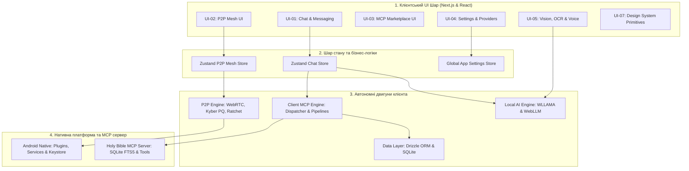

# 🏛️ Архітектурна карта та модульна декомпозиція кодової бази проєкту

> 📌 **Мета документа:** Повний аналіз зв'язності кодової бази, розподіл усіх **813 файлів** за архітектурними шарами та функціональними модулями (із першочерговим детальним розбором **UI-шару** та взаємозв'язків).

## 📊 1. Зведена таблиця архітектурних шарів та зв'язності

| Архітектурний шар | Модулів | Файлів | Рядків (LOC) | Чистий код (SLOC) | Обсяг (KB) | Внутрішні зв'язки |
| :--- | :---: | :---: | :---: | :---: | :---: | :---: |
| **UI** | 9 | 225 | 28,216 | 24,941 | 1,116.3 KB | 172 |
| **State & Logic** | 4 | 47 | 5,052 | 4,373 | 168.9 KB | 26 |
| **P2P Engine** | 5 | 99 | 10,357 | 7,821 | 323.9 KB | 71 |
| **Client MCP** | 5 | 78 | 8,220 | 6,930 | 328.7 KB | 82 |
| **AI & Hardware** | 3 | 127 | 13,267 | 10,868 | 440.7 KB | 151 |
| **Data Layer** | 1 | 12 | 1,242 | 974 | 42.1 KB | 3 |
| **Android Native** | 4 | 60 | 3,293 | 2,777 | 122.0 KB | 4 |
| **Server MCP Engine** | 5 | 108 | 9,453 | 7,837 | 334.0 KB | 128 |
| **Tooling & Config** | 2 | 57 | 5,313 | 4,242 | 236.6 KB | 16 |
| **РАЗОМ** | **38** | **813** | **84,413** | **70,763** | **3,113.2 KB** | **653** |

## 🗺️ 2. Граф залежностей між ключовими підсистемами

---

## 📦 1. Шар: UI

### 🔹 UI-01: Chat & Messaging Interface
**Призначення:** Компоненти чату, стрімінгу відповідей, списку повідомлень, інпуту введення та Markdown-рендерингу.

- **Кількість файлів:** 57
- **Загальний обсяг рядків:** 7,848 LOC (Чистий код: 7,010 SLOC)
- **Розмір:** 319.6 KB
- **Внутрішня зв'язність (Internal Coupling):** 67 викликів
- **Зовнішні залежності (Efferent $Ce$):** 11 модулів
- **Вхідні залежності (Afferent $Ca$):** 5 модулів

| № | Шлях до файлу | Мова | LOC | Чистий код | Розмір | Імпортує (файлів) | Ким імпортується |
| :---: | :--- | :--- | :---: | :---: | :---: | :---: | :---: |
| 1 | `client/src/components/chat/MessageList.tsx` | TypeScript (React) | **444** | 384 | 16.44 KB | 5 | 2 |
| 2 | `client/src/components/chat/ChatHeader.tsx` | TypeScript (React) | **400** | 353 | 18.44 KB | 9 | 2 |
| 3 | `client/src/components/chat/InputDock.tsx` | TypeScript (React) | **375** | 341 | 14.86 KB | 16 | 2 |
| 4 | `client/src/components/chat/message/MessageItem.tsx` | TypeScript (React) | **282** | 254 | 11.92 KB | 7 | 4 |
| 5 | `client/src/components/chat/McpActivityIndicator.tsx` | TypeScript (React) | **278** | 229 | 8.22 KB | 2 | 1 |
| 6 | `client/src/components/chat/AttachmentDock.tsx` | TypeScript (React) | **269** | 247 | 11.51 KB | 3 | 1 |
| 7 | `client/src/components/chat/hooks/useChatMessages.ts` | TypeScript | **268** | 223 | 10.07 KB | 4 | 1 |
| 8 | `client/src/components/chat/VoiceAssistantOverlay.tsx` | TypeScript (React) | **251** | 214 | 9.05 KB | 3 | 0 |
| 9 | `client/src/components/chat/dock/source/useSourceSelector.ts` | TypeScript | **248** | 218 | 9.66 KB | 6 | 1 |
| 10 | `client/src/components/chat/header/DetailModal.tsx` | TypeScript (React) | **236** | 225 | 11.79 KB | 3 | 1 |
| 11 | `client/src/components/chat/CitationCard.tsx` | TypeScript (React) | **209** | 183 | 7.61 KB | 2 | 1 |
| 12 | `client/src/components/chat/ChatView.tsx` | TypeScript (React) | **204** | 181 | 7.92 KB | 11 | 1 |
| 13 | `client/src/components/chat/renderer/segment-parser.ts` | TypeScript | **203** | 170 | 6.87 KB | 2 | 3 |
| 14 | `client/src/components/chat/dock/SourceSelectorModal.tsx` | TypeScript (React) | **191** | 177 | 7.81 KB | 3 | 1 |
| 15 | `client/src/components/chat/MetricsCard.tsx` | TypeScript (React) | **190** | 165 | 7.71 KB | 3 | 1 |
| 16 | `client/src/components/chat/dock/source/SourceProviderRow.tsx` | TypeScript (React) | **190** | 180 | 9.07 KB | 4 | 1 |
| 17 | `client/src/components/chat/background/useFluidCanvasRenderer.ts` | TypeScript | **183** | 153 | 5.85 KB | 0 | 1 |
| 18 | `client/src/components/chat/dock/source/SourceModelFilterBar.tsx` | TypeScript (React) | **175** | 168 | 6.99 KB | 3 | 1 |
| 19 | `client/src/components/chat/header/WarmthModal.tsx` | TypeScript (React) | **170** | 158 | 6.87 KB | 5 | 1 |
| 20 | `client/src/components/chat/renderer/markdown-components.tsx` | TypeScript (React) | **169** | 162 | 8.06 KB | 0 | 1 |
| 21 | `client/src/components/chat/dock/PowerSourceSwitcher.tsx` | TypeScript (React) | **166** | 155 | 7.13 KB | 4 | 1 |
| 22 | `client/src/components/chat/message/MessageTagsHeader.tsx` | TypeScript (React) | **161** | 148 | 7.23 KB | 1 | 1 |
| 23 | `client/src/components/chat/RichTextRenderer.tsx` | TypeScript (React) | **140** | 121 | 5.34 KB | 6 | 2 |
| 24 | `client/src/components/chat/export/ExportChatModal.tsx` | TypeScript (React) | **140** | 129 | 6.32 KB | 2 | 0 |
| 25 | `client/src/components/chat/EmptyState.tsx` | TypeScript (React) | **139** | 124 | 7.1 KB | 1 | 3 |
| 26 | `client/src/components/chat/header/warmth/WarmthSliderControl.tsx` | TypeScript (React) | **138** | 129 | 6.08 KB | 2 | 1 |
| 27 | `client/src/components/chat/dock/source/ModelCardItem.tsx` | TypeScript (React) | **121** | 116 | 5.39 KB | 4 | 1 |
| 28 | `client/src/components/chat/dock/useAutoDiscovery.ts` | TypeScript | **120** | 106 | 5.19 KB | 4 | 1 |
| 29 | `client/src/components/chat/dock/source/SourceModelCardGrid.tsx` | TypeScript (React) | **118** | 110 | 4.77 KB | 3 | 1 |
| 30 | `client/src/components/chat/dock/source/SourceP2PBanner.tsx` | TypeScript (React) | **116** | 106 | 5.68 KB | 2 | 1 |
| 31 | `client/src/components/chat/ScrollToBottomPill.tsx` | TypeScript (React) | **103** | 93 | 4.26 KB | 2 | 2 |
| 32 | `client/src/components/chat/ChatMessagesContainer.tsx` | TypeScript (React) | **98** | 82 | 3.05 KB | 6 | 0 |
| 33 | `client/src/components/chat/dock/source/SourceChannelTabs.tsx` | TypeScript (React) | **94** | 87 | 3.94 KB | 3 | 1 |
| 34 | `client/src/components/chat/renderer/ThinkingWidget.tsx` | TypeScript (React) | **92** | 84 | 3.77 KB | 0 | 1 |
| 35 | `client/src/components/chat/dock/InputDockActionButtons.tsx` | TypeScript (React) | **87** | 80 | 2.71 KB | 1 | 1 |
| 36 | `client/src/components/chat/message/StreamingMessageSlot.tsx` | TypeScript (React) | **86** | 74 | 3.27 KB | 4 | 1 |
| 37 | `client/src/components/chat/dock/InputDockSourceHeader.tsx` | TypeScript (React) | **80** | 75 | 3.16 KB | 3 | 1 |
| 38 | `client/src/components/chat/dock/VoiceRecorderDock.tsx` | TypeScript (React) | **80** | 76 | 3.46 KB | 2 | 1 |
| 39 | `client/src/components/chat/hooks/useAsyncMessageParser.ts` | TypeScript | **79** | 65 | 2.28 KB | 1 | 0 |
| 40 | `client/src/components/chat/dock/ModelBadges.tsx` | TypeScript (React) | **69** | 65 | 3.49 KB | 2 | 1 |
| 41 | `client/src/components/chat/header/ChatActionMenu.tsx` | TypeScript (React) | **68** | 57 | 1.96 KB | 1 | 0 |
| 42 | `client/src/components/chat/renderer/parser/markdown-normalizer.ts` | TypeScript | **67** | 59 | 4.34 KB | 0 | 1 |
| 43 | `client/src/components/chat/indicator/StatusIcon.tsx` | TypeScript (React) | **65** | 57 | 2.68 KB | 1 | 1 |
| 44 | `client/src/components/chat/AiThinkingIndicator.tsx` | TypeScript (React) | **64** | 55 | 2.29 KB | 5 | 2 |
| 45 | `client/src/components/chat/header/warmth/WarmthServerSelector.tsx` | TypeScript (React) | **63** | 60 | 2.95 KB | 0 | 1 |
| 46 | `client/src/components/chat/dock/source/types.ts` | TypeScript | **48** | 43 | 1.54 KB | 1 | 9 |
| 47 | `client/src/components/chat/renderer/parser/verse-citation-parser.ts` | TypeScript | **47** | 37 | 1.02 KB | 1 | 1 |
| 48 | `client/src/components/chat/dock/source/SourceApiKeyWarning.tsx` | TypeScript (React) | **45** | 41 | 1.74 KB | 1 | 1 |
| 49 | `client/src/components/chat/message/MessageAttachments.tsx` | TypeScript (React) | **45** | 41 | 1.94 KB | 0 | 1 |
| 50 | `client/src/components/chat/dock/source/SourceModalHeader.tsx` | TypeScript (React) | **36** | 32 | 1.19 KB | 2 | 1 |
| 51 | `client/src/components/chat/AmbientFluidBackground.tsx` | TypeScript (React) | **32** | 28 | 1.33 KB | 1 | 2 |
| 52 | `client/src/components/chat/dock/FileDropZone.tsx` | TypeScript (React) | **31** | 28 | 1.24 KB | 0 | 1 |
| 53 | `client/src/components/chat/dock/useTextareaAutoHeight.ts` | TypeScript | **22** | 16 | 0.63 KB | 0 | 1 |
| 54 | `client/src/components/chat/indicator/status-resolver.ts` | TypeScript | **22** | 18 | 1.35 KB | 0 | 1 |
| 55 | `client/src/components/chat/header/palette-utils.ts` | TypeScript | **21** | 18 | 2.65 KB | 1 | 5 |
| 56 | `client/src/components/chat/dock/source/index.ts` | TypeScript | **9** | 9 | 0.32 KB | 9 | 1 |
| 57 | `client/src/components/chat/renderer/markdown-ast-cache.ts` | TypeScript | **1** | 1 | 0.05 KB | 1 | 0 |

### 🔹 UI-02: P2P Mesh & Node Modals UI
**Призначення:** UI інтерфейси моніторингу однорангової мережі, радар вузлів, модальні вікна P2P з'єднань, синхронізація.

- **Кількість файлів:** 44
- **Загальний обсяг рядків:** 4,771 LOC (Чистий код: 4,212 SLOC)
- **Розмір:** 193.2 KB
- **Внутрішня зв'язність (Internal Coupling):** 29 викликів
- **Зовнішні залежності (Efferent $Ce$):** 7 модулів
- **Вхідні залежності (Afferent $Ca$):** 2 модулів

| № | Шлях до файлу | Мова | LOC | Чистий код | Розмір | Імпортує (файлів) | Ким імпортується |
| :---: | :--- | :--- | :---: | :---: | :---: | :---: | :---: |
| 1 | `client/src/components/p2p/P2pClientModal.tsx` | TypeScript (React) | **641** | 573 | 23.88 KB | 11 | 4 |
| 2 | `client/src/components/p2p/P2pNodeDetailsModal.tsx` | TypeScript (React) | **600** | 543 | 26.13 KB | 12 | 1 |
| 3 | `client/src/components/p2p/P2pHostModal.tsx` | TypeScript (React) | **375** | 336 | 14.78 KB | 11 | 3 |
| 4 | `client/src/components/p2p/client/P2pQrScannerView.tsx` | TypeScript (React) | **350** | 326 | 16.33 KB | 1 | 4 |
| 5 | `client/src/components/p2p/P2pPairingConfirmModal.tsx` | TypeScript (React) | **260** | 231 | 11.79 KB | 6 | 0 |
| 6 | `client/src/components/p2p/host/P2pHostGovernor.tsx` | TypeScript (React) | **208** | 197 | 10.37 KB | 4 | 2 |
| 7 | `client/src/components/p2p/details/NodeTelemetryGrid.tsx` | TypeScript (React) | **184** | 174 | 7.82 KB | 3 | 2 |
| 8 | `client/src/components/p2p/details/NodePerformanceStats.tsx` | TypeScript (React) | **175** | 161 | 7.78 KB | 2 | 2 |
| 9 | `client/src/components/p2p/DeviceIdentityCard.tsx` | TypeScript (React) | **149** | 127 | 5.74 KB | 6 | 0 |
| 10 | `client/src/components/p2p/P2pJoinModal.tsx` | TypeScript (React) | **141** | 122 | 5.73 KB | 3 | 0 |
| 11 | `client/src/components/p2p/client/P2pPairedNodesList.tsx` | TypeScript (React) | **131** | 123 | 6.23 KB | 3 | 2 |
| 12 | `client/src/components/p2p/WebGpuTelemetryHud.tsx` | TypeScript (React) | **128** | 103 | 3.93 KB | 0 | 0 |
| 13 | `client/src/components/p2p/P2pMeshTelemetryHud.tsx` | TypeScript (React) | **127** | 107 | 5.93 KB | 2 | 0 |
| 14 | `client/src/components/p2p/host/P2pConnectedGuestsList.tsx` | TypeScript (React) | **124** | 118 | 5.96 KB | 1 | 2 |
| 15 | `client/src/components/p2p/details/NodeSecurityCard.tsx` | TypeScript (React) | **92** | 86 | 4.61 KB | 1 | 2 |
| 16 | `client/src/components/p2p/host/P2pHostQrCard.tsx` | TypeScript (React) | **91** | 84 | 3.62 KB | 1 | 2 |
| 17 | `client/src/components/p2p/client/P2pManualConnect.tsx` | TypeScript (React) | **90** | 83 | 3.42 KB | 1 | 2 |
| 18 | `client/src/components/p2p/P2pWaveformCanvas.tsx` | TypeScript (React) | **82** | 65 | 2.34 KB | 0 | 2 |
| 19 | `client/src/components/p2p/details/NodeHardwareGpuSpecs.tsx` | TypeScript (React) | **78** | 67 | 2.69 KB | 0 | 0 |
| 20 | `client/src/components/p2p/client/hooks/useQrCameraStream.ts` | TypeScript | **71** | 65 | 2.3 KB | 3 | 0 |
| 21 | `client/src/components/p2p/client/P2pPairingStateProgress.tsx` | TypeScript (React) | **67** | 55 | 2.13 KB | 0 | 0 |
| 22 | `client/src/components/p2p/client/P2pPinInputView.tsx` | TypeScript (React) | **65** | 51 | 1.93 KB | 1 | 0 |
| 23 | `client/src/components/p2p/details/NodePingHistoryChart.tsx` | TypeScript (React) | **62** | 44 | 1.81 KB | 0 | 0 |
| 24 | `client/src/components/p2p/client/feedback-effects.ts` | TypeScript | **59** | 46 | 1.59 KB | 2 | 2 |
| 25 | `client/src/components/p2p/details/NodeQuotaGovernorSlider.tsx` | TypeScript (React) | **58** | 47 | 1.95 KB | 1 | 0 |
| 26 | `client/src/components/p2p/details/NodeBlacklistActions.tsx` | TypeScript (React) | **49** | 39 | 1.55 KB | 1 | 0 |
| 27 | `client/src/components/p2p/client/hooks/useOpticalDecoder.ts` | TypeScript | **47** | 41 | 1.45 KB | 1 | 0 |
| 28 | `client/src/components/p2p/details/NodeHeaderCard.tsx` | TypeScript (React) | **47** | 45 | 1.63 KB | 1 | 0 |
| 29 | `client/src/components/p2p/client/P2pClientConnectionSummary.tsx` | TypeScript (React) | **45** | 35 | 1.4 KB | 0 | 0 |
| 30 | `client/src/components/p2p/pairing/SasSecurityBadge.tsx` | TypeScript (React) | **42** | 37 | 1.89 KB | 0 | 1 |
| 31 | `client/src/components/p2p/pairing/DeviceTypeBadge.tsx` | TypeScript (React) | **28** | 24 | 1.37 KB | 0 | 1 |
| 32 | `client/src/components/p2p/P2pClientSheet.tsx` | TypeScript (React) | **19** | 10 | 0.46 KB | 1 | 0 |
| 33 | `client/src/components/p2p/P2pHostSheet.tsx` | TypeScript (React) | **19** | 10 | 0.44 KB | 1 | 0 |
| 34 | `client/src/components/p2p/client/P2pDecodeProgressBanner.tsx` | TypeScript (React) | **18** | 16 | 0.51 KB | 0 | 0 |
| 35 | `client/src/components/p2p/client/P2pCameraScannerView.tsx` | TypeScript (React) | **10** | 3 | 0.27 KB | 1 | 0 |
| 36 | `client/src/components/p2p/host/HostConnectedGuestsTable.tsx` | TypeScript (React) | **9** | 2 | 0.26 KB | 1 | 0 |
| 37 | `client/src/components/p2p/host/HostQrTokenGenerator.tsx` | TypeScript (React) | **9** | 2 | 0.24 KB | 1 | 0 |
| 38 | `client/src/components/p2p/host/HostResourceQuotaControls.tsx` | TypeScript (React) | **9** | 2 | 0.25 KB | 1 | 0 |
| 39 | `client/src/components/p2p/details/NodeOverviewTab.tsx` | TypeScript (React) | **2** | 2 | 0.12 KB | 1 | 0 |
| 40 | `client/src/components/p2p/details/NodeSecurityTab.tsx` | TypeScript (React) | **2** | 2 | 0.11 KB | 1 | 0 |
| 41 | `client/src/components/p2p/details/NodeTelemetryTab.tsx` | TypeScript (React) | **2** | 2 | 0.11 KB | 1 | 0 |
| 42 | `client/src/components/p2p/tabs/P2pManualConnectTab.tsx` | TypeScript (React) | **2** | 2 | 0.13 KB | 1 | 0 |
| 43 | `client/src/components/p2p/tabs/P2pPairedNodesTab.tsx` | TypeScript (React) | **2** | 2 | 0.13 KB | 1 | 0 |
| 44 | `client/src/components/p2p/tabs/P2pScannerTab.tsx` | TypeScript (React) | **2** | 2 | 0.12 KB | 1 | 0 |

### 🔹 UI-03: MCP Marketplace & Tool Management UI
**Призначення:** Картки MCP серверів, маркетплейс інструментів, керування підключеннями та логами MCP.

- **Кількість файлів:** 34
- **Загальний обсяг рядків:** 3,899 LOC (Чистий код: 3,539 SLOC)
- **Розмір:** 164.9 KB
- **Внутрішня зв'язність (Internal Coupling):** 42 викликів
- **Зовнішні залежності (Efferent $Ce$):** 6 модулів
- **Вхідні залежності (Afferent $Ca$):** 2 модулів

| № | Шлях до файлу | Мова | LOC | Чистий код | Розмір | Імпортує (файлів) | Ким імпортується |
| :---: | :--- | :--- | :---: | :---: | :---: | :---: | :---: |
| 1 | `client/src/components/mcp/McpServerCard.tsx` | TypeScript (React) | **514** | 478 | 23.7 KB | 10 | 2 |
| 2 | `client/src/components/mcp/McpAddChoiceModal.tsx` | TypeScript (React) | **510** | 472 | 25.97 KB | 3 | 1 |
| 3 | `client/src/components/mcp/McpServerSettingsModal.tsx` | TypeScript (React) | **347** | 328 | 20.84 KB | 2 | 1 |
| 4 | `client/src/components/mcp/McpDashboard.tsx` | TypeScript (React) | **322** | 289 | 10.67 KB | 12 | 0 |
| 5 | `client/src/components/mcp/presets.ts` | TypeScript | **219** | 218 | 8.42 KB | 0 | 4 |
| 6 | `client/src/components/mcp/McpServerEditModal.tsx` | TypeScript (React) | **208** | 192 | 8.96 KB | 1 | 1 |
| 7 | `client/src/components/mcp/cards/ServerActionButtons.tsx` | TypeScript (React) | **182** | 170 | 8.16 KB | 3 | 2 |
| 8 | `client/src/components/mcp/McpCustomServerTab.tsx` | TypeScript (React) | **179** | 159 | 6.22 KB | 0 | 1 |
| 9 | `client/src/components/mcp/McpPredefinedCatalogTab.tsx` | TypeScript (React) | **144** | 126 | 5.1 KB | 0 | 1 |
| 10 | `client/src/components/mcp/hooks/useMcpRuntimeEnvironment.ts` | TypeScript | **129** | 110 | 4.34 KB | 4 | 5 |
| 11 | `client/src/components/mcp/cards/ServerStatusBadge.tsx` | TypeScript (React) | **106** | 93 | 5.14 KB | 3 | 2 |
| 12 | `client/src/components/mcp/dashboard/McpToolCatalog.tsx` | TypeScript (React) | **101** | 92 | 3.81 KB | 1 | 2 |
| 13 | `client/src/components/mcp/dashboard/McpConfigDrawer.tsx` | TypeScript (React) | **95** | 86 | 3.52 KB | 2 | 1 |
| 14 | `client/src/components/mcp/McpServerListGrid.tsx` | TypeScript (React) | **88** | 84 | 3.21 KB | 2 | 0 |
| 15 | `client/src/components/mcp/dashboard/McpServerGrid.tsx` | TypeScript (React) | **88** | 84 | 3.19 KB | 2 | 2 |
| 16 | `client/src/components/mcp/McpHeaderToolbar.tsx` | TypeScript (React) | **84** | 78 | 3.05 KB | 1 | 1 |
| 17 | `client/src/components/mcp/dashboard/McpMetricsHeader.tsx` | TypeScript (React) | **75** | 68 | 3.12 KB | 0 | 2 |
| 18 | `client/src/components/mcp/modals/McpPresetCard.tsx` | TypeScript (React) | **70** | 64 | 2.43 KB | 1 | 0 |
| 19 | `client/src/components/mcp/modals/McpManualImportOptions.tsx` | TypeScript (React) | **62** | 56 | 2.96 KB | 0 | 0 |
| 20 | `client/src/components/mcp/cards/ServerStatusHeader.tsx` | TypeScript (React) | **60** | 50 | 1.82 KB | 2 | 0 |
| 21 | `client/src/components/mcp/hooks/useMcpPolling.ts` | TypeScript | **55** | 48 | 1.87 KB | 3 | 1 |
| 22 | `client/src/components/mcp/cards/ServerToolsList.tsx` | TypeScript (React) | **53** | 48 | 1.84 KB | 1 | 2 |
| 23 | `client/src/components/mcp/modals/ValidationStatusView.tsx` | TypeScript (React) | **51** | 39 | 1.76 KB | 0 | 0 |
| 24 | `client/src/components/mcp/types.ts` | TypeScript | **51** | 49 | 1.53 KB | 0 | 13 |
| 25 | `client/src/components/mcp/modals/DockerContainerTab.tsx` | TypeScript (React) | **40** | 30 | 1.33 KB | 0 | 0 |
| 26 | `client/src/components/mcp/cards/ServerPingLatencyBadge.tsx` | TypeScript (React) | **26** | 16 | 0.81 KB | 1 | 0 |
| 27 | `client/src/components/mcp/cards/ServerConfigMenu.tsx` | TypeScript (React) | **9** | 2 | 0.25 KB | 1 | 0 |
| 28 | `client/src/components/mcp/cards/ServerToolsAccordion.tsx` | TypeScript (React) | **9** | 2 | 0.23 KB | 1 | 0 |
| 29 | `client/src/components/mcp/modals/CustomCommandTab.tsx` | TypeScript (React) | **9** | 2 | 0.24 KB | 1 | 0 |
| 30 | `client/src/components/mcp/modals/NpmSearchTab.tsx` | TypeScript (React) | **9** | 2 | 0.24 KB | 1 | 0 |
| 31 | `client/src/components/mcp/McpConfigDrawer.tsx` | TypeScript (React) | **1** | 1 | 0.04 KB | 1 | 0 |
| 32 | `client/src/components/mcp/McpMetricsHeader.tsx` | TypeScript (React) | **1** | 1 | 0.04 KB | 1 | 0 |
| 33 | `client/src/components/mcp/McpServerGrid.tsx` | TypeScript (React) | **1** | 1 | 0.04 KB | 1 | 0 |
| 34 | `client/src/components/mcp/McpToolCatalog.tsx` | TypeScript (React) | **1** | 1 | 0.04 KB | 1 | 0 |

### 🔹 UI-04: Settings, AI Providers & Diagnostics UI
**Призначення:** Налаштування провайдерів (Ollama, OpenAI, Anthropic, Local), діагностика пристрою, безпека.

- **Кількість файлів:** 29
- **Загальний обсяг рядків:** 4,714 LOC (Чистий код: 4,350 SLOC)
- **Розмір:** 208.0 KB
- **Внутрішня зв'язність (Internal Coupling):** 19 викликів
- **Зовнішні залежності (Efferent $Ce$):** 8 модулів
- **Вхідні залежності (Afferent $Ca$):** 0 модулів

| № | Шлях до файлу | Мова | LOC | Чистий код | Розмір | Імпортує (файлів) | Ким імпортується |
| :---: | :--- | :--- | :---: | :---: | :---: | :---: | :---: |
| 1 | `client/src/components/settings/providers/LocalProvidersSection.tsx` | TypeScript (React) | **585** | 548 | 30.91 KB | 10 | 1 |
| 2 | `client/src/components/settings/DeviceDiagnosticsSection.tsx` | TypeScript (React) | **480** | 444 | 25.17 KB | 4 | 1 |
| 3 | `client/src/components/settings/providers/CloudProvidersSection.tsx` | TypeScript (React) | **386** | 370 | 20.62 KB | 3 | 1 |
| 4 | `client/src/components/settings/ProvidersSettingsPanel.tsx` | TypeScript (React) | **366** | 343 | 13.67 KB | 8 | 0 |
| 5 | `client/src/components/settings/providers/card/LocalProviderPullProgress.tsx` | TypeScript (React) | **293** | 265 | 12.85 KB | 3 | 2 |
| 6 | `client/src/components/settings/SettingsModal.tsx` | TypeScript (React) | **283** | 260 | 12.72 KB | 4 | 0 |
| 7 | `client/src/components/settings/providers/CloudProviderModal.tsx` | TypeScript (React) | **203** | 189 | 8.52 KB | 3 | 1 |
| 8 | `client/src/components/settings/providers/LocalProviderModal.tsx` | TypeScript (React) | **186** | 172 | 7.72 KB | 3 | 1 |
| 9 | `client/src/components/settings/profile/AvatarEditor.tsx` | TypeScript (React) | **162** | 146 | 5.86 KB | 1 | 1 |
| 10 | `client/src/components/settings/providers/card/LocalProviderModelList.tsx` | TypeScript (React) | **159** | 152 | 6.74 KB | 2 | 1 |
| 11 | `client/src/components/settings/LocalModelCard.tsx` | TypeScript (React) | **145** | 138 | 5.91 KB | 2 | 0 |
| 12 | `client/src/components/settings/providers/LocalProviderCard.tsx` | TypeScript (React) | **145** | 132 | 4.98 KB | 8 | 1 |
| 13 | `client/src/components/settings/providers/OnDeviceStorageQuota.tsx` | TypeScript (React) | **139** | 125 | 5.87 KB | 2 | 1 |
| 14 | `client/src/components/settings/providers/card/LocalProviderHeader.tsx` | TypeScript (React) | **121** | 116 | 5.01 KB | 2 | 1 |
| 15 | `client/src/components/settings/UserProfileSection.tsx` | TypeScript (React) | **113** | 98 | 3.93 KB | 4 | 1 |
| 16 | `client/src/components/settings/local-providers/LocalHardwareMonitor.tsx` | TypeScript (React) | **105** | 87 | 3.12 KB | 0 | 0 |
| 17 | `client/src/components/settings/providers/ProvidersHeaderFilter.tsx` | TypeScript (React) | **99** | 93 | 4.14 KB | 1 | 1 |
| 18 | `client/src/components/settings/local-providers/LocalModelPicker.tsx` | TypeScript (React) | **95** | 83 | 3.76 KB | 1 | 0 |
| 19 | `client/src/components/settings/providers/local/P2pMeshStatusBanner.tsx` | TypeScript (React) | **93** | 85 | 4.61 KB | 0 | 0 |
| 20 | `client/src/components/settings/providers/local/PairedPeersListCard.tsx` | TypeScript (React) | **90** | 83 | 3.83 KB | 0 | 0 |
| 21 | `client/src/components/settings/SegmentedControl.tsx` | TypeScript (React) | **84** | 79 | 3.22 KB | 1 | 2 |
| 22 | `client/src/components/settings/providers/card/LocalProviderInputDock.tsx` | TypeScript (React) | **82** | 76 | 2.84 KB | 1 | 1 |
| 23 | `client/src/components/settings/providers/local/LocalP2pMeshCard.tsx` | TypeScript (React) | **76** | 73 | 2.79 KB | 2 | 0 |
| 24 | `client/src/components/settings/profile/LanguageSelector.tsx` | TypeScript (React) | **54** | 43 | 1.85 KB | 2 | 1 |
| 25 | `client/src/components/settings/diagnostics/BatteryDiagnosticsCard.tsx` | TypeScript (React) | **52** | 45 | 2.26 KB | 1 | 0 |
| 26 | `client/src/components/settings/diagnostics/NetworkBenchmarkCard.tsx` | TypeScript (React) | **45** | 39 | 2.11 KB | 1 | 0 |
| 27 | `client/src/components/settings/diagnostics/HardwareCpuGpuCard.tsx` | TypeScript (React) | **41** | 37 | 1.81 KB | 1 | 0 |
| 28 | `client/src/components/settings/profile/ThemeSelector.tsx` | TypeScript (React) | **30** | 27 | 1.07 KB | 1 | 1 |
| 29 | `client/src/components/settings/providers/LocalProviderPullProgress.tsx` | TypeScript (React) | **2** | 2 | 0.12 KB | 1 | 0 |

### 🔹 UI-05: Multimodal (Vision, Voice & OCR) UI
**Призначення:** Камера, розпізнавання тексту OCR, розпізнавання об'єктів COCO, синтез та запис голосу.

- **Кількість файлів:** 3
- **Загальний обсяг рядків:** 359 LOC (Чистий код: 289 SLOC)
- **Розмір:** 10.6 KB
- **Внутрішня зв'язність (Internal Coupling):** 0 викликів
- **Зовнішні залежності (Efferent $Ce$):** 1 модулів
- **Вхідні залежності (Afferent $Ca$):** 0 модулів

| № | Шлях до файлу | Мова | LOC | Чистий код | Розмір | Імпортує (файлів) | Ким імпортується |
| :---: | :--- | :--- | :---: | :---: | :---: | :---: | :---: |
| 1 | `client/src/components/audio/AudioMessagePlayer.tsx` | TypeScript (React) | **167** | 139 | 4.75 KB | 1 | 0 |
| 2 | `client/src/components/audio/AudioWaveformCanvas.tsx` | TypeScript (React) | **108** | 84 | 3.08 KB | 0 | 0 |
| 3 | `client/src/components/audio/VoiceRecordingOverlay.tsx` | TypeScript (React) | **84** | 66 | 2.73 KB | 1 | 0 |

### 🔹 UI-06: Layout, Navigation & Shell UI
**Призначення:** Головна навігація, бічні панелі (Sidebar), шапка застосунку, глобальні діалогові вікна.

- **Кількість файлів:** 15
- **Загальний обсяг рядків:** 1,918 LOC (Чистий код: 1,717 SLOC)
- **Розмір:** 71.7 KB
- **Внутрішня зв'язність (Internal Coupling):** 9 викликів
- **Зовнішні залежності (Efferent $Ce$):** 5 модулів
- **Вхідні залежності (Afferent $Ca$):** 1 модулів

| № | Шлях до файлу | Мова | LOC | Чистий код | Розмір | Імпортує (файлів) | Ким імпортується |
| :---: | :--- | :--- | :---: | :---: | :---: | :---: | :---: |
| 1 | `client/src/components/sidebar/Sidebar.tsx` | TypeScript (React) | **374** | 338 | 13.94 KB | 14 | 1 |
| 2 | `client/src/components/sidebar/SidebarChatItem.tsx` | TypeScript (React) | **346** | 321 | 13.71 KB | 1 | 2 |
| 3 | `client/src/components/sidebar/SidebarUserCard.tsx` | TypeScript (React) | **129** | 116 | 4.85 KB | 3 | 1 |
| 4 | `client/src/components/sidebar/NavItem.tsx` | TypeScript (React) | **122** | 115 | 4.94 KB | 1 | 0 |
| 5 | `client/src/components/sidebar/SidebarChatActionMenu.tsx` | TypeScript (React) | **100** | 89 | 3.97 KB | 1 | 0 |
| 6 | `client/src/components/sidebar/MobileSidebarDrawer.tsx` | TypeScript (React) | **98** | 87 | 3.16 KB | 0 | 1 |
| 7 | `client/src/components/sidebar/SidebarSearchResults.tsx` | TypeScript (React) | **95** | 89 | 3.86 KB | 2 | 1 |
| 8 | `client/src/components/sidebar/SidebarSearchInput.tsx` | TypeScript (React) | **94** | 87 | 4.34 KB | 2 | 1 |
| 9 | `client/src/components/sidebar/SidebarVirtualChatList.tsx` | TypeScript (React) | **93** | 82 | 3.21 KB | 2 | 0 |
| 10 | `client/src/components/sidebar/sidebar-utils.ts` | TypeScript | **90** | 77 | 2.83 KB | 0 | 1 |
| 11 | `client/src/components/sidebar/SidebarHeader.tsx` | TypeScript (React) | **88** | 75 | 3.37 KB | 1 | 1 |
| 12 | `client/src/components/layout/DesktopFrame.tsx` | TypeScript (React) | **80** | 66 | 3.12 KB | 3 | 1 |
| 13 | `client/src/components/sidebar/useSidebarChatList.ts` | TypeScript | **75** | 58 | 1.87 KB | 0 | 0 |
| 14 | `client/src/components/sidebar/SidebarChatTitleEditor.tsx` | TypeScript (React) | **72** | 60 | 2.14 KB | 0 | 0 |
| 15 | `client/src/components/sidebar/SidebarNewChatButton.tsx` | TypeScript (React) | **62** | 57 | 2.39 KB | 1 | 1 |

### 🔹 UI-07: Design System & Base Primitives (Shadcn)
**Призначення:** Базові UI атоми: кнопки, діалоги, дропдауни, інпути, таби, алерти, бейджі.

- **Кількість файлів:** 13
- **Загальний обсяг рядків:** 928 LOC (Чистий код: 803 SLOC)
- **Розмір:** 27.6 KB
- **Внутрішня зв'язність (Internal Coupling):** 1 викликів
- **Зовнішні залежності (Efferent $Ce$):** 1 модулів
- **Вхідні залежності (Afferent $Ca$):** 7 модулів

| № | Шлях до файлу | Мова | LOC | Чистий код | Розмір | Імпортує (файлів) | Ким імпортується |
| :---: | :--- | :--- | :---: | :---: | :---: | :---: | :---: |
| 1 | `client/src/components/ui/RadixModalWrapper.tsx` | TypeScript (React) | **152** | 123 | 4.6 KB | 0 | 0 |
| 2 | `client/src/components/ui/icon-registry.tsx` | TypeScript (React) | **123** | 121 | 1.52 KB | 0 | 4 |
| 3 | `client/src/components/ui/tabs.tsx` | TypeScript (React) | **82** | 70 | 2.31 KB | 1 | 0 |
| 4 | `client/src/components/ui/glass.tsx` | TypeScript (React) | **78** | 61 | 3.16 KB | 1 | 23 |
| 5 | `client/src/components/ui/dialog.tsx` | TypeScript (React) | **76** | 65 | 2.39 KB | 1 | 0 |
| 6 | `client/src/components/ui/ErrorBoundary.tsx` | TypeScript (React) | **70** | 61 | 2.3 KB | 1 | 2 |
| 7 | `client/src/components/ui/sheet.tsx` | TypeScript (React) | **69** | 61 | 2.06 KB | 1 | 0 |
| 8 | `client/src/components/ui/button.tsx` | TypeScript (React) | **58** | 54 | 3.16 KB | 1 | 0 |
| 9 | `client/src/components/ui/focus-trap.ts` | TypeScript | **56** | 41 | 1.6 KB | 0 | 0 |
| 10 | `client/src/components/ui/popover.tsx` | TypeScript (React) | **51** | 44 | 1.4 KB | 1 | 0 |
| 11 | `client/src/components/ui/badge.tsx` | TypeScript (React) | **39** | 35 | 1.29 KB | 1 | 0 |
| 12 | `client/src/components/ui/slider.tsx` | TypeScript (React) | **38** | 35 | 0.78 KB | 1 | 0 |
| 13 | `client/src/components/ui/tooltip.tsx` | TypeScript (React) | **36** | 32 | 0.98 KB | 1 | 0 |

### 🔹 UI-08: App Router Pages, Styles & Layouts
**Призначення:** Сторінки Next.js App Router (i18n маршрутизація, локалі), глобальні стилі `globals.css`.

- **Кількість файлів:** 27
- **Загальний обсяг рядків:** 3,487 LOC (Чистий код: 2,770 SLOC)
- **Розмір:** 111.8 KB
- **Внутрішня зв'язність (Internal Coupling):** 5 викликів
- **Зовнішні залежності (Efferent $Ce$):** 11 модулів
- **Вхідні залежності (Afferent $Ca$):** 1 модулів

| № | Шлях до файлу | Мова | LOC | Чистий код | Розмір | Імпортує (файлів) | Ким імпортується |
| :---: | :--- | :--- | :---: | :---: | :---: | :---: | :---: |
| 1 | `client/src/app/globals.css` | CSS | **887** | 622 | 23.24 KB | 4 | 1 |
| 2 | `client/src/app/api/mcp/install-code/route.ts` | TypeScript | **375** | 319 | 14.56 KB | 4 | 0 |
| 3 | `client/src/app/api/mcp/download-db/route.ts` | TypeScript | **343** | 295 | 11.97 KB | 5 | 0 |
| 4 | `client/src/app/api/verse/route.ts` | TypeScript | **220** | 186 | 6.84 KB | 1 | 0 |
| 5 | `client/src/app/api/mcp/delete-code/route.ts` | TypeScript | **180** | 158 | 6.56 KB | 2 | 0 |
| 6 | `client/src/app/api/models/pull/route.ts` | TypeScript | **168** | 138 | 5.23 KB | 1 | 0 |
| 7 | `client/src/app/api/mcp/route.ts` | TypeScript | **137** | 119 | 4.95 KB | 2 | 0 |
| 8 | `client/src/app/api/p2p/signal/route.ts` | TypeScript | **121** | 101 | 3.2 KB | 0 | 0 |
| 9 | `client/src/app/api/mcp/registry/route.ts` | TypeScript | **120** | 101 | 3.44 KB | 1 | 1 |
| 10 | `client/src/app/api/mcp/open-folder/route.ts` | TypeScript | **116** | 93 | 4.43 KB | 3 | 0 |
| 11 | `client/src/app/api/chats/route.ts` | TypeScript | **94** | 83 | 2.88 KB | 1 | 0 |
| 12 | `client/src/app/[locale]/page.tsx` | TypeScript (React) | **84** | 69 | 3.15 KB | 9 | 0 |
| 13 | `client/src/app/api/system-diagnostics/route.ts` | TypeScript | **82** | 64 | 3.23 KB | 1 | 0 |
| 14 | `client/src/app/[locale]/layout.tsx` | TypeScript (React) | **81** | 74 | 4.01 KB | 6 | 0 |
| 15 | `client/src/app/api/settings/route.ts` | TypeScript | **80** | 65 | 2.74 KB | 2 | 0 |
| 16 | `client/src/app/api/upload/route.ts` | TypeScript | **69** | 56 | 2.56 KB | 3 | 0 |
| 17 | `client/src/app/api/ping/route.ts` | TypeScript | **48** | 38 | 1.35 KB | 0 | 0 |
| 18 | `client/src/app/styles/theme.css` | CSS | **48** | 4 | 1.08 KB | 0 | 1 |
| 19 | `client/src/app/api/chats/[id]/messages/route.ts` | TypeScript | **46** | 37 | 1.48 KB | 1 | 0 |
| 20 | `client/src/app/styles/animations.css` | CSS | **36** | 28 | 0.61 KB | 0 | 1 |
| 21 | `client/src/app/api/mcp/context/route.ts` | TypeScript | **34** | 30 | 1.26 KB | 1 | 0 |
| 22 | `client/src/app/styles/glassmorphism.css` | CSS | **33** | 26 | 0.87 KB | 0 | 0 |
| 23 | `client/src/app/styles/markdown-prose.css` | CSS | **26** | 20 | 0.55 KB | 0 | 0 |
| 24 | `client/src/app/styles/mcp.css` | CSS | **24** | 21 | 0.54 KB | 0 | 1 |
| 25 | `client/src/app/styles/mobile.css` | CSS | **18** | 10 | 0.55 KB | 0 | 1 |
| 26 | `client/src/app/api/chat/route.ts` | TypeScript | **10** | 7 | 0.35 KB | 1 | 0 |
| 27 | `client/src/app/api/mcp/configs/route.ts` | TypeScript | **7** | 6 | 0.21 KB | 1 | 0 |

### 🔹 UI-09: Specialized Feature Components
**Призначення:** Спеціалізовані допоміжні UI віджети та плагіни.

- **Кількість файлів:** 3
- **Загальний обсяг рядків:** 292 LOC (Чистий код: 251 SLOC)
- **Розмір:** 8.9 KB
- **Внутрішня зв'язність (Internal Coupling):** 0 викликів
- **Зовнішні залежності (Efferent $Ce$):** 3 модулів
- **Вхідні залежності (Afferent $Ca$):** 1 модулів

| № | Шлях до файлу | Мова | LOC | Чистий код | Розмір | Імпортує (файлів) | Ким імпортується |
| :---: | :--- | :--- | :---: | :---: | :---: | :---: | :---: |
| 1 | `client/src/components/providers/ExtensionShield.tsx` | TypeScript (React) | **174** | 151 | 5.56 KB | 3 | 1 |
| 2 | `client/src/components/theme-provider.tsx` | TypeScript (React) | **67** | 59 | 1.79 KB | 2 | 1 |
| 3 | `client/src/components/providers/ClientIntlProvider.tsx` | TypeScript (React) | **51** | 41 | 1.59 KB | 1 | 1 |

---

## 📦 2. Шар: State & Logic

### 🔹 STATE-01: P2P Mesh State Machine & Slices
**Призначення:** Zustand стори P2P мережі: топологія вузлів, статус передачі файлів, метрики шифрування.

- **Кількість файлів:** 19
- **Загальний обсяг рядків:** 1,354 LOC (Чистий код: 1,153 SLOC)
- **Розмір:** 43.4 KB
- **Внутрішня зв'язність (Internal Coupling):** 12 викликів
- **Зовнішні залежності (Efferent $Ce$):** 3 модулів
- **Вхідні залежності (Afferent $Ca$):** 4 модулів

| № | Шлях до файлу | Мова | LOC | Чистий код | Розмір | Імпортує (файлів) | Ким імпортується |
| :---: | :--- | :--- | :---: | :---: | :---: | :---: | :---: |
| 1 | `client/src/stores/p2p/signaling-client.ts` | TypeScript | **165** | 133 | 5.02 KB | 0 | 4 |
| 2 | `client/src/stores/p2p/services/SignalingEnvelopeDispatcher.ts` | TypeScript | **159** | 140 | 5.67 KB | 4 | 1 |
| 3 | `client/src/stores/p2p/slices/identity.slice.ts` | TypeScript | **136** | 114 | 4.26 KB | 5 | 1 |
| 4 | `client/src/stores/p2p/device-detector.ts` | TypeScript | **129** | 114 | 5.02 KB | 0 | 1 |
| 5 | `client/src/stores/p2p/services/p2p-telemetry.service.ts` | TypeScript | **114** | 99 | 4.28 KB | 4 | 1 |
| 6 | `client/src/stores/p2p/slices/qr-nonce.slice.ts` | TypeScript | **79** | 62 | 2.36 KB | 2 | 2 |
| 7 | `client/src/stores/p2p/p2p-types.ts` | TypeScript | **71** | 67 | 1.95 KB | 2 | 4 |
| 8 | `client/src/stores/p2p/services/p2p-session.coordinator.ts` | TypeScript | **66** | 54 | 2.07 KB | 2 | 2 |
| 9 | `client/src/stores/p2p/services/p2p-storage.adapter.ts` | TypeScript | **64** | 57 | 2.1 KB | 1 | 1 |
| 10 | `client/src/stores/p2p/slices/pairing.slice.ts` | TypeScript | **52** | 42 | 1.48 KB | 1 | 1 |
| 11 | `client/src/stores/p2p/slices/sessions.slice.ts` | TypeScript | **49** | 41 | 1.29 KB | 1 | 2 |
| 12 | `client/src/stores/p2p/slices/telemetry.slice.ts` | TypeScript | **41** | 35 | 1.03 KB | 2 | 1 |
| 13 | `client/src/stores/p2p/services/SasPairingHandshakeHandler.ts` | TypeScript | **39** | 36 | 1.19 KB | 3 | 1 |
| 14 | `client/src/stores/p2p/slices/transport.slice.ts` | TypeScript | **39** | 30 | 1.16 KB | 1 | 2 |
| 15 | `client/src/stores/p2p/slices/governor.slice.ts` | TypeScript | **38** | 33 | 1.04 KB | 1 | 1 |
| 16 | `client/src/stores/p2p/slices/ui.slice.ts` | TypeScript | **38** | 33 | 1.25 KB | 0 | 1 |
| 17 | `client/src/stores/p2p/services/QrNonceValidator.ts` | TypeScript | **34** | 25 | 1.0 KB | 0 | 1 |
| 18 | `client/src/stores/p2p/services/p2p-signaling.service.ts` | TypeScript | **28** | 25 | 0.87 KB | 3 | 1 |
| 19 | `client/src/stores/p2p/services/PeerRevocationCoordinator.ts` | TypeScript | **13** | 13 | 0.41 KB | 0 | 2 |

### 🔹 STATE-02: Chat & LLM Session Stores
**Призначення:** Zustand стори керування сесіями діалогів, чергою запитів, контекстом розмови.

- **Кількість файлів:** 6
- **Загальний обсяг рядків:** 425 LOC (Чистий код: 350 SLOC)
- **Розмір:** 13.1 KB
- **Внутрішня зв'язність (Internal Coupling):** 2 викликів
- **Зовнішні залежності (Efferent $Ce$):** 3 модулів
- **Вхідні залежності (Afferent $Ca$):** 3 модулів

| № | Шлях до файлу | Мова | LOC | Чистий код | Розмір | Імпортує (файлів) | Ким імпортується |
| :---: | :--- | :--- | :---: | :---: | :---: | :---: | :---: |
| 1 | `client/src/stores/chat/useTransientStreamStore.ts` | TypeScript | **126** | 112 | 3.26 KB | 1 | 0 |
| 2 | `client/src/stores/chat/chat-message.store.ts` | TypeScript | **98** | 77 | 3.12 KB | 1 | 0 |
| 3 | `client/src/stores/chat/useChatMetadataStore.ts` | TypeScript | **67** | 60 | 2.35 KB | 1 | 0 |
| 4 | `client/src/stores/chat/transient-stream-reactor.ts` | TypeScript | **64** | 46 | 1.8 KB | 0 | 2 |
| 5 | `client/src/stores/chat/chat-store.types.ts` | TypeScript | **40** | 37 | 1.62 KB | 1 | 3 |
| 6 | `client/src/stores/chat/useStreamTransientStore.ts` | TypeScript | **30** | 18 | 0.9 KB | 1 | 0 |

### 🔹 STATE-03: Global App & Provider Settings Stores
**Призначення:** Стори налаштувань ШІ провайдерів, параметрів пристрою, UI тем та конфігурації.

- **Кількість файлів:** 14
- **Загальний обсяг рядків:** 2,260 LOC (Чистий код: 2,027 SLOC)
- **Розмір:** 80.5 KB
- **Внутрішня зв'язність (Internal Coupling):** 12 викликів
- **Зовнішні залежності (Efferent $Ce$):** 6 модулів
- **Вхідні залежності (Afferent $Ca$):** 11 модулів

| № | Шлях до файлу | Мова | LOC | Чистий код | Розмір | Імпортує (файлів) | Ким імпортується |
| :---: | :--- | :--- | :---: | :---: | :---: | :---: | :---: |
| 1 | `client/src/stores/useChatStore.ts` | TypeScript | **430** | 383 | 15.25 KB | 5 | 8 |
| 2 | `client/src/stores/useModelPullStore.ts` | TypeScript | **284** | 254 | 9.22 KB | 4 | 4 |
| 3 | `client/src/stores/useP2pStore.ts` | TypeScript | **268** | 235 | 9.37 KB | 13 | 16 |
| 4 | `client/src/stores/slices/providerSlice.ts` | TypeScript | **223** | 203 | 9.53 KB | 5 | 1 |
| 5 | `client/src/stores/default-providers.ts` | TypeScript | **185** | 182 | 7.05 KB | 2 | 4 |
| 6 | `client/src/stores/slices/provider/cloudProviderSlice.ts` | TypeScript | **138** | 123 | 5.46 KB | 2 | 1 |
| 7 | `client/src/stores/useTransientStreamStore.ts` | TypeScript | **137** | 119 | 3.4 KB | 0 | 0 |
| 8 | `client/src/stores/slices/mcpSlice.ts` | TypeScript | **113** | 97 | 4.01 KB | 1 | 1 |
| 9 | `client/src/stores/slices/provider/localProviderSlice.ts` | TypeScript | **112** | 100 | 4.36 KB | 2 | 1 |
| 10 | `client/src/stores/sqlite-sync-adapter.ts` | TypeScript | **100** | 88 | 3.3 KB | 1 | 1 |
| 11 | `client/src/stores/useSettingsStore.ts` | TypeScript | **86** | 77 | 3.46 KB | 6 | 38 |
| 12 | `client/src/stores/useMcpDownloadStore.ts` | TypeScript | **80** | 70 | 2.83 KB | 1 | 1 |
| 13 | `client/src/stores/slices/uiSlice.ts` | TypeScript | **53** | 49 | 1.81 KB | 1 | 1 |
| 14 | `client/src/stores/useLocaleStore.ts` | TypeScript | **51** | 47 | 1.48 KB | 0 | 2 |

### 🔹 STATE-04: React Custom Hooks & Contexts
**Призначення:** Користувацькі React-хуки (кліпборд, мобільні жести, медіа-запити, життєвий цикл).

- **Кількість файлів:** 8
- **Загальний обсяг рядків:** 1,013 LOC (Чистий код: 843 SLOC)
- **Розмір:** 31.9 KB
- **Внутрішня зв'язність (Internal Coupling):** 0 викликів
- **Зовнішні залежності (Efferent $Ce$):** 5 модулів
- **Вхідні залежності (Afferent $Ca$):** 2 модулів

| № | Шлях до файлу | Мова | LOC | Чистий код | Розмір | Імпортує (файлів) | Ким імпортується |
| :---: | :--- | :--- | :---: | :---: | :---: | :---: | :---: |
| 1 | `client/src/hooks/useAudioRecorder.ts` | TypeScript | **288** | 243 | 9.49 KB | 0 | 2 |
| 2 | `client/src/hooks/useOnDeviceModelManager.ts` | TypeScript | **257** | 229 | 7.75 KB | 4 | 1 |
| 3 | `client/src/hooks/useFileUpload.ts` | TypeScript | **179** | 157 | 5.58 KB | 1 | 2 |
| 4 | `client/src/hooks/useOptimisticMcpToggle.ts` | TypeScript | **124** | 93 | 4.19 KB | 3 | 0 |
| 5 | `client/src/hooks/useDecoupledAudioLevel.ts` | TypeScript | **60** | 44 | 1.7 KB | 0 | 0 |
| 6 | `client/src/hooks/useLocalModelPull.ts` | TypeScript | **49** | 41 | 1.4 KB | 3 | 3 |
| 7 | `client/src/hooks/useStatusHysteresis.ts` | TypeScript | **35** | 23 | 1.2 KB | 0 | 0 |
| 8 | `client/src/hooks/useDebounce.ts` | TypeScript | **21** | 13 | 0.54 KB | 0 | 0 |

---

## 📦 3. Шар: P2P Engine

### 🔹 P2P-01: Cryptography & Post-Quantum Ratchet
**Призначення:** Постквантова криптографія Kyber, Double Ratchet, QR-криптографія, ChaCha20/Ed25519.

- **Кількість файлів:** 30
- **Загальний обсяг рядків:** 2,664 LOC (Чистий код: 1,935 SLOC)
- **Розмір:** 90.4 KB
- **Внутрішня зв'язність (Internal Coupling):** 33 викликів
- **Зовнішні залежності (Efferent $Ce$):** 0 модулів
- **Вхідні залежності (Afferent $Ca$):** 7 модулів

| № | Шлях до файлу | Мова | LOC | Чистий код | Розмір | Імпортує (файлів) | Ким імпортується |
| :---: | :--- | :--- | :---: | :---: | :---: | :---: | :---: |
| 1 | `client/src/lib/p2p/crypto/noble-crypto-suite.ts` | TypeScript | **311** | 201 | 9.27 KB | 0 | 10 |
| 2 | `client/src/lib/p2p/crypto/mlkem-postquantum-adapter.ts` | TypeScript | **243** | 155 | 8.79 KB | 0 | 1 |
| 3 | `client/src/lib/p2p/crypto/ratchet/ratchet-aead-cipher.ts` | TypeScript | **225** | 179 | 7.18 KB | 2 | 2 |
| 4 | `client/src/lib/p2p/crypto/payload-compressor.ts` | TypeScript | **156** | 115 | 4.8 KB | 1 | 0 |
| 5 | `client/src/lib/p2p/crypto/traffic-chaffing-scheduler.ts` | TypeScript | **152** | 104 | 4.53 KB | 0 | 0 |
| 6 | `client/src/lib/p2p/crypto/qr-decoder/image-filters.ts` | TypeScript | **149** | 117 | 4.25 KB | 0 | 2 |
| 7 | `client/src/lib/p2p/crypto/pq-hybrid-ratchet.ts` | TypeScript | **143** | 102 | 5.27 KB | 5 | 0 |
| 8 | `client/src/lib/p2p/crypto/qr-decoder/decoder-pipeline.ts` | TypeScript | **138** | 106 | 5.72 KB | 3 | 1 |
| 9 | `client/src/lib/p2p/crypto/key-exchange.ts` | TypeScript | **115** | 80 | 3.59 KB | 3 | 4 |
| 10 | `client/src/lib/p2p/crypto/post-quantum-suite.ts` | TypeScript | **100** | 66 | 3.08 KB | 2 | 2 |
| 11 | `client/src/lib/p2p/crypto/primitives/aes-gcm.ts` | TypeScript | **100** | 91 | 3.29 KB | 0 | 1 |
| 12 | `client/src/lib/p2p/crypto/qr-decoder/pyramid-scaler.ts` | TypeScript | **90** | 69 | 2.98 KB | 0 | 2 |
| 13 | `client/src/lib/p2p/crypto/qr-generator.ts` | TypeScript | **88** | 60 | 2.73 KB | 0 | 2 |
| 14 | `client/src/lib/p2p/crypto/kdf-engine.ts` | TypeScript | **86** | 67 | 2.94 KB | 1 | 2 |
| 15 | `client/src/lib/p2p/crypto/primitives/sha256.ts` | TypeScript | **74** | 61 | 2.92 KB | 0 | 2 |
| 16 | `client/src/lib/p2p/crypto/qr/qr-version-specs.ts` | TypeScript | **67** | 60 | 4.67 KB | 0 | 0 |
| 17 | `client/src/lib/p2p/crypto/sas-engine.ts` | TypeScript | **58** | 42 | 2.23 KB | 0 | 4 |
| 18 | `client/src/lib/p2p/crypto/primitives/hmac-hkdf.ts` | TypeScript | **52** | 39 | 1.38 KB | 1 | 1 |
| 19 | `client/src/lib/p2p/crypto/pq/kdf-chain-ratchet.ts` | TypeScript | **45** | 31 | 1.56 KB | 1 | 1 |
| 20 | `client/src/lib/p2p/crypto/ratchet/replay-sliding-window.ts` | TypeScript | **38** | 28 | 0.88 KB | 0 | 3 |
| 21 | `client/src/lib/p2p/crypto/primitives/curve25519.ts` | TypeScript | **33** | 24 | 1.16 KB | 1 | 1 |
| 22 | `client/src/lib/p2p/crypto/primitives/csprng.ts` | TypeScript | **31** | 20 | 1.16 KB | 0 | 2 |
| 23 | `client/src/lib/p2p/crypto/ratchet/traffic-padding.ts` | TypeScript | **29** | 23 | 1.18 KB | 0 | 2 |
| 24 | `client/src/lib/p2p/crypto/pq/pq-types.ts` | TypeScript | **26** | 21 | 0.67 KB | 0 | 2 |
| 25 | `client/src/lib/p2p/crypto/qr-decoder/jsqr-loader.ts` | TypeScript | **25** | 19 | 0.78 KB | 0 | 2 |
| 26 | `client/src/lib/p2p/crypto/qr-decoder.ts` | TypeScript | **22** | 14 | 0.47 KB | 4 | 2 |
| 27 | `client/src/lib/p2p/crypto/pq/pq-frame-codec.ts` | TypeScript | **21** | 17 | 0.68 KB | 0 | 1 |
| 28 | `client/src/lib/p2p/crypto/pure-crypto-fallback.ts` | TypeScript | **17** | 6 | 0.66 KB | 6 | 1 |
| 29 | `client/src/lib/p2p/crypto/primitives/crypto-worker-types.ts` | TypeScript | **16** | 11 | 1.07 KB | 0 | 1 |
| 30 | `client/src/lib/p2p/crypto/ratchet-cipher.ts` | TypeScript | **14** | 7 | 0.56 KB | 3 | 1 |

### 🔹 P2P-02: Transport, Signaling & WebRTC
**Призначення:** Транспортні шлюзи WebRTC, Host-Priority сигнали, WebSocket fallback, Datachannels.

- **Кількість файлів:** 24
- **Загальний обсяг рядків:** 2,547 LOC (Чистий код: 1,947 SLOC)
- **Розмір:** 77.9 KB
- **Внутрішня зв'язність (Internal Coupling):** 14 викликів
- **Зовнішні залежності (Efferent $Ce$):** 3 модулів
- **Вхідні залежності (Afferent $Ca$):** 2 модулів

| № | Шлях до файлу | Мова | LOC | Чистий код | Розмір | Імпортує (файлів) | Ким імпортується |
| :---: | :--- | :--- | :---: | :---: | :---: | :---: | :---: |
| 1 | `client/src/lib/p2p/transport/webrtc-mesh-transport.ts` | TypeScript | **303** | 249 | 10.37 KB | 9 | 4 |
| 2 | `client/src/lib/p2p/transports/webrtc-transport.ts` | TypeScript | **270** | 210 | 7.82 KB | 1 | 0 |
| 3 | `client/src/lib/p2p/transport/host-priority/host-priority-fsm.ts` | TypeScript | **185** | 149 | 5.77 KB | 0 | 2 |
| 4 | `client/src/lib/p2p/transport/p2p-worker-bridge.ts` | TypeScript | **181** | 129 | 5.05 KB | 1 | 0 |
| 5 | `client/src/lib/p2p/transport/host-priority-mutex.ts` | TypeScript | **145** | 92 | 4.58 KB | 4 | 0 |
| 6 | `client/src/lib/p2p/transport/webrtc/IceSessionLifecycle.ts` | TypeScript | **145** | 117 | 4.9 KB | 2 | 1 |
| 7 | `client/src/lib/p2p/transports/ohttp-gateway.ts` | TypeScript | **145** | 102 | 4.34 KB | 1 | 0 |
| 8 | `client/src/lib/p2p/transports/confer-transport.ts` | TypeScript | **138** | 114 | 3.98 KB | 0 | 0 |
| 9 | `client/src/lib/p2p/transport/p2p-transport.service.ts` | TypeScript | **127** | 103 | 3.39 KB | 0 | 0 |
| 10 | `client/src/lib/p2p/transport/binary-framing.ts` | TypeScript | **124** | 83 | 3.88 KB | 0 | 0 |
| 11 | `client/src/lib/p2p/transport/lockfree-ringbuffer.ts` | TypeScript | **115** | 75 | 4.23 KB | 0 | 0 |
| 12 | `client/src/lib/p2p/transport/mobile-lifecycle-guard.ts` | TypeScript | **100** | 69 | 2.95 KB | 1 | 0 |
| 13 | `client/src/lib/p2p/transport/host-priority/lease-expiry-coordinator.ts` | TypeScript | **93** | 74 | 2.82 KB | 1 | 1 |
| 14 | `client/src/lib/p2p/transport/host-priority/circular-token-buffer.ts` | TypeScript | **62** | 39 | 1.52 KB | 1 | 1 |
| 15 | `client/src/lib/p2p/transport/webrtc/DataChannelMultiplexer.ts` | TypeScript | **62** | 54 | 1.62 KB | 1 | 0 |
| 16 | `client/src/lib/p2p/transport/native-lifecycle.bridge.ts` | TypeScript | **58** | 40 | 1.82 KB | 0 | 1 |
| 17 | `client/src/lib/p2p/transport/webrtc/channel-multiplexer.ts` | TypeScript | **52** | 46 | 1.73 KB | 1 | 1 |
| 18 | `client/src/lib/p2p/transport/webrtc/rtt-pinger.ts` | TypeScript | **44** | 38 | 1.07 KB | 0 | 1 |
| 19 | `client/src/lib/p2p/transport/nat-traversal-manager.ts` | TypeScript | **42** | 28 | 1.22 KB | 0 | 1 |
| 20 | `client/src/lib/p2p/transport/webrtc/ZeroCopyFrameCodec.ts` | TypeScript | **34** | 31 | 0.8 KB | 1 | 1 |
| 21 | `client/src/lib/p2p/transport/webrtc/metrics-tracker.ts` | TypeScript | **33** | 25 | 0.97 KB | 0 | 0 |
| 22 | `client/src/lib/p2p/transport/webrtc/backpressure-controller.ts` | TypeScript | **31** | 26 | 1.21 KB | 0 | 2 |
| 23 | `client/src/lib/p2p/transport/webrtc/ice-connection-manager.ts` | TypeScript | **30** | 28 | 0.96 KB | 0 | 1 |
| 24 | `client/src/lib/p2p/transport/webrtc/types.ts` | TypeScript | **28** | 26 | 0.98 KB | 1 | 1 |

### 🔹 P2P-03: Mesh Topology & Orchestrator
**Призначення:** Gossip-протокол, маршрутизація пакетів, таблиця пірів, DHT, виявлення сусідів.

- **Кількість файлів:** 15
- **Загальний обсяг рядків:** 1,816 LOC (Чистий код: 1,394 SLOC)
- **Розмір:** 53.8 KB
- **Внутрішня зв'язність (Internal Coupling):** 12 викликів
- **Зовнішні залежності (Efferent $Ce$):** 5 модулів
- **Вхідні залежності (Afferent $Ca$):** 2 модулів

| № | Шлях до файлу | Мова | LOC | Чистий код | Розмір | Імпортує (файлів) | Ким імпортується |
| :---: | :--- | :--- | :---: | :---: | :---: | :---: | :---: |
| 1 | `client/src/lib/p2p/mesh/gossipsub-mesh-engine.ts` | TypeScript | **244** | 197 | 7.15 KB | 2 | 0 |
| 2 | `client/src/lib/p2p/mesh/gossipsub-engine.ts` | TypeScript | **233** | 164 | 6.47 KB | 1 | 0 |
| 3 | `client/src/lib/p2p/mesh/kademlia-dht.ts` | TypeScript | **201** | 143 | 6.01 KB | 1 | 0 |
| 4 | `client/src/lib/p2p/mesh/failover-manager.ts` | TypeScript | **160** | 116 | 4.92 KB | 1 | 0 |
| 5 | `client/src/lib/p2p/mesh/p2p-worker-bridge.ts` | TypeScript | **154** | 127 | 3.89 KB | 0 | 0 |
| 6 | `client/src/lib/p2p/orchestrator/p2p-mcp-router.ts` | TypeScript | **152** | 133 | 5.14 KB | 8 | 1 |
| 7 | `client/src/lib/p2p/mesh/qos-router.ts` | TypeScript | **127** | 84 | 4.53 KB | 1 | 0 |
| 8 | `client/src/lib/p2p/orchestrator/p2p-remote-provider.adapter.ts` | TypeScript | **118** | 100 | 4.06 KB | 4 | 1 |
| 9 | `client/src/lib/p2p/mesh/backpressure-controller.ts` | TypeScript | **98** | 70 | 2.7 KB | 0 | 2 |
| 10 | `client/src/lib/p2p/orchestrator/hybrid-mcp-resolver.ts` | TypeScript | **85** | 61 | 2.9 KB | 1 | 1 |
| 11 | `client/src/lib/p2p/mesh/types.ts` | TypeScript | **82** | 70 | 1.94 KB | 1 | 5 |
| 12 | `client/src/lib/p2p/orchestrator/McpRequestDispatcher.ts` | TypeScript | **68** | 55 | 2.0 KB | 1 | 1 |
| 13 | `client/src/lib/p2p/orchestrator/NodeCapabilityRegistry.ts` | TypeScript | **40** | 30 | 0.91 KB | 0 | 1 |
| 14 | `client/src/lib/p2p/orchestrator/McpTierPolicyEngine.ts` | TypeScript | **30** | 25 | 0.73 KB | 0 | 1 |
| 15 | `client/src/lib/p2p/orchestrator/McpRpcProtocol.ts` | TypeScript | **24** | 19 | 0.46 KB | 0 | 2 |

### 🔹 P2P-04: Decentralized File Transfer & Compute Sync
**Призначення:** Чанкінг великих файлів, відновлення завантажень, розподілені обчислення.

- **Кількість файлів:** 11
- **Загальний обсяг рядків:** 948 LOC (Чистий код: 724 SLOC)
- **Розмір:** 28.2 KB
- **Внутрішня зв'язність (Internal Coupling):** 5 викликів
- **Зовнішні залежності (Efferent $Ce$):** 1 модулів
- **Вхідні залежності (Afferent $Ca$):** 0 модулів

| № | Шлях до файлу | Мова | LOC | Чистий код | Розмір | Імпортує (файлів) | Ким імпортується |
| :---: | :--- | :--- | :---: | :---: | :---: | :---: | :---: |
| 1 | `client/src/lib/p2p/sync/yjs-crdt-sync-provider.ts` | TypeScript | **186** | 148 | 5.01 KB | 0 | 0 |
| 2 | `client/src/lib/p2p/files/opfs-blob-streamer.ts` | TypeScript | **169** | 126 | 4.8 KB | 0 | 0 |
| 3 | `client/src/lib/p2p/inference/tensor-quantizer.ts` | TypeScript | **133** | 99 | 4.17 KB | 1 | 0 |
| 4 | `client/src/lib/p2p/files/p2p-blob-streamer.ts` | TypeScript | **127** | 100 | 3.99 KB | 4 | 0 |
| 5 | `client/src/lib/p2p/inference/speculative-decoding-engine.ts` | TypeScript | **106** | 73 | 3.82 KB | 1 | 0 |
| 6 | `client/src/lib/p2p/files/multimodal-packager.ts` | TypeScript | **68** | 49 | 2.01 KB | 0 | 0 |
| 7 | `client/src/lib/p2p/files/StreamReassemblyBuffer.ts` | TypeScript | **45** | 38 | 1.23 KB | 0 | 1 |
| 8 | `client/src/lib/p2p/files/BlobChunker.ts` | TypeScript | **40** | 31 | 0.93 KB | 0 | 1 |
| 9 | `client/src/lib/p2p/inference/types.ts` | TypeScript | **39** | 32 | 1.01 KB | 0 | 2 |
| 10 | `client/src/lib/p2p/files/DataChannelFlowController.ts` | TypeScript | **23** | 17 | 0.7 KB | 0 | 0 |
| 11 | `client/src/lib/p2p/files/ChunkChecksumEngine.ts` | TypeScript | **12** | 11 | 0.56 KB | 0 | 1 |

### 🔹 P2P-05: P2P Identity, Privacy & Telemetry
**Призначення:** Безпечна ідентифікація пристрою, Zero-Knowledge верифікація, телеметрія трафіку.

- **Кількість файлів:** 19
- **Загальний обсяг рядків:** 2,382 LOC (Чистий код: 1,821 SLOC)
- **Розмір:** 73.5 KB
- **Внутрішня зв'язність (Internal Coupling):** 7 викликів
- **Зовнішні залежності (Efferent $Ce$):** 1 модулів
- **Вхідні залежності (Afferent $Ca$):** 8 модулів

| № | Шлях до файлу | Мова | LOC | Чистий код | Розмір | Імпортує (файлів) | Ким імпортується |
| :---: | :--- | :--- | :---: | :---: | :---: | :---: | :---: |
| 1 | `client/src/lib/p2p/types.ts` | TypeScript | **286** | 248 | 7.03 KB | 0 | 28 |
| 2 | `client/src/lib/p2p/state/yjs-sync-mesh.ts` | TypeScript | **228** | 164 | 6.38 KB | 1 | 0 |
| 3 | `client/src/lib/p2p/telemetry/resource-governor.ts` | TypeScript | **186** | 137 | 6.82 KB | 2 | 3 |
| 4 | `client/src/lib/p2p/telemetry/host-hardware-collector.ts` | TypeScript | **177** | 154 | 6.86 KB | 1 | 2 |
| 5 | `client/src/lib/p2p/search/hybrid-search-engine.ts` | TypeScript | **157** | 120 | 5.37 KB | 0 | 0 |
| 6 | `client/src/lib/p2p/protocol-standards.ts` | TypeScript | **134** | 104 | 4.81 KB | 0 | 4 |
| 7 | `client/src/lib/p2p/identity/device-identity.ts` | TypeScript | **128** | 82 | 4.55 KB | 0 | 4 |
| 8 | `client/src/lib/p2p/engines/universal-engine-manager.ts` | TypeScript | **127** | 89 | 3.66 KB | 2 | 0 |
| 9 | `client/src/lib/p2p/storage/orama-vector-db.ts` | TypeScript | **112** | 80 | 2.95 KB | 0 | 0 |
| 10 | `client/src/lib/p2p/engines/model-metadata-normalizer.ts` | TypeScript | **111** | 88 | 4.01 KB | 1 | 1 |
| 11 | `client/src/lib/p2p/mobile/spatial-handoff-bus.ts` | TypeScript | **107** | 84 | 3.21 KB | 0 | 0 |
| 12 | `client/src/lib/p2p/state/hlc-clock.ts` | TypeScript | **102** | 68 | 2.77 KB | 0 | 0 |
| 13 | `client/src/lib/p2p/workers/crypto-pipeline.worker.ts` | TypeScript | **100** | 84 | 2.62 KB | 0 | 0 |
| 14 | `client/src/lib/p2p/identity/SessionTicketManager.ts` | TypeScript | **92** | 81 | 2.58 KB | 1 | 0 |
| 15 | `client/src/lib/p2p/privacy/surrogate-anonymizer.ts` | TypeScript | **91** | 59 | 3.05 KB | 0 | 1 |
| 16 | `client/src/lib/p2p/mobile/web-push-manager.ts` | TypeScript | **86** | 65 | 2.76 KB | 0 | 0 |
| 17 | `client/src/lib/p2p/workers/stream-codec.worker.ts` | TypeScript | **70** | 55 | 1.45 KB | 0 | 0 |
| 18 | `client/src/lib/p2p/telemetry/thermal-battery-guard.ts` | TypeScript | **47** | 29 | 1.59 KB | 1 | 1 |
| 19 | `client/src/lib/p2p/events/p2p-stream-event-bus.ts` | TypeScript | **41** | 30 | 1.01 KB | 0 | 2 |

---

## 📦 4. Шар: Client MCP

### 🔹 MCP-01: Client MCP Execution Engine & Pipelines
**Призначення:** Пайплайни виклику інструментів, санітизація вхідних даних, стрімінгові обробники.

- **Кількість файлів:** 7
- **Загальний обсяг рядків:** 356 LOC (Чистий код: 319 SLOC)
- **Розмір:** 13.9 KB
- **Внутрішня зв'язність (Internal Coupling):** 4 викликів
- **Зовнішні залежності (Efferent $Ce$):** 3 модулів
- **Вхідні залежності (Afferent $Ca$):** 1 модулів

| № | Шлях до файлу | Мова | LOC | Чистий код | Розмір | Імпортує (файлів) | Ким імпортується |
| :---: | :--- | :--- | :---: | :---: | :---: | :---: | :---: |
| 1 | `client/src/lib/mcp/engine/aggregation-engine.ts` | TypeScript | **126** | 111 | 5.13 KB | 5 | 1 |
| 2 | `client/src/lib/mcp/engine/pipelines/ResponseTransformer.ts` | TypeScript | **73** | 70 | 3.54 KB | 0 | 0 |
| 3 | `client/src/lib/mcp/engine/stages/ToolInvocationPlanner.ts` | TypeScript | **45** | 40 | 1.54 KB | 2 | 1 |
| 4 | `client/src/lib/mcp/engine/stages/ToolOutputEvaluator.ts` | TypeScript | **38** | 34 | 1.3 KB | 2 | 1 |
| 5 | `client/src/lib/mcp/engine/stages/PromptComplexityClassifier.ts` | TypeScript | **33** | 26 | 1.16 KB | 1 | 1 |
| 6 | `client/src/lib/mcp/engine/pipelines/ComplexityPipeline.ts` | TypeScript | **28** | 26 | 0.83 KB | 1 | 0 |
| 7 | `client/src/lib/mcp/engine/stages/ContextSynthesisPipeline.ts` | TypeScript | **13** | 12 | 0.44 KB | 0 | 1 |

### 🔹 MCP-02: MCP Pool & Lifecycle Manager
**Призначення:** Пул клієнтських MCP з'єднань, автоматичне перепідключення, керування пам'яттю.

- **Кількість файлів:** 9
- **Загальний обсяг рядків:** 1,074 LOC (Чистий код: 859 SLOC)
- **Розмір:** 35.0 KB
- **Внутрішня зв'язність (Internal Coupling):** 6 викликів
- **Зовнішні залежності (Efferent $Ce$):** 2 модулів
- **Вхідні залежності (Afferent $Ca$):** 4 модулів

| № | Шлях до файлу | Мова | LOC | Чистий код | Розмір | Імпортує (файлів) | Ким імпортується |
| :---: | :--- | :--- | :---: | :---: | :---: | :---: | :---: |
| 1 | `client/src/lib/mcp/lifecycle/heartbeat-monitor.ts` | TypeScript | **188** | 154 | 5.62 KB | 1 | 1 |
| 2 | `client/src/lib/mcp/lifecycle/capability-inspector.ts` | TypeScript | **175** | 140 | 7.58 KB | 1 | 2 |
| 3 | `client/src/lib/mcp/client-pool/mcp-client-pool.ts` | TypeScript | **156** | 125 | 4.23 KB | 1 | 0 |
| 4 | `client/src/lib/mcp/lifecycle/security-sandbox.ts` | TypeScript | **140** | 102 | 4.5 KB | 1 | 2 |
| 5 | `client/src/lib/mcp/lifecycle/orphan-sweeper.ts` | TypeScript | **99** | 80 | 2.93 KB | 1 | 3 |
| 6 | `client/src/lib/mcp/lifecycle/server-cleaner.ts` | TypeScript | **88** | 80 | 3.04 KB | 1 | 1 |
| 7 | `client/src/lib/mcp/lifecycle/exit-handler.ts` | TypeScript | **78** | 68 | 2.62 KB | 2 | 1 |
| 8 | `client/src/lib/mcp/lifecycle/process-tree-killer.ts` | TypeScript | **75** | 48 | 2.03 KB | 0 | 2 |
| 9 | `client/src/lib/mcp/lifecycle/stdio-transport.ts` | TypeScript | **75** | 62 | 2.42 KB | 6 | 2 |

### 🔹 MCP-03: Dynamic Tool Routing & Resolvers
**Призначення:** Евристичний роутинг інструментів під промпти користувача, перевірка дозволів.

- **Кількість файлів:** 12
- **Загальний обсяг рядків:** 1,349 LOC (Чистий код: 1,097 SLOC)
- **Розмір:** 49.3 KB
- **Внутрішня зв'язність (Internal Coupling):** 11 викликів
- **Зовнішні залежності (Efferent $Ce$):** 2 модулів
- **Вхідні залежності (Afferent $Ca$):** 3 модулів

| № | Шлях до файлу | Мова | LOC | Чистий код | Розмір | Імпортує (файлів) | Ким імпортується |
| :---: | :--- | :--- | :---: | :---: | :---: | :---: | :---: |
| 1 | `client/src/lib/mcp/routing/UniversalSchemaMapper.ts` | TypeScript | **313** | 254 | 11.67 KB | 0 | 2 |
| 2 | `client/src/lib/mcp/routing/NamespacedToolRegistry.ts` | TypeScript | **174** | 135 | 5.64 KB | 0 | 2 |
| 3 | `client/src/lib/mcp/routing/SmartIntentRouter.ts` | TypeScript | **138** | 110 | 5.17 KB | 0 | 1 |
| 4 | `client/src/lib/mcp/routing/MultiTurnToolOrchestrator.ts` | TypeScript | **133** | 105 | 4.51 KB | 2 | 1 |
| 5 | `client/src/lib/mcp/resolvers/runtime-resolver.ts` | TypeScript | **105** | 88 | 3.89 KB | 6 | 1 |
| 6 | `client/src/lib/mcp/resolvers/runtime/NpxRuntimeResolver.ts` | TypeScript | **95** | 85 | 3.39 KB | 1 | 1 |
| 7 | `client/src/lib/mcp/routing/McpArchitectureV2Integration.ts` | TypeScript | **95** | 67 | 3.04 KB | 4 | 0 |
| 8 | `client/src/lib/mcp/resolvers/self-healing-interceptor.ts` | TypeScript | **75** | 57 | 2.34 KB | 0 | 0 |
| 9 | `client/src/lib/mcp/resolvers/runtime/NodeRuntimeResolver.ts` | TypeScript | **72** | 67 | 2.62 KB | 0 | 1 |
| 10 | `client/src/lib/mcp/resolvers/runtime/ExecutableFinder.ts` | TypeScript | **59** | 53 | 1.96 KB | 0 | 2 |
| 11 | `client/src/lib/mcp/heuristics/prompt-complexity.ts` | TypeScript | **53** | 42 | 3.64 KB | 0 | 3 |
| 12 | `client/src/lib/mcp/resolvers/runtime/PythonRuntimeResolver.ts` | TypeScript | **37** | 34 | 1.39 KB | 0 | 1 |

### 🔹 MCP-04: MCP Marketplace & Catalog Registry
**Призначення:** Каталог маніфестів MCP, вбудовані каталоги (seed-data), парсери метаданих.

- **Кількість файлів:** 16
- **Загальний обсяг рядків:** 1,923 LOC (Чистий код: 1,736 SLOC)
- **Розмір:** 113.2 KB
- **Внутрішня зв'язність (Internal Coupling):** 26 викликів
- **Зовнішні залежності (Efferent $Ce$):** 2 модулів
- **Вхідні залежності (Afferent $Ca$):** 1 модулів

| № | Шлях до файлу | Мова | LOC | Чистий код | Розмір | Імпортує (файлів) | Ким імпортується |
| :---: | :--- | :--- | :---: | :---: | :---: | :---: | :---: |
| 1 | `client/src/lib/mcp-registry/catalog/seed-data.ts` | TypeScript | **446** | 385 | 65.01 KB | 1 | 1 |
| 2 | `client/src/lib/mcp-registry/catalog/productivity.ts` | TypeScript | **199** | 198 | 6.02 KB | 1 | 1 |
| 3 | `client/src/lib/mcp-registry/catalog/databases.ts` | TypeScript | **173** | 172 | 5.29 KB | 1 | 1 |
| 4 | `client/src/lib/mcp-registry/db.ts` | TypeScript | **171** | 141 | 5.21 KB | 2 | 2 |
| 5 | `client/src/lib/mcp-registry/catalog/devtools.ts` | TypeScript | **160** | 159 | 4.86 KB | 1 | 1 |
| 6 | `client/src/lib/mcp-registry/npm-search.ts` | TypeScript | **141** | 115 | 6.73 KB | 2 | 1 |
| 7 | `client/src/lib/mcp-registry/catalog/search.ts` | TypeScript | **134** | 133 | 4.05 KB | 1 | 1 |
| 8 | `client/src/lib/mcp/registry-store.ts` | TypeScript | **131** | 111 | 4.26 KB | 3 | 0 |
| 9 | `client/src/lib/mcp-registry/index.ts` | TypeScript | **104** | 77 | 3.76 KB | 4 | 1 |
| 10 | `client/src/lib/mcp-registry/catalog/ai-memory.ts` | TypeScript | **82** | 81 | 2.55 KB | 1 | 1 |
| 11 | `client/src/lib/mcp-registry/types.ts` | TypeScript | **52** | 49 | 0.93 KB | 0 | 12 |
| 12 | `client/src/lib/mcp-registry/catalog/browser.ts` | TypeScript | **43** | 42 | 1.43 KB | 1 | 1 |
| 13 | `client/src/lib/mcp-registry/catalog/index.ts` | TypeScript | **26** | 23 | 0.9 KB | 9 | 1 |
| 14 | `client/src/lib/mcp/registry/config-path-resolver.ts` | TypeScript | **23** | 18 | 0.64 KB | 0 | 1 |
| 15 | `client/src/lib/mcp/registry/config-normalizer.ts` | TypeScript | **20** | 15 | 0.95 KB | 1 | 1 |
| 16 | `client/src/lib/mcp-registry/catalog/biblical.ts` | TypeScript | **18** | 17 | 0.66 KB | 1 | 1 |

### 🔹 MCP-05: MCP Downloader & Artifact Storage
**Призначення:** Завантажувач серверних бандлів, кеш артефактів, сховище схем.

- **Кількість файлів:** 34
- **Загальний обсяг рядків:** 3,518 LOC (Чистий код: 2,919 SLOC)
- **Розмір:** 117.3 KB
- **Внутрішня зв'язність (Internal Coupling):** 35 викликів
- **Зовнішні залежності (Efferent $Ce$):** 4 модулів
- **Вхідні залежності (Afferent $Ca$):** 12 модулів

| № | Шлях до файлу | Мова | LOC | Чистий код | Розмір | Імпортує (файлів) | Ким імпортується |
| :---: | :--- | :--- | :---: | :---: | :---: | :---: | :---: |
| 1 | `client/src/lib/mcp/client-storage.ts` | TypeScript | **219** | 179 | 7.07 KB | 3 | 4 |
| 2 | `client/src/lib/mcp/cache/LruTtlCache.ts` | TypeScript | **208** | 174 | 5.21 KB | 0 | 1 |
| 3 | `client/src/lib/mcp/disk-analyzer.ts` | TypeScript | **201** | 155 | 5.77 KB | 0 | 4 |
| 4 | `client/src/lib/mcp/mcp-manager.ts` | TypeScript | **194** | 171 | 6.22 KB | 4 | 12 |
| 5 | `client/src/lib/mcp/storage/browser-stream-downloader.ts` | TypeScript | **185** | 147 | 6.54 KB | 2 | 1 |
| 6 | `client/src/lib/mcp/process-manager.ts` | TypeScript | **174** | 149 | 6.54 KB | 7 | 1 |
| 7 | `client/src/lib/mcp/vector-context.ts` | TypeScript | **171** | 127 | 5.19 KB | 0 | 1 |
| 8 | `client/src/lib/mcp/remote-size-resolver.ts` | TypeScript | **167** | 137 | 6.73 KB | 0 | 5 |
| 9 | `client/src/lib/mcp/downloader/chunk-streamer.ts` | TypeScript | **156** | 130 | 4.32 KB | 1 | 1 |
| 10 | `client/src/lib/mcp/extractors/intent-extractor.ts` | TypeScript | **155** | 139 | 5.84 KB | 0 | 1 |
| 11 | `client/src/lib/mcp/code-detector.ts` | TypeScript | **146** | 119 | 6.65 KB | 2 | 2 |
| 12 | `client/src/lib/mcp/dynamic-mcp-inspector.ts` | TypeScript | **137** | 109 | 4.37 KB | 0 | 1 |
| 13 | `client/src/lib/mcp/mcp-cli-parser.ts` | TypeScript | **137** | 112 | 4.84 KB | 1 | 0 |
| 14 | `client/src/lib/mcp/context-aggregator.ts` | TypeScript | **125** | 113 | 4.69 KB | 5 | 1 |
| 15 | `client/src/lib/mcp/verse-sanitizer.ts` | TypeScript | **125** | 108 | 3.88 KB | 0 | 0 |
| 16 | `client/src/lib/mcp/types.ts` | TypeScript | **93** | 87 | 2.14 KB | 0 | 25 |
| 17 | `client/src/lib/mcp/wasm-loader.ts` | TypeScript | **89** | 73 | 3.23 KB | 1 | 2 |
| 18 | `client/src/lib/mcp/database-detector.ts` | TypeScript | **79** | 67 | 2.87 KB | 3 | 1 |
| 19 | `client/src/lib/mcp/biblical-intelligence.ts` | TypeScript | **76** | 58 | 2.72 KB | 2 | 0 |
| 20 | `client/src/lib/mcp/evaluators/accuracy-evaluator.ts` | TypeScript | **73** | 60 | 2.15 KB | 0 | 2 |
| 21 | `client/src/lib/mcp/downloader/manifest-resolver.ts` | TypeScript | **64** | 56 | 2.17 KB | 2 | 1 |
| 22 | `client/src/lib/mcp/server-list.ts` | TypeScript | **63** | 53 | 2.29 KB | 5 | 5 |
| 23 | `client/src/lib/mcp/logger.ts` | TypeScript | **56** | 48 | 1.94 KB | 0 | 2 |
| 24 | `client/src/lib/mcp/storage/opfs-storage-driver.ts` | TypeScript | **55** | 46 | 1.8 KB | 1 | 2 |
| 25 | `client/src/lib/mcp/cas-engine.ts` | TypeScript | **53** | 39 | 1.68 KB | 0 | 1 |
| 26 | `client/src/lib/mcp/downloader/download-state-manager.ts` | TypeScript | **53** | 48 | 1.39 KB | 0 | 2 |
| 27 | `client/src/lib/mcp/evaluator.ts` | TypeScript | **49** | 46 | 1.88 KB | 2 | 0 |
| 28 | `client/src/lib/mcp/sanitizers/context-sanitizer.ts` | TypeScript | **35** | 26 | 1.24 KB | 0 | 2 |
| 29 | `client/src/lib/mcp/streams/stream-guard.ts` | TypeScript | **34** | 20 | 1.03 KB | 0 | 1 |
| 30 | `client/src/lib/mcp/downloader/database-verifier.ts` | TypeScript | **31** | 27 | 1.07 KB | 0 | 1 |
| 31 | `client/src/lib/mcp/downloader/ApfsCloneEngine.ts` | TypeScript | **30** | 28 | 1.13 KB | 1 | 0 |
| 32 | `client/src/lib/mcp/mcp-client.ts` | TypeScript | **30** | 18 | 0.99 KB | 1 | 2 |
| 33 | `client/src/lib/mcp/downloader/BackpressuredStreamWriter.ts` | TypeScript | **28** | 26 | 1.01 KB | 0 | 0 |
| 34 | `client/src/lib/mcp/storage/storage-types.ts` | TypeScript | **27** | 24 | 0.64 KB | 0 | 3 |

---

## 📦 5. Шар: AI & Hardware

### 🔹 AI-01: Local LLM Engine (WLLAMA / WebLLM)
**Призначення:** Локальні інференс-рушії WebLLM, Wllama (Wasm/SIMD), керування квантованими моделями.

- **Кількість файлів:** 87
- **Загальний обсяг рядків:** 8,524 LOC (Чистий код: 7,023 SLOC)
- **Розмір:** 288.5 KB
- **Внутрішня зв'язність (Internal Coupling):** 119 викликів
- **Зовнішні залежності (Efferent $Ce$):** 6 модулів
- **Вхідні залежності (Afferent $Ca$):** 9 модулів

| № | Шлях до файлу | Мова | LOC | Чистий код | Розмір | Імпортує (файлів) | Ким імпортується |
| :---: | :--- | :--- | :---: | :---: | :---: | :---: | :---: |
| 1 | `client/src/lib/ai/on-device/worker-pool/inference-worker-proxy.ts` | TypeScript | **321** | 237 | 9.19 KB | 1 | 1 |
| 2 | `client/src/lib/ai/on-device/storage/storage-quota.service.ts` | TypeScript | **212** | 183 | 7.3 KB | 1 | 1 |
| 3 | `client/src/lib/ai/on-device/workers/opfs-downloader.worker.ts` | TypeScript | **197** | 168 | 6.59 KB | 1 | 0 |
| 4 | `client/src/lib/ai/on-device/catalog/catalog-matcher.ts` | TypeScript | **194** | 137 | 6.31 KB | 2 | 1 |
| 5 | `client/src/lib/models/metadata-fetcher.ts` | TypeScript | **194** | 168 | 6.63 KB | 2 | 1 |
| 6 | `client/src/lib/ai/streaming/executors/remote-http-stream-executor.ts` | TypeScript | **191** | 170 | 6.43 KB | 3 | 1 |
| 7 | `client/src/lib/ai/on-device/workers/webgpu-engine.worker.ts` | TypeScript | **187** | 168 | 5.2 KB | 1 | 0 |
| 8 | `client/src/lib/ai/adapters/ollama.adapter.ts` | TypeScript | **178** | 156 | 6.68 KB | 2 | 3 |
| 9 | `client/src/lib/ai/on-device/workers/wasm-engine.worker.ts` | TypeScript | **177** | 151 | 5.48 KB | 2 | 0 |
| 10 | `client/src/lib/ai/adapters/anthropic.adapter.ts` | TypeScript | **171** | 149 | 5.83 KB | 2 | 2 |
| 11 | `client/src/lib/ai/on-device/catalog/catalog-data.ts` | TypeScript | **168** | 163 | 5.35 KB | 1 | 2 |
| 12 | `client/src/lib/ai/on-device/storage/opfs-storage.driver.ts` | TypeScript | **167** | 141 | 4.52 KB | 0 | 2 |
| 13 | `client/src/lib/ai/adapters/openai-compatible.adapter.ts` | TypeScript | **166** | 145 | 6.4 KB | 3 | 4 |
| 14 | `client/src/lib/models/model-profiler.ts` | TypeScript | **164** | 139 | 5.84 KB | 1 | 2 |
| 15 | `client/src/lib/ai/on-device/opfs-resilient-downloader.ts` | TypeScript | **158** | 124 | 4.96 KB | 2 | 0 |
| 16 | `client/src/lib/models/modality-detector.ts` | TypeScript | **154** | 98 | 7.45 KB | 0 | 5 |
| 17 | `client/src/lib/models/param-size-parser.ts` | TypeScript | **154** | 121 | 5.85 KB | 0 | 4 |
| 18 | `client/src/lib/models/budget-calculator.ts` | TypeScript | **152** | 137 | 4.74 KB | 3 | 1 |
| 19 | `client/src/lib/ai/streaming/chat-stream-client.ts` | TypeScript | **142** | 117 | 4.4 KB | 5 | 2 |
| 20 | `client/src/lib/ai/on-device/on-device-engine.service.ts` | TypeScript | **140** | 111 | 4.14 KB | 5 | 6 |
| 21 | `client/src/lib/ai/streaming/unified-transient-stream-store.ts` | TypeScript | **139** | 113 | 4.18 KB | 0 | 0 |
| 22 | `client/src/lib/ai/adapters/gemini.adapter.ts` | TypeScript | **138** | 120 | 5.12 KB | 2 | 2 |
| 23 | `client/src/lib/ai/on-device/catalog/dynamic-model-resolver.ts` | TypeScript | **138** | 122 | 5.36 KB | 3 | 1 |
| 24 | `client/src/lib/ai/stream/stream-transformer.ts` | TypeScript | **133** | 114 | 4.63 KB | 6 | 3 |
| 25 | `client/src/lib/ai/on-device/webgpu-engine.service.ts` | TypeScript | **132** | 101 | 3.78 KB | 1 | 0 |
| 26 | `client/src/lib/ai/on-device/hooks/useWebGpuChatEngine.ts` | TypeScript | **124** | 103 | 3.57 KB | 2 | 0 |
| 27 | `client/src/lib/ai/on-device/streaming-thought-fsm.ts` | TypeScript | **123** | 94 | 3.22 KB | 0 | 0 |
| 28 | `client/src/lib/ai/core/pipeline/stream-execution-pipeline.ts` | TypeScript | **121** | 110 | 3.71 KB | 4 | 1 |
| 29 | `client/src/lib/ai/on-device/types.ts` | TypeScript | **121** | 106 | 3.94 KB | 0 | 18 |
| 30 | `client/src/lib/models/budget-governor.ts` | TypeScript | **119** | 92 | 3.14 KB | 0 | 0 |
| 31 | `client/src/lib/ai/stream/reasoning-tag-fsm.ts` | TypeScript | **115** | 92 | 3.96 KB | 0 | 2 |
| 32 | `client/src/lib/ai/core/error-guidance.ts` | TypeScript | **114** | 91 | 11.85 KB | 0 | 2 |
| 33 | `client/src/lib/ai/core/orchestrator.ts` | TypeScript | **114** | 101 | 4.63 KB | 7 | 2 |
| 34 | `client/src/lib/ai/on-device/storage-manager.ts` | TypeScript | **111** | 87 | 3.82 KB | 7 | 4 |
| 35 | `client/src/lib/models/pull/ModelPullEngine.ts` | TypeScript | **111** | 98 | 3.83 KB | 3 | 1 |
| 36 | `client/src/lib/models/adaptive-controller.ts` | TypeScript | **110** | 91 | 3.95 KB | 5 | 0 |
| 37 | `client/src/lib/models/prompt-complexity-estimator.ts` | TypeScript | **110** | 74 | 4.97 KB | 0 | 2 |
| 38 | `client/src/lib/ai/on-device/polyfills/cache-storage.polyfill.ts` | TypeScript | **107** | 83 | 3.18 KB | 0 | 1 |
| 39 | `client/src/lib/ai/streaming/chat-stream-orchestrator.ts` | TypeScript | **106** | 97 | 3.78 KB | 2 | 1 |
| 40 | `client/src/lib/ai/chat/jinja-chat-template.service.ts` | TypeScript | **103** | 89 | 3.25 KB | 0 | 1 |
| 41 | `client/src/lib/ai/core/mcp-context-bridge.ts` | TypeScript | **97** | 84 | 4.34 KB | 3 | 0 |
| 42 | `client/src/lib/ai/providers/anthropic-ai-adapter.ts` | TypeScript | **95** | 79 | 2.49 KB | 0 | 0 |
| 43 | `client/src/lib/ai/on-device/prompt/prompt-formatters.ts` | TypeScript | **94** | 72 | 2.66 KB | 0 | 2 |
| 44 | `client/src/lib/ai/on-device/gpu-recovery-handler.ts` | TypeScript | **93** | 65 | 2.7 KB | 0 | 0 |
| 45 | `client/src/lib/ai/on-device/universal-on-device-engine.ts` | TypeScript | **93** | 68 | 2.82 KB | 3 | 0 |
| 46 | `client/src/lib/ai/on-device/storage/storage-cleaner.ts` | TypeScript | **92** | 76 | 3.14 KB | 3 | 1 |
| 47 | `client/src/lib/ai/core/prompt-composer.ts` | TypeScript | **90** | 67 | 3.57 KB | 0 | 1 |
| 48 | `client/src/lib/ai/providers/openai-ai-adapter.ts` | TypeScript | **87** | 72 | 2.19 KB | 0 | 0 |
| 49 | `client/src/lib/models/hardware-calibrator.ts` | TypeScript | **86** | 73 | 2.68 KB | 3 | 1 |
| 50 | `client/src/lib/ai/core/pipeline/mcp-context-resolver.ts` | TypeScript | **84** | 74 | 3.09 KB | 2 | 1 |
| 51 | `client/src/lib/ai/streaming/executors/on-device-stream-executor.ts` | TypeScript | **83** | 66 | 2.53 KB | 3 | 1 |
| 52 | `client/src/lib/ai/on-device/range-chunk-fetcher.ts` | TypeScript | **82** | 63 | 2.5 KB | 0 | 1 |
| 53 | `client/src/lib/ai/rag/shared-vector-memory.ts` | TypeScript | **79** | 58 | 2.73 KB | 0 | 0 |
| 54 | `client/src/lib/models/latency-tracker.ts` | TypeScript | **79** | 68 | 2.77 KB | 0 | 2 |
| 55 | `client/src/lib/ai/adapters/streams/SseParserTransformStream.ts` | TypeScript | **78** | 73 | 2.33 KB | 1 | 1 |
| 56 | `client/src/lib/ai/providers/ollama-ai-adapter.ts` | TypeScript | **76** | 62 | 1.93 KB | 0 | 0 |
| 57 | `client/src/lib/ai/dynamic-resolver/quantization-shard-picker.ts` | TypeScript | **73** | 62 | 2.63 KB | 0 | 1 |
| 58 | `client/src/lib/ai/on-device/workers/webgpu-tab-broker.ts` | TypeScript | **73** | 63 | 2.12 KB | 0 | 0 |
| 59 | `client/src/lib/models/pull/modelPullParsers.ts` | TypeScript | **71** | 65 | 2.68 KB | 2 | 1 |
| 60 | `client/src/lib/ai/adapters/on-device.adapter.ts` | TypeScript | **69** | 57 | 2.32 KB | 3 | 1 |
| 61 | `client/src/lib/ai/on-device/storage/webllm-cache.adapter.ts` | TypeScript | **68** | 59 | 2.11 KB | 0 | 2 |
| 62 | `client/src/lib/ai/stream/loop-breaker.ts` | TypeScript | **53** | 36 | 1.35 KB | 0 | 1 |
| 63 | `client/src/lib/ai/stream/StreamCheckpointManager.ts` | TypeScript | **52** | 43 | 1.37 KB | 0 | 0 |
| 64 | `client/src/lib/models/capabilities.ts` | TypeScript | **48** | 39 | 0.86 KB | 5 | 8 |
| 65 | `client/src/lib/ai/core/types.ts` | TypeScript | **46** | 43 | 1.38 KB | 0 | 17 |
| 66 | `client/src/lib/ai/stream/stream-render-batcher.ts` | TypeScript | **46** | 36 | 1.21 KB | 0 | 2 |
| 67 | `client/src/lib/ai/streaming/executors/p2p-stream-executor.ts` | TypeScript | **44** | 37 | 1.32 KB | 0 | 1 |
| 68 | `client/src/lib/ai/on-device/rpc.types.ts` | TypeScript | **41** | 33 | 1.67 KB | 1 | 0 |
| 69 | `client/src/lib/ai/core/FailoverPolicyEngine.ts` | TypeScript | **39** | 29 | 0.88 KB | 1 | 1 |
| 70 | `client/src/lib/ai/on-device/on-device-engine.worker.ts` | TypeScript | **37** | 25 | 1.0 KB | 1 | 0 |
| 71 | `client/src/lib/ai/dynamic-resolver/hf-api-cached-client.ts` | TypeScript | **34** | 28 | 1.03 KB | 0 | 1 |
| 72 | `client/src/lib/ai/stream/thinking-budget-limiter.ts` | TypeScript | **33** | 24 | 0.86 KB | 0 | 1 |
| 73 | `client/src/lib/ai/adapters/openrouter.adapter.ts` | TypeScript | **32** | 26 | 1.16 KB | 2 | 2 |
| 74 | `client/src/lib/ai/on-device/prompt/throttled-token-streamer.ts` | TypeScript | **30** | 23 | 0.81 KB | 0 | 0 |
| 75 | `client/src/lib/ai/stream/SseChunkParser.ts` | TypeScript | **30** | 27 | 0.72 KB | 0 | 0 |
| 76 | `client/src/lib/ai/core/ProviderDispatcher.ts` | TypeScript | **29** | 23 | 1.24 KB | 8 | 1 |
| 77 | `client/src/lib/ai/core/pipeline/execution-context-builder.ts` | TypeScript | **28** | 26 | 1.3 KB | 1 | 1 |
| 78 | `client/src/lib/ai/stream/token-sanitizer.ts` | TypeScript | **27** | 18 | 1.28 KB | 0 | 1 |
| 79 | `client/src/lib/ai/stream/BackpressureController.ts` | TypeScript | **25** | 18 | 0.59 KB | 0 | 0 |
| 80 | `client/src/lib/models/pull-formatters.ts` | TypeScript | **25** | 20 | 1.09 KB | 0 | 2 |
| 81 | `client/src/lib/ai/core/token-allocator.ts` | TypeScript | **21** | 16 | 1.01 KB | 1 | 0 |
| 82 | `client/src/lib/ai/adapters/base.adapter.ts` | TypeScript | **20** | 15 | 0.71 KB | 1 | 6 |
| 83 | `client/src/lib/ai/streaming/executors/types.ts` | TypeScript | **20** | 19 | 0.56 KB | 0 | 1 |
| 84 | `client/src/lib/ai/on-device/storage/gguf-validator.ts` | TypeScript | **15** | 11 | 0.53 KB | 0 | 2 |
| 85 | `client/src/lib/ai/on-device/models-catalog.ts` | TypeScript | **12** | 5 | 0.38 KB | 3 | 6 |
| 86 | `client/src/lib/ai/index.ts` | TypeScript | **10** | 10 | 0.42 KB | 10 | 0 |
| 87 | `client/src/lib/models/token-estimator.ts` | TypeScript | **9** | 6 | 0.33 KB | 0 | 1 |

### 🔹 AI-02: Hardware Diagnostics, OCR & Vision
**Призначення:** Tesseract OCR, COCO-SSD детекція, системний інспектор пам'яті/VRAM/батареї.

- **Кількість файлів:** 27
- **Загальний обсяг рядків:** 2,883 LOC (Чистий код: 2,361 SLOC)
- **Розмір:** 98.6 KB
- **Внутрішня зв'язність (Internal Coupling):** 32 викликів
- **Зовнішні залежності (Efferent $Ce$):** 2 модулів
- **Вхідні залежності (Afferent $Ca$):** 10 модулів

| № | Шлях до файлу | Мова | LOC | Чистий код | Розмір | Імпортує (файлів) | Ким імпортується |
| :---: | :--- | :--- | :---: | :---: | :---: | :---: | :---: |
| 1 | `client/src/lib/hardware/fps-meter.ts` | TypeScript | **219** | 155 | 7.04 KB | 0 | 3 |
| 2 | `client/src/lib/diagnostics/inspectors/macos-inspector.ts` | TypeScript | **214** | 180 | 9.22 KB | 2 | 1 |
| 3 | `client/src/lib/diagnostics/inspectors/linux-inspector.ts` | TypeScript | **207** | 174 | 7.53 KB | 2 | 1 |
| 4 | `client/src/lib/hardware/optical/adaptive-optical-engine.ts` | TypeScript | **184** | 141 | 5.54 KB | 0 | 2 |
| 5 | `client/src/lib/hardware/optical/optical-handoff.service.ts` | TypeScript | **180** | 135 | 5.18 KB | 0 | 3 |
| 6 | `client/src/lib/hardware/client-detector.ts` | TypeScript | **179** | 154 | 6.04 KB | 4 | 5 |
| 7 | `client/src/lib/hardware/network-speed-benchmark.ts` | TypeScript | **178** | 139 | 6.46 KB | 1 | 2 |
| 8 | `client/src/lib/hardware/mobile-hardware-profiler.ts` | TypeScript | **152** | 134 | 5.17 KB | 6 | 26 |
| 9 | `client/src/lib/hardware/telemetry/BatteryTelemetryCollector.ts` | TypeScript | **117** | 103 | 4.03 KB | 2 | 1 |
| 10 | `client/src/lib/hardware/speech/speech-synthesis.service.ts` | TypeScript | **103** | 75 | 3.01 KB | 0 | 1 |
| 11 | `client/src/lib/diagnostics/diagnostics-service.ts` | TypeScript | **101** | 91 | 3.91 KB | 4 | 1 |
| 12 | `client/src/lib/hardware-engine.ts` | TypeScript | **93** | 69 | 3.76 KB | 5 | 7 |
| 13 | `client/src/lib/hardware/telemetry/NetworkTelemetryCollector.ts` | TypeScript | **92** | 83 | 2.8 KB | 1 | 1 |
| 14 | `client/src/lib/hardware/tab-lifecycle-governor.ts` | TypeScript | **91** | 67 | 3.72 KB | 2 | 1 |
| 15 | `client/src/lib/diagnostics/inspectors/windows-inspector.ts` | TypeScript | **90** | 78 | 3.48 KB | 3 | 1 |
| 16 | `client/src/lib/hardware/workers/hardware-profiler.worker.ts` | TypeScript | **85** | 71 | 2.62 KB | 0 | 0 |
| 17 | `client/src/lib/hardware/detectors/WebGpuDetector.ts` | TypeScript | **84** | 77 | 2.49 KB | 0 | 1 |
| 18 | `client/src/lib/hardware/types.ts` | TypeScript | **84** | 79 | 2.54 KB | 0 | 6 |
| 19 | `client/src/lib/hardware/gpu-chipset-parser.ts` | TypeScript | **76** | 57 | 3.64 KB | 0 | 1 |
| 20 | `client/src/lib/hardware/telemetry/native-telemetry.bridge.ts` | TypeScript | **74** | 55 | 2.02 KB | 0 | 2 |
| 21 | `client/src/lib/diagnostics/types.ts` | TypeScript | **65** | 63 | 1.59 KB | 0 | 4 |
| 22 | `client/src/lib/hardware/classifiers/TierRecommender.ts` | TypeScript | **46** | 43 | 1.51 KB | 1 | 1 |
| 23 | `client/src/lib/hardware/ios-jetsam-guard.ts` | TypeScript | **45** | 36 | 1.55 KB | 0 | 2 |
| 24 | `client/src/lib/diagnostics/exec-helper.ts` | TypeScript | **35** | 29 | 0.87 KB | 0 | 4 |
| 25 | `client/src/lib/hardware/benchmark.ts` | TypeScript | **34** | 27 | 1.03 KB | 0 | 2 |
| 26 | `client/src/lib/diagnostics/inspectors/windows/cim_batch_runner.ts` | TypeScript | **33** | 30 | 1.24 KB | 1 | 1 |
| 27 | `client/src/lib/hardware/useContentBlur.ts` | TypeScript | **22** | 16 | 0.61 KB | 0 | 1 |

### 🔹 AI-03: Web Workers (Off-Thread Compute)
**Призначення:** Фонові потоки браузера для криптографії, векторних ембедінгів та парсингу файлів.

- **Кількість файлів:** 13
- **Загальний обсяг рядків:** 1,860 LOC (Чистий код: 1,484 SLOC)
- **Розмір:** 53.6 KB
- **Внутрішня зв'язність (Internal Coupling):** 0 викликів
- **Зовнішні залежності (Efferent $Ce$):** 3 модулів
- **Вхідні залежності (Afferent $Ca$):** 0 модулів

| № | Шлях до файлу | Мова | LOC | Чистий код | Розмір | Імпортує (файлів) | Ким імпортується |
| :---: | :--- | :--- | :---: | :---: | :---: | :---: | :---: |
| 1 | `client/src/workers/chat-parser.worker.ts` | TypeScript | **260** | 222 | 7.79 KB | 0 | 0 |
| 2 | `client/src/workers/opfs-storage.worker.ts` | TypeScript | **259** | 204 | 7.21 KB | 0 | 0 |
| 3 | `client/src/workers/p2p-transport.worker.ts` | TypeScript | **246** | 194 | 6.67 KB | 1 | 0 |
| 4 | `client/src/workers/tensor-quantizer.worker.ts` | TypeScript | **224** | 171 | 6.38 KB | 0 | 0 |
| 5 | `client/src/workers/hybrid-rag.worker.ts` | TypeScript | **217** | 169 | 6.18 KB | 0 | 0 |
| 6 | `client/src/workers/opfs-downloader.worker.ts` | TypeScript | **197** | 161 | 5.91 KB | 0 | 0 |
| 7 | `client/src/workers/qr-scanner.worker.ts` | TypeScript | **142** | 104 | 4.04 KB | 0 | 0 |
| 8 | `client/src/workers/camera-optical.worker.ts` | TypeScript | **139** | 110 | 4.13 KB | 0 | 0 |
| 9 | `client/src/lib/workers/mcp-task-worker.ts` | TypeScript | **70** | 57 | 1.6 KB | 1 | 0 |
| 10 | `client/src/workers/traffic-chaffing.worker.ts` | TypeScript | **49** | 41 | 1.54 KB | 0 | 0 |
| 11 | `client/src/workers/pow-miner.worker.ts` | TypeScript | **25** | 22 | 0.84 KB | 0 | 0 |
| 12 | `client/src/workers/blob-streamer.worker.ts` | TypeScript | **17** | 16 | 0.65 KB | 0 | 0 |
| 13 | `client/src/lib/workers/parser.worker.ts` | TypeScript | **15** | 13 | 0.62 KB | 3 | 0 |

---

## 📦 6. Шар: Data Layer

### 🔹 DATA-01: Client DB, Drizzle ORM & Document Parsers
**Призначення:** Drizzle ORM схеми, збереження історії діалогів у SQLite/IDB, парсери PDF/DOCX/XLSX.

- **Кількість файлів:** 12
- **Загальний обсяг рядків:** 1,242 LOC (Чистий код: 974 SLOC)
- **Розмір:** 42.1 KB
- **Внутрішня зв'язність (Internal Coupling):** 3 викликів
- **Зовнішні залежності (Efferent $Ce$):** 1 модулів
- **Вхідні залежності (Afferent $Ca$):** 7 модулів

| № | Шлях до файлу | Мова | LOC | Чистий код | Розмір | Імпортує (файлів) | Ким імпортується |
| :---: | :--- | :--- | :---: | :---: | :---: | :---: | :---: |
| 1 | `client/src/lib/storage/indexeddb-chat-adapter.ts` | TypeScript | **311** | 223 | 9.73 KB | 1 | 5 |
| 2 | `client/src/lib/parsers/media.parser.ts` | TypeScript | **228** | 180 | 7.87 KB | 1 | 2 |
| 3 | `client/src/lib/parsers/image.parser.ts` | TypeScript | **133** | 108 | 4.4 KB | 0 | 2 |
| 4 | `client/src/db/statements.ts` | TypeScript | **117** | 92 | 3.63 KB | 1 | 2 |
| 5 | `client/src/db/index.ts` | TypeScript | **112** | 93 | 4.5 KB | 1 | 5 |
| 6 | `client/src/lib/parsers/whisper.daemon.ts` | TypeScript | **85** | 61 | 2.61 KB | 0 | 1 |
| 7 | `client/src/db/schema.ts` | TypeScript | **69** | 62 | 2.89 KB | 0 | 2 |
| 8 | `client/src/db/fts-setup.ts` | TypeScript | **66** | 48 | 2.28 KB | 0 | 0 |
| 9 | `client/src/lib/parsers/document.parser.ts` | TypeScript | **59** | 50 | 2.3 KB | 0 | 2 |
| 10 | `client/drizzle/0000_loose_king_cobra.sql` | SQL | **36** | 33 | 1.05 KB | 0 | 0 |
| 11 | `client/drizzle/0001_ambitious_nightcrawler.sql` | SQL | **16** | 15 | 0.65 KB | 0 | 0 |
| 12 | `client/drizzle.config.ts` | TypeScript | **10** | 9 | 0.2 KB | 0 | 0 |

---

## 📦 7. Шар: Android Native

### 🔹 NATIVE-01: Android Keystore & Security
**Призначення:** Апаратне шифрування Android Keystore, генерація відбитків пристрою.

- **Кількість файлів:** 3
- **Загальний обсяг рядків:** 149 LOC (Чистий код: 118 SLOC)
- **Розмір:** 5.7 KB
- **Внутрішня зв'язність (Internal Coupling):** 0 викликів
- **Зовнішні залежності (Efferent $Ce$):** 0 модулів
- **Вхідні залежності (Afferent $Ca$):** 1 модулів

| № | Шлях до файлу | Мова | LOC | Чистий код | Розмір | Імпортує (файлів) | Ким імпортується |
| :---: | :--- | :--- | :---: | :---: | :---: | :---: | :---: |
| 1 | `client/android/app/src/main/java/com/holy/bible/mcp/identity/KeystoreSecurityManager.java` | Java | **64** | 47 | 2.17 KB | 0 | 1 |
| 2 | `client/android/app/src/main/java/com/holy/bible/mcp/identity/LegacyIdentityMigrator.java` | Java | **47** | 39 | 2.06 KB | 0 | 1 |
| 3 | `client/android/app/src/main/java/com/holy/bible/mcp/identity/DeviceFingerprintGenerator.java` | Java | **38** | 32 | 1.46 KB | 0 | 1 |

### 🔹 NATIVE-02: Android Background Services & Mesh Workers
**Призначення:** Foreground Service для неперервної роботи P2P сітки, WorkManager фонові задачі.

- **Кількість файлів:** 3
- **Загальний обсяг рядків:** 150 LOC (Чистий код: 122 SLOC)
- **Розмір:** 5.3 KB
- **Внутрішня зв'язність (Internal Coupling):** 0 викликів
- **Зовнішні залежності (Efferent $Ce$):** 0 модулів
- **Вхідні залежності (Afferent $Ca$):** 1 модулів

| № | Шлях до файлу | Мова | LOC | Чистий код | Розмір | Імпортує (файлів) | Ким імпортується |
| :---: | :--- | :--- | :---: | :---: | :---: | :---: | :---: |
| 1 | `client/android/app/src/main/java/com/holy/bible/mcp/service/WakeLockGuard.java` | Java | **66** | 56 | 2.37 KB | 0 | 1 |
| 2 | `client/android/app/src/main/java/com/holy/bible/mcp/service/P2PMeshNotificationChannel.java` | Java | **56** | 47 | 2.21 KB | 0 | 1 |
| 3 | `client/android/app/src/main/java/com/holy/bible/mcp/service/P2PMeshWorker.java` | Java | **28** | 19 | 0.76 KB | 0 | 1 |

### 🔹 NATIVE-03: Capacitor Android Custom Plugins
**Призначення:** Java плагіни доступу до камери, розпізнавання голосу, тактильного відгуку, телеметрії.

- **Кількість файлів:** 17
- **Загальний обсяг рядків:** 1,819 LOC (Чистий код: 1,520 SLOC)
- **Розмір:** 67.6 KB
- **Внутрішня зв'язність (Internal Coupling):** 4 викликів
- **Зовнішні залежності (Efferent $Ce$):** 2 модулів
- **Вхідні залежності (Afferent $Ca$):** 0 модулів

| № | Шлях до файлу | Мова | LOC | Чистий код | Розмір | Імпортує (файлів) | Ким імпортується |
| :---: | :--- | :--- | :---: | :---: | :---: | :---: | :---: |
| 1 | `client/android/app/src/main/java/com/holy/bible/mcp/vision/ui/ScannerOverlayBuilder.java` | Java | **226** | 182 | 9.17 KB | 0 | 1 |
| 2 | `client/android/app/src/main/java/com/holy/bible/mcp/HolyTelemetryPlugin.java` | Java | **216** | 190 | 10.3 KB | 0 | 0 |
| 3 | `client/android/app/src/main/java/com/holy/bible/mcp/HolyVisionPlugin.java` | Java | **199** | 170 | 6.57 KB | 3 | 0 |
| 4 | `client/android/app/src/main/java/com/holy/bible/mcp/HolySpeechPlugin.java` | Java | **198** | 170 | 6.84 KB | 1 | 0 |
| 5 | `client/android/app/src/main/java/com/holy/bible/mcp/vision/CameraXSessionController.java` | Java | **157** | 134 | 6.16 KB | 0 | 1 |
| 6 | `client/android/app/src/main/java/com/holy/bible/mcp/P2PForegroundService.java` | Java | **103** | 85 | 3.72 KB | 3 | 0 |
| 7 | `client/android/app/src/main/java/com/holy/bible/mcp/vision/ui/FlipButtonView.java` | Java | **91** | 69 | 3.26 KB | 0 | 0 |
| 8 | `client/android/app/src/main/java/com/holy/bible/mcp/HolyDeviceIdentityPlugin.java` | Java | **90** | 75 | 3.15 KB | 3 | 0 |
| 9 | `client/android/app/src/main/java/com/holy/bible/mcp/vision/ui/HudReticleView.java` | Java | **89** | 71 | 2.91 KB | 0 | 0 |
| 10 | `client/android/app/src/main/java/com/holy/bible/mcp/vision/ui/TorchButtonView.java` | Java | **84** | 69 | 2.69 KB | 0 | 0 |
| 11 | `client/android/app/src/main/java/com/holy/bible/mcp/vision/MlKitBarcodeAnalyzer.java` | Java | **76** | 64 | 2.92 KB | 0 | 1 |
| 12 | `client/android/app/src/main/java/com/holy/bible/mcp/HolyVisionFeedback.java` | Java | **62** | 57 | 2.21 KB | 0 | 0 |
| 13 | `client/android/app/src/main/java/com/holy/bible/mcp/vision/ui/CloseButtonView.java` | Java | **55** | 43 | 1.82 KB | 0 | 0 |
| 14 | `client/android/app/src/main/java/com/holy/bible/mcp/MainActivity.java` | Java | **51** | 45 | 1.86 KB | 0 | 0 |
| 15 | `client/android/app/src/main/java/com/holy/bible/mcp/speech/AudioFocusManager.java` | Java | **46** | 35 | 1.73 KB | 0 | 1 |
| 16 | `client/android/app/src/main/java/com/holy/bible/mcp/HolyP2PBridgePlugin.java` | Java | **41** | 35 | 1.36 KB | 0 | 0 |
| 17 | `client/android/app/src/main/java/com/holy/bible/mcp/speech/AudioBufferManager.java` | Java | **35** | 26 | 0.91 KB | 0 | 0 |

### 🔹 NATIVE-04: Android Manifests, Gradle & Shell
**Призначення:** Конфігурації збірки Gradle, Proguard правила оптимізації, AndroidManifest.xml.

- **Кількість файлів:** 37
- **Загальний обсяг рядків:** 1,175 LOC (Чистий код: 1,017 SLOC)
- **Розмір:** 43.4 KB
- **Внутрішня зв'язність (Internal Coupling):** 0 викликів
- **Зовнішні залежності (Efferent $Ce$):** 0 модулів
- **Вхідні залежності (Afferent $Ca$):** 0 модулів

| № | Шлях до файлу | Мова | LOC | Чистий код | Розмір | Імпортує (файлів) | Ким імпортується |
| :---: | :--- | :--- | :---: | :---: | :---: | :---: | :---: |
| 1 | `client/android/app/src/main/assets/public/index.html` | HTML | **343** | 318 | 11.09 KB | 0 | 0 |
| 2 | `client/android/app/src/main/res/drawable/ic_launcher_background.xml` | XML | **170** | 170 | 5.47 KB | 0 | 0 |
| 3 | `client/android/app/build.gradle` | Gradle | **77** | 57 | 2.94 KB | 0 | 0 |
| 4 | `client/android/app/src/main/AndroidManifest.xml` | XML | **77** | 63 | 3.76 KB | 0 | 0 |
| 5 | `client/android/capacitor-cordova-android-plugins/build.gradle` | Gradle | **59** | 47 | 1.63 KB | 0 | 0 |
| 6 | `client/android/app/src/main/res/layout/dialog_holy_vision_scanner.xml` | XML | **51** | 43 | 1.82 KB | 0 | 0 |
| 7 | `client/android/app/src/main/res/values/styles.xml` | XML | **46** | 37 | 2.19 KB | 0 | 0 |
| 8 | `client/android/app/src/main/res/drawable-v24/ic_launcher_foreground.xml` | XML | **34** | 34 | 1.84 KB | 0 | 0 |
| 9 | `client/android/build.gradle` | Gradle | **29** | 20 | 0.62 KB | 0 | 0 |
| 10 | `client/android/app/capacitor.build.gradle` | Gradle | **22** | 16 | 0.57 KB | 0 | 0 |
| 11 | `client/android/gradle.properties` | Java Properties | **22** | 2 | 0.96 KB | 0 | 0 |
| 12 | `client/android/app/proguard-rules.pro` | Proguard Rules | **21** | 0 | 0.73 KB | 0 | 0 |
| 13 | `client/android/app/src/main/res/anim/camera_fade_in.xml` | XML | **16** | 16 | 0.5 KB | 0 | 0 |
| 14 | `client/android/app/src/main/res/anim/camera_fade_out.xml` | XML | **16** | 16 | 0.5 KB | 0 | 0 |
| 15 | `client/android/app/src/main/res/values-ru/strings.xml` | XML | **16** | 16 | 1.1 KB | 0 | 0 |
| 16 | `client/android/app/src/main/res/values-uk/strings.xml` | XML | **16** | 16 | 1.09 KB | 0 | 0 |
| 17 | `client/android/app/src/main/res/values/strings.xml` | XML | **16** | 16 | 0.9 KB | 0 | 0 |
| 18 | `client/android/variables.gradle` | Gradle | **16** | 16 | 0.49 KB | 0 | 0 |
| 19 | `client/android/capacitor.settings.gradle` | Gradle | **15** | 10 | 0.76 KB | 0 | 0 |
| 20 | `client/android/app/src/main/res/drawable/ic_scanner_reticle_hud.xml` | XML | **12** | 11 | 0.47 KB | 0 | 0 |
| 21 | `client/android/app/src/main/res/layout/activity_main.xml` | XML | **12** | 11 | 0.52 KB | 0 | 0 |
| 22 | `client/android/app/src/main/res/drawable/ic_scanner_close.xml` | XML | **9** | 9 | 0.36 KB | 0 | 0 |
| 23 | `client/android/app/src/main/res/drawable/ic_scanner_flip.xml` | XML | **9** | 9 | 0.42 KB | 0 | 0 |
| 24 | `client/android/app/src/main/res/drawable/ic_scanner_torch_selector.xml` | XML | **9** | 9 | 0.28 KB | 0 | 0 |
| 25 | `client/android/app/src/main/res/xml/network_security_config.xml` | XML | **9** | 9 | 0.29 KB | 0 | 0 |
| 26 | `client/android/capacitor-cordova-android-plugins/src/main/AndroidManifest.xml` | XML | **8** | 6 | 0.24 KB | 0 | 0 |
| 27 | `client/android/capacitor-cordova-android-plugins/cordova.variables.gradle` | Gradle | **7** | 5 | 0.3 KB | 0 | 0 |
| 28 | `client/android/gradle/wrapper/gradle-wrapper.properties` | Java Properties | **7** | 7 | 0.25 KB | 0 | 0 |
| 29 | `client/android/app/src/main/res/xml/config.xml` | XML | **6** | 4 | 0.18 KB | 0 | 0 |
| 30 | `client/android/app/src/main/res/mipmap-anydpi-v26/ic_launcher.xml` | XML | **5** | 5 | 0.26 KB | 0 | 0 |
| 31 | `client/android/app/src/main/res/mipmap-anydpi-v26/ic_launcher_round.xml` | XML | **5** | 5 | 0.26 KB | 0 | 0 |
| 32 | `client/android/app/src/main/res/xml/file_paths.xml` | XML | **5** | 5 | 0.21 KB | 0 | 0 |
| 33 | `client/android/settings.gradle` | Gradle | **5** | 4 | 0.2 KB | 0 | 0 |
| 34 | `client/android/app/src/main/res/values/ic_launcher_background.xml` | XML | **4** | 4 | 0.12 KB | 0 | 0 |
| 35 | `client/android/local.properties` | Java Properties | **1** | 1 | 0.04 KB | 0 | 0 |
| 36 | `client/android/app/src/main/assets/public/cordova.js` | JavaScript | **0** | 0 | 0.0 KB | 0 | 0 |
| 37 | `client/android/app/src/main/assets/public/cordova_plugins.js` | JavaScript | **0** | 0 | 0.0 KB | 0 | 0 |

---

## 📦 8. Шар: Server MCP Engine

### 🔹 SERVER-01: SQLite FTS5 & Theological Directives DB
**Призначення:** Двигун повнотекстового пошуку FTS5, векторне розширення sqlite-vec, база чутливості.

- **Кількість файлів:** 28
- **Загальний обсяг рядків:** 2,601 LOC (Чистий код: 2,137 SLOC)
- **Розмір:** 84.1 KB
- **Внутрішня зв'язність (Internal Coupling):** 42 викликів
- **Зовнішні залежності (Efferent $Ce$):** 3 модулів
- **Вхідні залежності (Afferent $Ca$):** 5 модулів

| № | Шлях до файлу | Мова | LOC | Чистий код | Розмір | Імпортує (файлів) | Ким імпортується |
| :---: | :--- | :--- | :---: | :---: | :---: | :---: | :---: |
| 1 | `src/database/connection/generic_sqlite_pool.ts` | TypeScript | **335** | 257 | 9.21 KB | 1 | 1 |
| 2 | `src/database/resilient_downloader.ts` | TypeScript | **243** | 193 | 8.49 KB | 3 | 3 |
| 3 | `src/directives/directives_db_loader.ts` | TypeScript | **237** | 210 | 8.19 KB | 6 | 1 |
| 4 | `src/directives/directive_store.ts` | TypeScript | **195** | 160 | 6.39 KB | 11 | 14 |
| 5 | `src/database/bible_repository.ts` | TypeScript | **167** | 134 | 4.69 KB | 1 | 0 |
| 6 | `src/database/connection/sqlite_connection_pool.ts` | TypeScript | **155** | 120 | 5.07 KB | 5 | 1 |
| 7 | `src/database/database_downloader.ts` | TypeScript | **152** | 122 | 5.4 KB | 3 | 3 |
| 8 | `src/database/integrity_checker.ts` | TypeScript | **131** | 106 | 4.38 KB | 0 | 4 |
| 9 | `src/directives/repositories/theology_repository.ts` | TypeScript | **100** | 89 | 2.91 KB | 0 | 2 |
| 10 | `src/database/better_sqlite_pool.ts` | TypeScript | **79** | 62 | 2.28 KB | 4 | 3 |
| 11 | `src/directives/theological_tables.ts` | TypeScript | **74** | 68 | 2.21 KB | 1 | 1 |
| 12 | `src/database/auxiliary/aux_database_manager.ts` | TypeScript | **70** | 60 | 5.18 KB | 0 | 2 |
| 13 | `src/directives/types.ts` | TypeScript | **69** | 64 | 1.62 KB | 0 | 7 |
| 14 | `src/directives/schema/drizzle_schema.ts` | TypeScript | **64** | 52 | 1.34 KB | 0 | 0 |
| 15 | `src/directives/theological_knowledge_store.ts` | TypeScript | **54** | 44 | 1.73 KB | 0 | 1 |
| 16 | `src/directives/repositories/tier_repository.ts` | TypeScript | **53** | 47 | 1.58 KB | 1 | 2 |
| 17 | `src/database/sqlite_connection.ts` | TypeScript | **52** | 46 | 1.49 KB | 1 | 1 |
| 18 | `src/database/connection/sqlite_connection_factory.ts` | TypeScript | **49** | 41 | 1.58 KB | 0 | 3 |
| 19 | `src/directives/warmth_resolver.ts` | TypeScript | **48** | 39 | 1.53 KB | 1 | 1 |
| 20 | `src/directives/tier_resolver.ts` | TypeScript | **46** | 39 | 1.29 KB | 1 | 1 |
| 21 | `src/database/path_resolver.ts` | TypeScript | **45** | 37 | 1.57 KB | 0 | 5 |
| 22 | `src/directives/repositories/warmth_repository.ts` | TypeScript | **43** | 36 | 1.38 KB | 1 | 2 |
| 23 | `src/directives/repositories/mode_repository.ts` | TypeScript | **39** | 32 | 1.19 KB | 1 | 2 |
| 24 | `src/directives/directive_path_resolver.ts` | TypeScript | **29** | 25 | 1.34 KB | 0 | 1 |
| 25 | `src/database/connection/statement_compiler.ts` | TypeScript | **28** | 21 | 0.79 KB | 0 | 1 |
| 26 | `src/database/connection/wal_checkpoint_manager.ts` | TypeScript | **28** | 21 | 0.76 KB | 1 | 1 |
| 27 | `src/database.ts` | TypeScript | **11** | 11 | 0.33 KB | 2 | 16 |
| 28 | `src/database/sqlite_connection_pool.ts` | TypeScript | **5** | 1 | 0.12 KB | 1 | 0 |

### 🔹 SERVER-02: Holy Bible MCP Tool Handlers
**Призначення:** Обробники MCP інструментів: `ask_holy_bible`, `search_keyword`, `get_verse`, `get_strongs`.

- **Кількість файлів:** 20
- **Загальний обсяг рядків:** 1,709 LOC (Чистий код: 1,530 SLOC)
- **Розмір:** 61.9 KB
- **Внутрішня зв'язність (Internal Coupling):** 19 викликів
- **Зовнішні залежності (Efferent $Ce$):** 3 модулів
- **Вхідні залежності (Afferent $Ca$):** 2 модулів

| № | Шлях до файлу | Мова | LOC | Чистий код | Розмір | Імпортує (файлів) | Ким імпортується |
| :---: | :--- | :--- | :---: | :---: | :---: | :---: | :---: |
| 1 | `src/tools/schemas/tool_schemas.ts` | TypeScript | **211** | 180 | 6.84 KB | 0 | 1 |
| 2 | `src/tools/handlers/system.handlers.ts` | TypeScript | **186** | 174 | 6.58 KB | 7 | 1 |
| 3 | `src/tools/handlers/verse.handlers.ts` | TypeScript | **176** | 153 | 6.53 KB | 6 | 1 |
| 4 | `src/tools/handlers/search.handlers.ts` | TypeScript | **132** | 117 | 4.54 KB | 6 | 1 |
| 5 | `src/tools/handlers/ask_holy_bible.handler.ts` | TypeScript | **116** | 95 | 5.11 KB | 7 | 2 |
| 6 | `src/tools/index.ts` | TypeScript | **115** | 101 | 4.02 KB | 8 | 1 |
| 7 | `src/tools/handlers/ask_holy_bible/prompt_context_composer.ts` | TypeScript | **96** | 84 | 3.78 KB | 3 | 1 |
| 8 | `src/tools/catalogs/system.tools.ts` | TypeScript | **81** | 80 | 2.8 KB | 0 | 1 |
| 9 | `src/tools/handlers/ask_holy_bible/verse_context_retriever.ts` | TypeScript | **72** | 64 | 2.14 KB | 2 | 2 |
| 10 | `src/tools/catalogs/verse.tools.ts` | TypeScript | **70** | 69 | 2.87 KB | 0 | 1 |
| 11 | `src/tools/catalogs/search.tools.ts` | TypeScript | **68** | 67 | 2.48 KB | 0 | 1 |
| 12 | `src/tools/tool_definition_factory.ts` | TypeScript | **67** | 49 | 1.61 KB | 0 | 0 |
| 13 | `src/tools/handlers/commentary.handlers.ts` | TypeScript | **62** | 53 | 2.33 KB | 4 | 1 |
| 14 | `src/tools/catalogs/theology.tools.ts` | TypeScript | **54** | 53 | 2.22 KB | 0 | 1 |
| 15 | `src/tools/catalogs/morphology.tools.ts` | TypeScript | **51** | 50 | 1.9 KB | 0 | 1 |
| 16 | `src/tools/catalogs/ask.tools.ts` | TypeScript | **48** | 47 | 2.42 KB | 0 | 1 |
| 17 | `src/tools/handlers/ask_holy_bible/telemetry_calculator.ts` | TypeScript | **41** | 38 | 1.43 KB | 0 | 1 |
| 18 | `src/tools/handlers/morphology.handlers.ts` | TypeScript | **33** | 29 | 1.37 KB | 2 | 1 |
| 19 | `src/tools/definitions.ts` | TypeScript | **25** | 23 | 0.67 KB | 6 | 1 |
| 20 | `src/tools_registry.ts` | TypeScript | **5** | 4 | 0.29 KB | 2 | 1 |

### 🔹 SERVER-03: Search Morphology & Cross-Ref Graph
**Призначення:** Морфологічний аналіз Strong, синонімічний розбір, граф перехресних біблійних посилань.

- **Кількість файлів:** 15
- **Загальний обсяг рядків:** 1,200 LOC (Чистий код: 1,009 SLOC)
- **Розмір:** 45.9 KB
- **Внутрішня зв'язність (Internal Coupling):** 13 викликів
- **Зовнішні залежності (Efferent $Ce$):** 2 модулів
- **Вхідні залежності (Afferent $Ca$):** 4 модулів

| № | Шлях до файлу | Мова | LOC | Чистий код | Розмір | Імпортує (файлів) | Ким імпортується |
| :---: | :--- | :--- | :---: | :---: | :---: | :---: | :---: |
| 1 | `src/graph/theological_graphology_engine.ts` | TypeScript | **204** | 183 | 6.7 KB | 1 | 4 |
| 2 | `src/morphology/robinson_parser.ts` | TypeScript | **156** | 132 | 5.55 KB | 1 | 3 |
| 3 | `src/morphology/interlinear_builder.ts` | TypeScript | **121** | 103 | 4.93 KB | 7 | 2 |
| 4 | `src/morphology/hebrew_parser.ts` | TypeScript | **114** | 91 | 4.3 KB | 1 | 3 |
| 5 | `src/search/minisearch_fallback_engine.ts` | TypeScript | **89** | 80 | 4.15 KB | 1 | 1 |
| 6 | `src/morphology/strongs_etymology_service.ts` | TypeScript | **87** | 67 | 3.8 KB | 3 | 1 |
| 7 | `src/morphology/types.ts` | TypeScript | **70** | 67 | 1.4 KB | 0 | 5 |
| 8 | `src/search/diff/translation_word_diff.ts` | TypeScript | **63** | 52 | 1.59 KB | 0 | 1 |
| 9 | `src/graph/prophecy_fulfillment_matcher.ts` | TypeScript | **62** | 49 | 2.26 KB | 2 | 1 |
| 10 | `src/search/morphology/ukrainian_morphology_engine.ts` | TypeScript | **61** | 49 | 2.85 KB | 0 | 2 |
| 11 | `src/morphology/transliteration_engine.ts` | TypeScript | **46** | 33 | 1.87 KB | 0 | 2 |
| 12 | `src/graph/thematic_chain_tracer.ts` | TypeScript | **42** | 32 | 2.47 KB | 2 | 1 |
| 13 | `src/search/rrf_calculator.ts` | TypeScript | **36** | 32 | 1.21 KB | 0 | 1 |
| 14 | `src/morphology_engine.ts` | TypeScript | **25** | 17 | 1.06 KB | 4 | 3 |
| 15 | `src/search/pastoral_counsel_matcher.ts` | TypeScript | **24** | 22 | 1.71 KB | 0 | 1 |

### 🔹 SERVER-04: Server CLI & Database Lifecycle
**Призначення:** CLI утиліти для завантаження, верифікації та підтримки цілісності локальної БД.

- **Кількість файлів:** 6
- **Загальний обсяг рядків:** 388 LOC (Чистий код: 327 SLOC)
- **Розмір:** 13.2 KB
- **Внутрішня зв'язність (Internal Coupling):** 7 викликів
- **Зовнішні залежності (Efferent $Ce$):** 1 модулів
- **Вхідні залежності (Afferent $Ca$):** 2 модулів

| № | Шлях до файлу | Мова | LOC | Чистий код | Розмір | Імпортує (файлів) | Ким імпортується |
| :---: | :--- | :--- | :---: | :---: | :---: | :---: | :---: |
| 1 | `src/cli/progress_bar.ts` | TypeScript | **105** | 90 | 3.46 KB | 0 | 4 |
| 2 | `src/cli/index.ts` | TypeScript | **99** | 78 | 3.11 KB | 4 | 1 |
| 3 | `src/cli/commands/delete_db.ts` | TypeScript | **72** | 63 | 2.13 KB | 2 | 1 |
| 4 | `src/cli/commands/status_db.ts` | TypeScript | **51** | 44 | 2.32 KB | 4 | 1 |
| 5 | `src/cli/commands/verify_db.ts` | TypeScript | **31** | 27 | 1.18 KB | 3 | 1 |
| 6 | `src/cli/commands/download_db.ts` | TypeScript | **30** | 25 | 1.01 KB | 1 | 1 |

### 🔹 SERVER-05: Server Core Runtime, Transports & Workers
**Призначення:** Вхідна точка сервера MCP (`index.ts`), Stdio/SSE транспорти, Piscina worker pool.

- **Кількість файлів:** 39
- **Загальний обсяг рядків:** 3,555 LOC (Чистий код: 2,834 SLOC)
- **Розмір:** 129.0 KB
- **Внутрішня зв'язність (Internal Coupling):** 47 викликів
- **Зовнішні залежності (Efferent $Ce$):** 4 модулів
- **Вхідні залежності (Afferent $Ca$):** 3 модулів

| № | Шлях до файлу | Мова | LOC | Чистий код | Розмір | Імпортує (файлів) | Ким імпортується |
| :---: | :--- | :--- | :---: | :---: | :---: | :---: | :---: |
| 1 | `src/prompts_repository.ts` | TypeScript | **261** | 229 | 14.15 KB | 3 | 1 |
| 2 | `src/token_optimizer/index.ts` | TypeScript | **225** | 177 | 8.71 KB | 1 | 0 |
| 3 | `src/resources_repository.ts` | TypeScript | **189** | 155 | 7.24 KB | 5 | 1 |
| 4 | `src/capabilities/adaptive_budget_engine.ts` | TypeScript | **188** | 150 | 7.6 KB | 3 | 1 |
| 5 | `src/scripture_graph_engine.ts` | TypeScript | **169** | 135 | 6.53 KB | 6 | 1 |
| 6 | `src/hybrid_search_engine.ts` | TypeScript | **164** | 138 | 5.27 KB | 6 | 1 |
| 7 | `src/parallel_corpus_engine.ts` | TypeScript | **156** | 120 | 5.79 KB | 5 | 1 |
| 8 | `src/services/online_bible_fallback.ts` | TypeScript | **156** | 131 | 5.45 KB | 1 | 3 |
| 9 | `src/transport/http_health_server.ts` | TypeScript | **154** | 130 | 5.54 KB | 2 | 1 |
| 10 | `src/services/language_resolver.ts` | TypeScript | **152** | 128 | 6.3 KB | 0 | 5 |
| 11 | `src/workers/integrity_worker.ts` | TypeScript | **129** | 118 | 4.33 KB | 1 | 0 |
| 12 | `src/vector_context/markdown_semantic_splitter.ts` | TypeScript | **122** | 90 | 3.63 KB | 0 | 2 |
| 13 | `src/capabilities/model_param_extractor.ts` | TypeScript | **119** | 93 | 4.56 KB | 0 | 2 |
| 14 | `src/formatting.ts` | TypeScript | **102** | 64 | 3.48 KB | 1 | 5 |
| 15 | `src/utils/cross_platform_path.ts` | TypeScript | **101** | 64 | 3.05 KB | 0 | 0 |
| 16 | `src/workers/piscina_worker_pool.ts` | TypeScript | **101** | 91 | 3.02 KB | 2 | 1 |
| 17 | `src/index.ts` | TypeScript | **84** | 67 | 2.68 KB | 6 | 0 |
| 18 | `src/workers/integrity_tasks.ts` | TypeScript | **73** | 59 | 2.26 KB | 0 | 2 |
| 19 | `src/resources/resource_uri_parser.ts` | TypeScript | **69** | 52 | 1.95 KB | 1 | 5 |
| 20 | `src/transport/sse_session_manager.ts` | TypeScript | **67** | 58 | 1.95 KB | 0 | 2 |
| 21 | `src/data/osis_dictionary.ts` | TypeScript | **66** | 54 | 2.3 KB | 0 | 12 |
| 22 | `src/vector_context.ts` | TypeScript | **59** | 38 | 2.05 KB | 2 | 1 |
| 23 | `src/transport/stdio_transport_adapter.ts` | TypeScript | **52** | 44 | 1.68 KB | 0 | 1 |
| 24 | `src/vector_context/in_memory_bm25_index.ts` | TypeScript | **52** | 37 | 1.54 KB | 1 | 1 |
| 25 | `src/resources/handlers/chapter_resource_handler.ts` | TypeScript | **51** | 41 | 1.61 KB | 4 | 1 |
| 26 | `src/transport_manager.ts` | TypeScript | **47** | 40 | 1.5 KB | 3 | 1 |
| 27 | `src/resources/handlers/strongs_resource_handler.ts` | TypeScript | **46** | 38 | 1.18 KB | 2 | 1 |
| 28 | `src/archetypes.ts` | TypeScript | **44** | 31 | 1.74 KB | 1 | 3 |
| 29 | `src/workers/worker_pool.ts` | TypeScript | **42** | 29 | 1.22 KB | 3 | 0 |
| 30 | `src/workers/morphology_worker.ts` | TypeScript | **39** | 26 | 1.47 KB | 3 | 0 |
| 31 | `src/capabilities/types.ts` | TypeScript | **37** | 33 | 0.89 KB | 0 | 3 |
| 32 | `src/resources/handlers/interlinear_resource_handler.ts` | TypeScript | **37** | 29 | 1.2 KB | 2 | 1 |
| 33 | `src/osis_engine.ts` | TypeScript | **36** | 30 | 1.32 KB | 1 | 5 |
| 34 | `src/workers/scripture_graph_worker.ts` | TypeScript | **35** | 24 | 0.89 KB | 0 | 0 |
| 35 | `src/i18n/mcp_locales.ts` | TypeScript | **34** | 23 | 2.23 KB | 0 | 0 |
| 36 | `src/resources/handlers/crossref_resource_handler.ts` | TypeScript | **34** | 27 | 1.02 KB | 2 | 1 |
| 37 | `src/workers/types.ts` | TypeScript | **27** | 25 | 0.53 KB | 0 | 3 |
| 38 | `src/capabilities.ts` | TypeScript | **18** | 9 | 0.55 KB | 4 | 4 |
| 39 | `src/capabilities/model_tier_matrix.ts` | TypeScript | **18** | 7 | 0.58 KB | 1 | 2 |

---

## 📦 9. Шар: Tooling & Config

### 🔹 TOOL-01: Database Migrations & Validation Scripts
**Призначення:** Скрипти міграцій баз даних, наповнення директив, перевірка багатомовності.

- **Кількість файлів:** 9
- **Загальний обсяг рядків:** 1,375 LOC (Чистий код: 1,133 SLOC)
- **Розмір:** 90.7 KB
- **Внутрішня зв'язність (Internal Coupling):** 0 викликів
- **Зовнішні залежності (Efferent $Ce$):** 8 модулів
- **Вхідні залежності (Afferent $Ca$):** 0 модулів

| № | Шлях до файлу | Мова | LOC | Чистий код | Розмір | Імпортує (файлів) | Ким імпортується |
| :---: | :--- | :--- | :---: | :---: | :---: | :---: | :---: |
| 1 | `scripts/seed_directives_db.ts` | TypeScript | **272** | 243 | 21.7 KB | 0 | 0 |
| 2 | `scripts/verify_full_system.ts` | TypeScript | **238** | 159 | 14.82 KB | 15 | 0 |
| 3 | `scripts/migrate_sqlite_directives.ts` | TypeScript | **207** | 176 | 22.69 KB | 0 | 0 |
| 4 | `scripts/audit_blocks_1_to_5.ts` | TypeScript | **171** | 165 | 8.53 KB | 0 | 0 |
| 5 | `scripts/audit_blocks_1_to_4.ts` | TypeScript | **132** | 125 | 6.38 KB | 0 | 0 |
| 6 | `scripts/verify_v2.ts` | TypeScript | **130** | 96 | 7.11 KB | 0 | 0 |
| 7 | `scripts/verify_all_blocks_master.ts` | TypeScript | **78** | 58 | 3.88 KB | 0 | 0 |
| 8 | `scripts/verify_concurrency_stress.ts` | TypeScript | **74** | 54 | 3.16 KB | 2 | 0 |
| 9 | `scripts/migrate_osis_to_sqlite.ts` | TypeScript | **73** | 57 | 2.46 KB | 0 | 0 |

### 🔹 TOOL-02: Project Root Configuration & Manifests
**Призначення:** Конфігурації TypeScript, Next.js, Capacitor, Dockerfile, маніфести.

- **Кількість файлів:** 48
- **Загальний обсяг рядків:** 3,938 LOC (Чистий код: 3,109 SLOC)
- **Розмір:** 145.9 KB
- **Внутрішня зв'язність (Internal Coupling):** 16 викликів
- **Зовнішні залежності (Efferent $Ce$):** 8 модулів
- **Вхідні залежності (Afferent $Ca$):** 13 модулів

| № | Шлях до файлу | Мова | LOC | Чистий код | Розмір | Імпортує (файлів) | Ким імпортується |
| :---: | :--- | :--- | :---: | :---: | :---: | :---: | :---: |
| 1 | `client/scripts/real_e2e_cot_diagnostic.ts` | TypeScript | **321** | 266 | 16.66 KB | 6 | 0 |
| 2 | `client/src/lib/actions/provider-fetch-models.ts` | TypeScript | **301** | 259 | 10.44 KB | 3 | 1 |
| 3 | `client/src/lib/actions/chat.actions.ts` | TypeScript | **278** | 214 | 8.57 KB | 2 | 5 |
| 4 | `setup.ts` | TypeScript | **198** | 162 | 7.18 KB | 0 | 0 |
| 5 | `client/src/lib/crypto/encryption.ts` | TypeScript | **182** | 132 | 6.22 KB | 0 | 2 |
| 6 | `client/src/lib/bible/rag/shared-vector-memory.ts` | TypeScript | **164** | 114 | 4.95 KB | 0 | 0 |
| 7 | `client/public/wllama/messages.d.ts` | TypeScript | **158** | 158 | 4.87 KB | 0 | 0 |
| 8 | `client/src/types/settings.ts` | TypeScript | **158** | 126 | 6.79 KB | 0 | 14 |
| 9 | `client/scripts/master_e2e_stress_suite.ts` | TypeScript | **151** | 112 | 7.36 KB | 7 | 0 |
| 10 | `client/src/lib/actions/provider-inspect-model.ts` | TypeScript | **144** | 124 | 5.84 KB | 3 | 1 |
| 11 | `client/src/lib/actions/provider-ping.ts` | TypeScript | **144** | 125 | 4.35 KB | 2 | 1 |
| 12 | `client/src/lib/utils/CrossPlatformPath.ts` | TypeScript | **130** | 86 | 4.16 KB | 0 | 0 |
| 13 | `client/src/lib/fps-governor.ts` | TypeScript | **126** | 103 | 3.9 KB | 1 | 1 |
| 14 | `client/src/lib/chat/export-chat.ts` | TypeScript | **117** | 100 | 3.93 KB | 1 | 2 |
| 15 | `client/src/lib/media.ts` | TypeScript | **104** | 68 | 3.58 KB | 0 | 4 |
| 16 | `client/scripts/verify_i18n.ts` | TypeScript | **99** | 82 | 3.64 KB | 0 | 0 |
| 17 | `client/src/lib/bible/osis-map.ts` | TypeScript | **98** | 80 | 3.41 KB | 0 | 3 |
| 18 | `client/src/lib/native/barcode-scanner.service.ts` | TypeScript | **90** | 61 | 2.59 KB | 0 | 0 |
| 19 | `client/src/lib/actions/settings.actions.ts` | TypeScript | **87** | 66 | 2.83 KB | 3 | 1 |
| 20 | `client/src/lib/clipboard/unified-clipboard.ts` | TypeScript | **83** | 59 | 2.77 KB | 0 | 3 |
| 21 | `client/src/lib/validations/provider.schema.ts` | TypeScript | **73** | 63 | 2.54 KB | 0 | 0 |
| 22 | `client/src/contracts/api.contract.ts` | TypeScript | **72** | 55 | 2.1 KB | 0 | 0 |
| 23 | `client/src/contracts/native-bridge.contract.ts` | TypeScript | **68** | 51 | 2.21 KB | 0 | 0 |
| 24 | `client/src/lib/native/hardware-telemetry.service.ts` | TypeScript | **55** | 37 | 1.59 KB | 0 | 0 |
| 25 | `client/src/lib/logger.ts` | TypeScript | **51** | 38 | 2.1 KB | 0 | 3 |
| 26 | `client/next.config.ts` | TypeScript | **50** | 45 | 1.27 KB | 0 | 0 |
| 27 | `client/src/lib/shared/fs-async-utils.ts` | TypeScript | **50** | 41 | 1.18 KB | 0 | 1 |
| 28 | `client/Dockerfile` | Dockerfile | **42** | 27 | 1.04 KB | 0 | 0 |
| 29 | `client/capacitor.config.ts` | TypeScript | **40** | 38 | 0.85 KB | 0 | 0 |
| 30 | `client/src/lib/useContentBlur.ts` | TypeScript | **39** | 22 | 1.11 KB | 0 | 1 |
| 31 | `client/src/lib/chat/markdown-ast-cache.ts` | TypeScript | **37** | 25 | 0.92 KB | 0 | 1 |
| 32 | `client/src/lib/actions/provider.actions.ts` | TypeScript | **36** | 31 | 1.23 KB | 5 | 4 |
| 33 | `client/src/lib/shared/atomic-file-writer.ts` | TypeScript | **28** | 21 | 0.9 KB | 1 | 0 |
| 34 | `client/public/wllama/glue.d.ts` | TypeScript | **22** | 16 | 0.72 KB | 0 | 0 |
| 35 | `client/src/i18n/request.ts` | TypeScript | **21** | 16 | 0.54 KB | 1 | 0 |
| 36 | `client/docker-compose.yml` | YAML | **19** | 17 | 0.3 KB | 0 | 0 |
| 37 | `client/eslint.config.mjs` | JavaScript (ESM) | **18** | 14 | 0.45 KB | 0 | 0 |
| 38 | `client/src/i18n/routing.ts` | TypeScript | **15** | 8 | 0.48 KB | 0 | 3 |
| 39 | `client/src/lib/utils.ts` | TypeScript | **14** | 12 | 0.41 KB | 0 | 70 |
| 40 | `smithery.yaml` | YAML | **12** | 8 | 0.21 KB | 0 | 0 |
| 41 | `client/src/lib/actions/provider-url-utils.ts` | TypeScript | **9** | 6 | 0.31 KB | 0 | 5 |
| 42 | `client/src/proxy.ts` | TypeScript | **9** | 6 | 0.24 KB | 1 | 0 |
| 43 | `client/global.d.ts` | TypeScript | **8** | 5 | 0.17 KB | 0 | 0 |
| 44 | `client/next-env.d.ts` | TypeScript | **7** | 2 | 0.28 KB | 0 | 0 |
| 45 | `client/postcss.config.cjs` | JavaScript (CommonJS) | **5** | 5 | 0.07 KB | 0 | 0 |
| 46 | `client/public/capacitor.js` | JavaScript | **3** | 1 | 8.51 KB | 0 | 0 |
| 47 | `client/public/wllama/source-map.d.ts` | TypeScript | **1** | 1 | 0.06 KB | 0 | 0 |
| 48 | `client/src/lib/icons/icon-registry.tsx` | TypeScript (React) | **1** | 1 | 0.05 KB | 1 | 0 |

