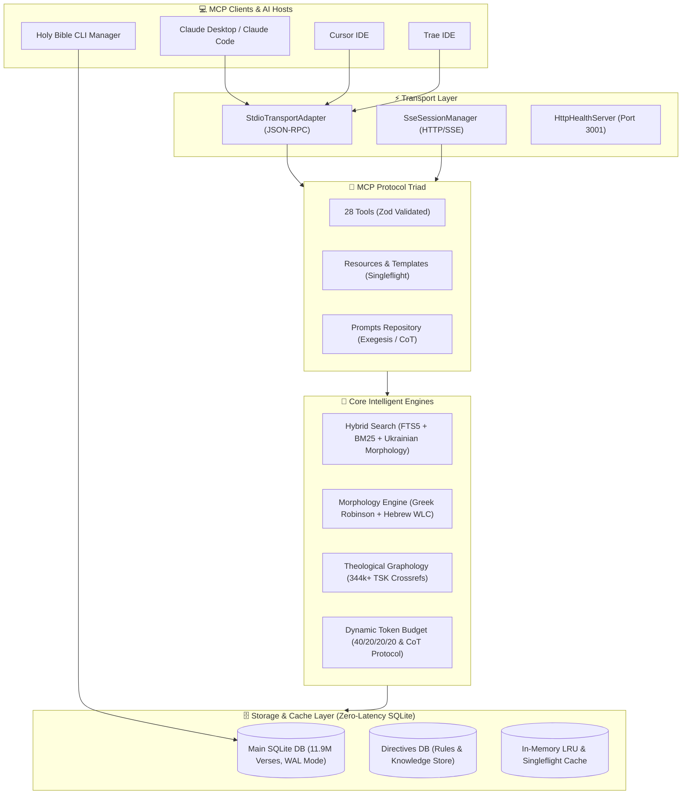

# 📖 Multilingual Holy Bible MCP Server v2.0

[](https://modelcontextprotocol.io)
[](https://www.npmjs.com/package/@grizlizora/holy-bible-mcp)
[](LICENSE)
[](#supported-languages)
[](#database-specifications)
[](#-cross-platform--architecture-support)
[](https://github.com/grizlizora/holy-bible-mcp/actions/workflows/ci.yml)
[](#-automated-testing--ci)

A high-performance, **100% offline**, zero-latency **Model Context Protocol (MCP) Server** and **CLI Database Manager** that connects any LLM (Claude 3.7, GPT-4o, Gemini 2.0, DeepSeek-R1, Llama 3, Qwen) to **11,907,047 Biblical verses** across **1,081 translations** in **800+ languages**.

Equipped with the complete **MCP Protocol Triad** (`Tools`, `Resources`, `Prompts`), dual transport (`Stdio` + `SSE`), **100% SQLite-driven architecture**, Hebrew/Greek Robinson morphology, 344k+ TSK cross-reference graph, Trench's synonyms, and 15-translation parallel corpus diff engine.

---

## 🏗️ System Architecture & Data Flow



---

## 🖥️ CLI Database Manager (Universal Terminal Commands)

Manage the offline 5.88 GB SQLite Bible database directly from your terminal across any OS. The database is stored globally in `~/.bible-mcp/` and shared across **all** your IDEs (Trae, Cursor, Claude Desktop, Claude Code) with zero duplicate storage.

| Command | NPX (Zero-Install) | Local Monorepo | Description |
|:---|:---|:---|:---|
| **Download Database** | `npx @grizlizora/holy-bible-mcp download-db` | `npm run db:download` | Resumable download with HTTP Range header, EMA progress bar & multi-mirror race |
| **Clean / Delete Database** | `npx @grizlizora/holy-bible-mcp delete-db` | `npm run db:clean` | Safely removes `.sqlite`, `-wal`, `-shm`, `.part`, `.tmp` with disk space freed report |
| **Check Database Status** | `npx @grizlizora/holy-bible-mcp db-status` | `npm run db:status` | Validates SQLite integrity, size, canonical verses, and tests mirror latency |
| **Verify Integrity** | `npx @grizlizora/holy-bible-mcp verify-db` | `npm run db:verify` | Performs deep `PRAGMA quick_check(1)` and schema verification |

### CLI Options & Flags:
```bash
# Force fresh download or overwrite existing corrupted files
npx @grizlizora/holy-bible-mcp download-db --force

# Specify a custom target directory
npx @grizlizora/holy-bible-mcp download-db --dir /Volumes/ExternalSSD/bible-data

# Delete database without interactive confirmation (CI/CD / automation)
npx @grizlizora/holy-bible-mcp delete-db --yes
```

---

## 💻 Cross-Platform & Architecture Support

Holy Bible MCP 2.0 is built with pure standard Node.js APIs and pre-compiled native SQLite binaries. It runs seamlessly with **0 configuration** across:

* **Operating Systems**:
  * 🍏 **macOS** (macOS 12+ Monterey, Ventura, Sonoma, Sequoia)
  * 🐧 **Linux** (Ubuntu, Debian, Fedora, Arch, Alpine, RHEL)
  * 🪟 **Windows** (Windows 10, 11, Server via PowerShell / CMD / WSL2)
* **CPU Architectures**:
  * ⚡ **ARM64 / AArch64** (Apple Silicon M1/M2/M3/M4, AWS Graviton, Raspberry Pi 4/5)
  * ⚡ **x86_64 / AMD64** (Intel Core / Xeon, AMD Ryzen / EPYC)

### Global Database Path Resolution:
1. **macOS / Linux**: `/Users/<user>/.bible-mcp/bible_database.sqlite` (or `/home/<user>/.bible-mcp/bible_database.sqlite`)
2. **Windows**: `C:\Users\<user>\.bible-mcp\bible_database.sqlite` (via `%USERPROFILE%`)
3. **Custom Env**: Set `BIBLE_DB_PATH=/path/to/bible_database.sqlite` to override globally.

> **💡 Hot-Mounting Support:** If your IDE is already running when you execute `download-db`, the server automatically detects the new database on disk within 2.5s and hot-mounts it without restarting the IDE.

---

## 🚀 Quick Start — IDE & Agent Configurations

Add the server to your MCP client configuration file:

### 1. Trae IDE (`.trae/trae.mcp.json` or Global Settings)
```json
{
  "mcpServers": {
    "holy-bible-mcp": {
      "command": "npx",
      "args": ["-y", "@grizlizora/holy-bible-mcp"],
      "env": {
        "MODES_CONTROL": "on",
        "WARMTH_CONTROL": "on",
        "SHOW_METRICS": "on",
        "DEFAULT_MODE": "auto",
        "DEFAULT_WARMTH": "80"
      },
      "autoApprove": [
        "ask_holy_bible",
        "search_keyword",
        "get_verse",
        "get_chapter_context",
        "get_commentary",
        "get_strongs_definition",
        "get_strongs_etymology",
        "analyze_greek_hebrew_word",
        "search_semantic",
        "search_topic",
        "search_scripture_hybrid",
        "get_cross_references",
        "find_thematic_scripture_chain",
        "get_prophecy_fulfillment_pairs",
        "find_scriptures_by_life_situation",
        "get_parallel_verses",
        "compare_translations_diff",
        "get_translation_metadata",
        "get_interlinear_verse",
        "set_relevance_sensitivity",
        "set_response_mode",
        "set_show_metrics",
        "get_mcp_capabilities",
        "get_model_recommendations",
        "extract_vector_context",
        "build_biblical_context",
        "sanitize_scripture_markdown",
        "get_p2p_swarm_status"
      ]
    }
  }
}
```

### 2. Cursor IDE (`.cursor/mcp.json`)
```json
{
  "mcpServers": {
    "holy-bible-mcp": {
      "command": "npx",
      "args": ["-y", "@grizlizora/holy-bible-mcp"],
      "env": {
        "MODES_CONTROL": "on",
        "WARMTH_CONTROL": "on",
        "SHOW_METRICS": "on",
        "DEFAULT_MODE": "auto",
        "DEFAULT_WARMTH": "80"
      }
    }
  }
}
```

### 3. Claude Desktop (`claude_desktop_config.json`)
* **macOS:** `~/Library/Application Support/Claude/claude_desktop_config.json`
* **Windows:** `%APPDATA%\Claude\claude_desktop_config.json`
```json
{
  "mcpServers": {
    "holy-bible-mcp": {
      "command": "npx",
      "args": ["-y", "@grizlizora/holy-bible-mcp"],
      "env": {
        "MODES_CONTROL": "on",
        "WARMTH_CONTROL": "on",
        "SHOW_METRICS": "on",
        "DEFAULT_MODE": "auto",
        "DEFAULT_WARMTH": "80"
      }
    }
  }
}
```

---

## ⚙️ Environment Variables & Tuning

Customize server behavior by passing environment variables in the `env` block:

| Variable | Values | Default | Description |
|:---|:---|:---|:---|
| **`DEFAULT_MODE`** | `"auto"`, `"deep"`, `"detailed"`, `"verses_only"`, `"minimal"`, `"off"` | `"auto"` | **Analytical Depth:** Controls response structure. Set to `"off"` to disable forced formatting directives. |
| **`DEFAULT_WARMTH`** | `0`–`100` or `"off"` | `"80"` | **Pastoral Warmth:** `80-100` (Pastoral empathy), `40-79` (Balanced), `0-39` or `"off"` (Strict academic neutrality). |
| **`SHOW_METRICS`** | `"on"`, `"off"` | `"on"` | **Telemetry Badge:** Shows/hides the accuracy and complexity badge at the bottom of responses. |
| **`MODES_CONTROL`** | `"on"`, `"off"` | `"on"` | Allows LLMs to dynamically switch modes via `set_response_mode`. Set to `"off"` to lock mode. |
| **`WARMTH_CONTROL`** | `"on"`, `"off"` | `"on"` | Allows LLMs to dynamically adjust warmth via `set_relevance_sensitivity`. Set to `"off"` to lock warmth. |
| **`BIBLE_DB_PATH`** | File Path | `~/.bible-mcp/...` | Optional explicit path to the 5.88 GB SQLite database file. |

---

## 🛠 Available MCP Tools

| Tool | Parameters | Description |
|:---|:---|:---|
| `ask_holy_bible` | `question`, `language`, `mode` | **Master Tool**: Canonical answers with verified scripture anchors and theological directives |
| `get_interlinear_verse` | `book`, `chapter`, `verse`, `parallel_translation` | Word-by-word Hebrew (WLC) / Greek (NA28) interlinear with morphology and Strong's |
| `get_strongs_etymology` | `strongs_id` (e.g. `G26`, `H1254`) | Strong's Concordance, BDB/Thayer definitions, and Trench's Synonyms distinctions |
| `get_cross_references` | `book`, `chapter`, `verse`, `max_results` | Top-ranked theological cross-references from 344k+ TSK graph with anti-flooding filter |
| `find_thematic_scripture_chain`| `theme`, `starting_verse` | Traces progressive revelation across covenants (e.g. *Living Water*, *Seed of Faith*) |
| `get_prophecy_fulfillment_pairs` | `topic` | Matched OT Messianic Prophecies and their NT Historical Fulfillments in Christ |
| `search_scripture_hybrid` | `query`, `language`, `mode`, `top_k` | Hybrid search combining FTS5 BM25, Ukrainian morphology stemming, and vector RRF |
| `find_scriptures_by_life_situation` | `situation_description`, `emotion`, `language` | Pastoral counseling matcher for real-world emotional struggles (anxiety, grief, burnout) |
| `get_parallel_verses` | `book`, `chapter`, `verse`, `translations` | Aligns scripture across 15 translations (UBIO, UKRK, UTT, KJV, BSB, WLC, NA28, etc.) |
| `compare_translations_diff` | `book`, `chapter`, `verse`, `base_translation`, `target_translation` | Token-level Myers LCS Diff analysis comparing translations and translation philosophies |
| `get_translation_metadata` | `translation_id` | Metadata, translation philosophy (Formal vs Dynamic), and textual basis |
| `search_keyword` | `keyword`, `translation`, `limit` | Ultra-fast FTS5 full-text search across 11.9M verses |
| `get_verse` | `book`, `chapter`, `verse`, `language` | Retrieve exact verse by reference |
| `get_chapter_context` | `book`, `chapter`, `language` | Retrieve entire chapter context |
| `extract_vector_context` | `query`, `full_text`, `max_tokens` | Hierarchical chunker and vector reasoning over large attachments |
| `get_model_recommendations` | `model_name`, `parameter_size_b` | Adaptive sampling parameters (min_p, temperature, top_p, num_ctx) |

---

## 📜 Available MCP Resources

Access biblical content via standard RFC 6570 URIs:
* `bible://{translation}/{book}/{chapter}` — Read entire chapter (e.g. `bible://ubio/GEN/1`, `bible://kjv/JHN/3`, `bible://web/PSA/23`).
* `bible://strongs/{number}` — Strong's Concordance article (e.g. `bible://strongs/G26` for *Agape*, `bible://strongs/H1254` for *Bara*).
* `bible://crossref/{book}/{chapter}/{verse}` — Cross-reference network (e.g. `bible://crossref/JHN/3/16`).
* `bible://interlinear/{book}/{chapter}/{verse}` — Word-by-word interlinear text with morphology.

---

## 💬 Available MCP Prompts

* `theological_exegesis` — Historical-grammatical exegesis workflow with original language nuances.
* `pastoral_devotional` — Empathetic, Christ-centered pastoral encouragement tailored to life trials.
* `parallel_translation_comparison` — Manuscript and linguistic comparison across Bible translations.
* `original_languages_deep_dive` — Exhaustive Greek/Hebrew word study with Strong's etymology.
* `holy_bible_study` — Tier-calibrated Biblical study system prompt with 4-part canonical trajectory.
* `biblical_guidance_prompt` — Moral worldview guidance grounded in the 3 Eternal Moral Axioms.

---

## 🧪 Automated Testing & CI

The project uses **Vitest** for fast unit testing of morphology engines, token budgeters, Zod schemas, and SQLite directives:

```bash
# Run complete test suite once
npm test

# Run tests in watch mode during development
npm run test:watch
```

CI workflow automatically tests all Pull Requests and commits across **Ubuntu, macOS, and Windows** on **Node.js 18, 20, and 22**.

---

## 💻 Local Monorepo Setup & Build

```bash
# 1. Clone the repository
git clone https://github.com/grizlizora/holy-bible-mcp.git
cd holy-bible-mcp

# 2. Install dependencies & build TypeScript
npm install
npm run build

# 3. Run unit tests
npm test

# 4. (Optional) Download offline database
npm run db:download
```

---

## 📄 License

Licensed under the [MIT License](LICENSE). Free for open-source, commercial, and personal AI integration.
