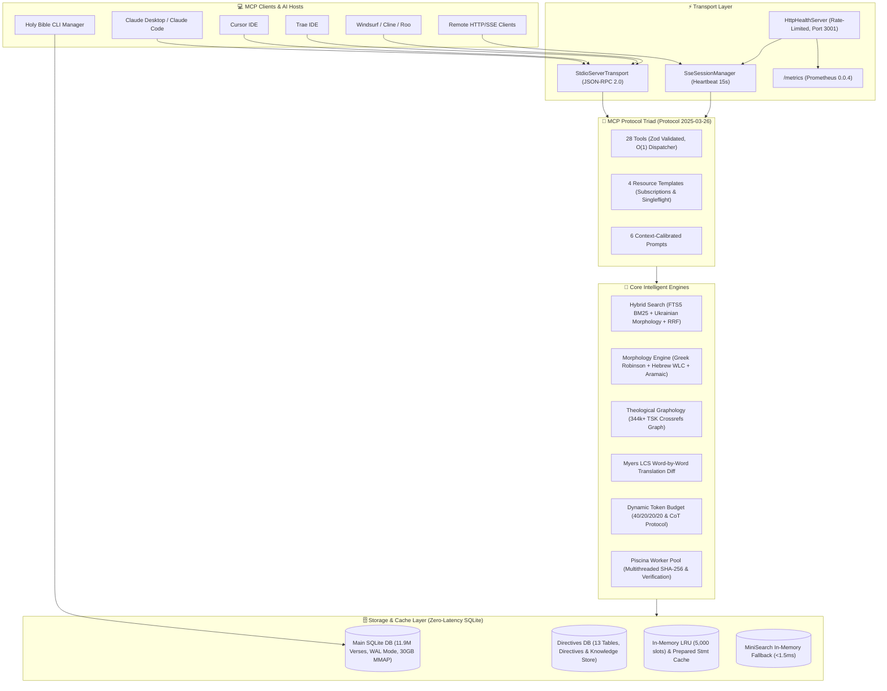

# 📖 Multilingual Holy Bible MCP Server v2.0

[](https://modelcontextprotocol.io)
[](https://www.npmjs.com/package/@grizlizora/holy-bible-mcp)
[](LICENSE)
[](#-supported-languages--database-specifications)
[](#-supported-languages--database-specifications)
[](#-cross-platform--architecture-support)
[](#-automated-testing--ci)

A high-performance, **100% offline**, zero-latency **Model Context Protocol (MCP) Server** and **CLI Database Manager** that connects any LLM (Claude 3.7, GPT-4o, Gemini 2.0, DeepSeek-R1, Llama 3.3, Qwen 2.5) to **11,907,047 Biblical verses** across **1,081 translations** in **800+ languages**.

Equipped with the complete **MCP Protocol Triad** (`Tools`, `Resources`, `Prompts`), dual transport (`Stdio` + `SSE`), **100% SQLite-driven architecture** (Multi-connection Pool, WAL Mode), Hebrew/Greek Robinson morphology, 344k+ TSK cross-reference graph, Trench's synonyms, and 15-translation parallel corpus diff engine.

---

## 📑 Table of Contents

- [🏗️ System Architecture & Data Flow](#️-system-architecture--data-flow)
- [✨ Key Technical Features](#-key-technical-features)
- [🌐 Supported Languages & Database Specifications](#-supported-languages--database-specifications)
- [💻 Cross-Platform & Architecture Support](#-cross-platform--architecture-support)
- [🖥️ CLI Database Manager](#️-cli-database-manager)
- [🚀 Quick Start — IDE & Client Configurations](#-quick-start--ide--client-configurations)
  - [1. Trae IDE](#1-trae-ide)
  - [2. Cursor IDE](#2-cursor-ide)
  - [3. Claude Desktop](#3-claude-desktop)
  - [4. Claude Code CLI](#4-claude-code-cli)
  - [5. Windsurf / Cline / Roo-Code](#5-windsurf--cline--roo-code)
  - [6. Remote SSE Mode (Open-WebUI / Ollama / Docker)](#6-remote-sse-mode-open-webui--ollama--docker)
- [🛠️ Complete MCP Tools Catalog (28 Tools)](#️-complete-mcp-tools-catalog-28-tools)
- [📜 MCP Resources & RFC 6570 Templates](#-mcp-resources--rfc-6570-templates)
- [💬 MCP Prompts Repository (6 Calibrated Workflows)](#-mcp-prompts-repository-6-calibrated-workflows)
- [⚙️ Environment Variables & Tuning](#️-environment-variables--tuning)
- [🧠 Adaptive Model Budgeting & CoT Protocol](#-adaptive-model-budgeting--cot-protocol)
- [🔒 Enterprise Security & Reliability](#-enterprise-security--reliability)
- [🧪 Automated Testing & CI](#-automated-testing--ci)
- [💻 Local Monorepo Setup & Build](#-local-monorepo-setup--build)
- [📄 License](#-license)

---

## 🏗️ System Architecture & Data Flow



---

## ✨ Key Technical Features

1. **Complete Protocol Triad with Modern Tool Annotations**: Full implementation of MCP Tools (with `{ readOnlyHint: true, idempotentHint: true }` annotations), Resources (with active subscriptions & `list_changed` / `updated` notifications), and System Prompts.
2. **Zero-Latency SQLite Architecture**:
   - High-concurrency **Multi-connection Pool** (`better-sqlite3`) in **WAL Mode**.
   - **Zero-Copy Memory-Mapped I/O**: `PRAGMA mmap_size = 2147483648` (2 GB) for instant page reads directly from OS memory.
   - **Multi-threaded Execution**: `PRAGMA threads = 4` and `PRAGMA synchronous = NORMAL`.
   - **SARGable B-Tree Seek Indexing**: Sub-millisecond verse lookups (<0.5ms) without table scans.
   - **Bounded 64 MB LRU Query Cache**: `lru-cache` with byte-aware tracking, 2,000 entries max, and 10-minute TTL (eliminates RAM leaks).
   - Dedicated `data/directives.sqlite` database loaded at boot in **<5ms**.
   - Hot-mounting detection: detects newly downloaded databases in **2.5s** with live MCP notification broadcasts.
3. **Piscina Multithreading Worker Pool**: CPU-intensive operations (multithreaded SHA-256 chunk hashing, integrity inspection, graph analysis) run on lazy on-demand worker threads (`minThreads: 0`), saving **~80 MB RAM** at idle.
4. **Scholarly Linguistic Engines**:
   - **Greek Robinson Parser**: Decodes tense, voice, mood, case, number, and gender with dedicated Greek LRU cache.
   - **Hebrew & Aramaic WLC Parser**: BDB definitions, Strong's Concordance canonical lemmas (`CANONICAL_STRONGS_OFFLINE`), and Trench's Synonyms distinctions.
   - **Myers LCS Word Diff Engine**: Token-level alignment comparing translation philosophies (Formal vs Dynamic Equivalence).
5. **Hybrid Search with RRF**:
   - SQLite FTS5 with BM25 ranking.
   - Ukrainian morphological stemmer with inverted `O(1)` irregular maps.
   - Reciprocal Rank Fusion (RRF) combining lexical, topical, and theological context.
   - Instant in-memory `MiniSearch` fallback ($<1.5$ ms).
6. **Enterprise Security & DoS Protection**:
   - **4 MB Request Payload Limit**: Strict body buffering on `/messages` and `/sse` with `413 Payload Too Large`.
   - **Bounded Sliding-Window Rate Limiter**: 120 req/min capped at 10,000 IPs with automatic purge.
   - **Constant-Time Authentication**: `crypto.timingSafeEqual` prevents timing side-channel attacks on `MCP_AUTH_TOKEN`.
   - **Path Traversal & SSRF Guards**: `delete-db` and `verify-db` path normalization restricted to `bible_database.sqlite*`; custom mirrors block loopback and private RFC 1918 subnets.
   - **30-Second Reconnection Grace Period**: Transient SSE disconnects do not kill the session, eliminating premature 404s.
   - Enterprise security headers: `X-Content-Type-Options: nosniff`, `X-Frame-Options: DENY`, `Strict-Transport-Security`.
   - 100% Parameterized SQL queries (zero SQL injection surface).
7. **Adaptive Context & CoT Budgeting**:
   - Auto-calibrates prompt complexity, output word budgets, and Chain-of-Thought thinking budgets for 1B, 3B, 8B, 70B+, and frontier models (Claude 3.7, DeepSeek-R1, GPT-4o, Gemini 2.0).

---

## 🌐 Supported Languages & Database Specifications

The offline SQLite database contains canonical biblical corpora across 800+ languages with full OSIS book mapping:

| Language Group | Code | Core Translations | Textual Basis & Philosophy |
|:---|:---|:---|:---|
| **Ukrainian** | `ukr` | **UBIO** (Огієнко 1962), **UKRK** (Куліш 1903), **UTT** (Турконяк 2011), **UKRH** (Хоменко 1963), **CUV** (Сучасний) | Formal Equivalence / Textus Receptus & Critical Text |
| **English** | `eng` | **KJV** (King James Version), **BSB** (Berean Standard), **ESV**, **NIV**, **ASV**, **WEB** | Formal Equivalence (KJV, BSB, ESV) / Dynamic (NIV) |
| **Original Greek** | `grc` / `ell` | **NA28** (Nestle-Aland 28th), **TR** (Textus Receptus 1550), **LXX** (Septuagint) | Byzantine Majority Text & Alexandrian Critical Text |
| **Original Hebrew** | `heb` | **WLC** (Westminster Leningrad Codex), **BHS** (Biblia Hebraica Stuttgartensia) | Masoretic Text (MT) with Strong's Concordance |
| **Latin** | `lat` | **VUL** (Biblia Sacra Vulgata Clementina) | Jerome Vulgate Tradition |
| **Global Languages** | `deu`, `fra`, `spa`, `zho`, `jpn`, `kor`, `ara`, +790 more | **LUT** (Luther 1912), **LSG** (Louis Segond), **RVR** (Reina-Valera 1909), **CUV** (Chinese Union) | Major National Canonical Standard Translations |

### 📊 Database Volume Specifications:
- **Total Canonical Verses:** 11,907,047 verses
- **Total Translations:** 1,081 translations
- **Cross-Reference Edges:** 344,000+ Treasury of Scripture Knowledge (TSK) links
- **Strong's Dictionary Entries:** 8,674 Hebrew and Greek lexical roots with definitions
- **Storage Footprint:** ~5.88 GB (Single compact SQLite file with FTS5 and WAL mode)

---

## 💻 Cross-Platform & Architecture Support

Holy Bible MCP 2.0 is built with pure standard Node.js APIs and pre-compiled native SQLite binaries. It runs seamlessly with **0 configuration** across:

* **Operating Systems**:
  * 🍏 **macOS** (macOS 12+ Monterey, Ventura, Sonoma, Sequoia)
  * 🐧 **Linux** (Ubuntu, Debian, Fedora, Arch, Alpine, RHEL)
  * 🪟 **Windows** (Windows 10, 11, Server via PowerShell / CMD / WSL2)
* **CPU Architectures**:
  * ⚡ **ARM64 / AArch64** (Apple Silicon M1/M2/M3/M4, AWS Graviton, Raspberry Pi 4/5)
  * ⚡ **x86_64 / AMD64** (Intel Core / Xeon, AMD Ryzen / EPYC)

### Global Database Path Resolution:
1. **macOS / Linux**: `/Users/<user>/.bible-mcp/bible_database.sqlite` (or `/home/<user>/.bible-mcp/bible_database.sqlite`)
2. **Windows**: `C:\Users\<user>\.bible-mcp\bible_database.sqlite` (via `%USERPROFILE%`)
3. **Custom Env**: Set `BIBLE_DB_PATH=/path/to/bible_database.sqlite` to override globally.

> **💡 Hot-Mounting Support:** If your IDE is already running when you execute `download-db`, the server automatically detects the new database on disk within 2.5s and hot-mounts it without restarting the IDE.

---

## 🖥️ CLI Database Manager

Manage the offline 5.88 GB SQLite Bible database directly from your terminal across any OS. The database is stored globally in `~/.bible-mcp/` and shared across **all** your IDEs (Trae, Cursor, Claude Desktop, Claude Code) with zero duplicate storage.

| Command | NPX (Zero-Install) | Local Monorepo | Description |
|:---|:---|:---|:---|
| **Download Database** | `npx @grizlizora/holy-bible-mcp download-db` | `npm run db:download` | Resumable download with HTTP Range header, EMA progress bar & multi-mirror race |
| **Clean / Delete Database** | `npx @grizlizora/holy-bible-mcp delete-db` | `npm run db:clean` | Safely removes `.sqlite`, `-wal`, `-shm`, `.part`, `.tmp` with disk space freed report |
| **Check Database Status** | `npx @grizlizora/holy-bible-mcp db-status` | `npm run db:status` | Validates SQLite integrity, size, canonical verses, and tests mirror latency |
| **Verify Integrity** | `npx @grizlizora/holy-bible-mcp verify-db` | `npm run db:verify` | Performs deep `PRAGMA quick_check(1)` and schema verification |

### CLI Options & Flags:

```bash
# Force fresh download or overwrite existing corrupted files
npx @grizlizora/holy-bible-mcp download-db --force

# Perform deep multithreaded SHA-256 validation via Piscina Worker Pool
npx @grizlizora/holy-bible-mcp verify-db --checksum

# Specify a custom target directory
npx @grizlizora/holy-bible-mcp download-db --dir /Volumes/ExternalSSD/bible-data

# Delete database without interactive confirmation (CI/CD / automated scripts)
npx @grizlizora/holy-bible-mcp delete-db --yes
```

---

## 🚀 Quick Start — IDE & Client Configurations

### 1. Trae IDE
Add to `.trae/trae.mcp.json` or Global Settings:
```json
{
  "mcpServers": {
    "holy-bible-mcp": {
      "command": "npx",
      "args": ["-y", "@grizlizora/holy-bible-mcp"],
      "env": {
        "MODES_CONTROL": "on",
        "WARMTH_CONTROL": "on",
        "SHOW_METRICS": "on",
        "DEFAULT_MODE": "auto",
        "DEFAULT_WARMTH": "80"
      },
      "autoApprove": [
        "ask_holy_bible",
        "build_biblical_context",
        "search_keyword",
        "search_scripture_hybrid",
        "search_semantic",
        "search_topic",
        "find_scriptures_by_life_situation",
        "get_verse",
        "get_chapter_context",
        "get_parallel_verses",
        "compare_translations_diff",
        "get_translation_metadata",
        "get_interlinear_verse",
        "get_strongs_definition",
        "get_strongs_etymology",
        "analyze_greek_hebrew_word",
        "get_commentary",
        "get_cross_references",
        "find_thematic_scripture_chain",
        "get_prophecy_fulfillment_pairs",
        "set_relevance_sensitivity",
        "set_response_mode",
        "set_show_metrics",
        "get_p2p_swarm_status",
        "get_mcp_capabilities",
        "get_model_recommendations",
        "extract_vector_context",
        "sanitize_scripture_markdown"
      ]
    }
  }
}
```

### 2. Cursor IDE
Add to `.cursor/mcp.json`:
```json
{
  "mcpServers": {
    "holy-bible-mcp": {
      "command": "npx",
      "args": ["-y", "@grizlizora/holy-bible-mcp"],
      "env": {
        "MODES_CONTROL": "on",
        "WARMTH_CONTROL": "on",
        "SHOW_METRICS": "on",
        "DEFAULT_MODE": "auto",
        "DEFAULT_WARMTH": "80"
      }
    }
  }
}
```

### 3. Claude Desktop
Add to `claude_desktop_config.json`:
- **macOS:** `~/Library/Application Support/Claude/claude_desktop_config.json`
- **Windows:** `%APPDATA%\Claude\claude_desktop_config.json`
```json
{
  "mcpServers": {
    "holy-bible-mcp": {
      "command": "npx",
      "args": ["-y", "@grizlizora/holy-bible-mcp"],
      "env": {
        "MODES_CONTROL": "on",
        "WARMTH_CONTROL": "on",
        "SHOW_METRICS": "on",
        "DEFAULT_MODE": "auto",
        "DEFAULT_WARMTH": "80"
      }
    }
  }
}
```

### 4. Claude Code CLI
```bash
claude mcp add holy-bible-mcp -- npx -y @grizlizora/holy-bible-mcp
```

### 5. Windsurf / Cline / Roo-Code
Add to your extension MCP settings:
```json
{
  "mcpServers": {
    "holy-bible-mcp": {
      "command": "node",
      "args": ["/path/to/holy-bible/build/index.js"]
    }
  }
}
```

### 6. Remote SSE & Cloud Deployment (Render / Open-WebUI / Ollama / Docker)

#### 🌐 Live Cloud Service (Render)
Holy Bible MCP 2.0 is deployed and live in the cloud:
* **Primary URL**: [https://holy-bible-vgaf.onrender.com](https://holy-bible-vgaf.onrender.com)
* **Remote SSE Endpoint**: `https://holy-bible-vgaf.onrender.com/sse`
* **Streamable MCP Endpoint**: `https://holy-bible-vgaf.onrender.com/mcp`
* **Health / Status**: `https://holy-bible-vgaf.onrender.com/health`
* **Prometheus Metrics**: `https://holy-bible-vgaf.onrender.com/metrics`
* **Smithery Server Card**: `https://holy-bible-vgaf.onrender.com/server-card.json`

#### 💻 Self-Hosted Remote SSE Service
Run the server on your own server or Docker container:
```bash
# Start server in remote SSE mode on port 3001
MCP_TRANSPORT=sse MCP_PORT=3001 MCP_AUTH_TOKEN="your-secure-token" npx @grizlizora/holy-bible-mcp
```
Connect your remote client to `http://localhost:3001/sse` (or your Render URL) with Authorization header `Bearer your-secure-token`.

---

## 🛠️ Complete MCP Tools Catalog (28 Tools)

All tools use **Zod schemas** with runtime coercion, lenient argument normalization, and $O(1)$ dispatching.

### 🌟 1. Master & Context Tools
| Tool | Arguments | Description |
|:---|:---|:---|
| `ask_holy_bible` | `question`, `language`, `mode`, `warmth`, `parameter_size_b` | **Master Tool**: Canonical answers with verified scripture anchors, theological directives, and telemetry. |
| `build_biblical_context` | `question`, `mode`, `language`, `warmth` | Builds structured theological context for external LLM prompt composition. |

### 🔍 2. Search & Retrieval Tools
| Tool | Arguments | Description |
|:---|:---|:---|
| `search_keyword` | `keyword`, `translation`, `language`, `limit` | Ultra-fast SQLite FTS5 full-text search across 11.9M verses. |
| `search_scripture_hybrid` | `query`, `language`, `mode`, `top_k` | Hybrid search combining FTS5 BM25, Ukrainian morphology stemming, and vector RRF. |
| `search_semantic` | `concept` | Matches conceptual and doctrinal keywords against semantic theological indices. |
| `search_topic` | `topic`, `limit` | Finds top passages associated with specific theological topics. |
| `find_scriptures_by_life_situation` | `situation_description`, `emotion`, `language` | Pastoral counseling matcher for real-world emotional struggles (anxiety, grief, burnout). |

### 📖 3. Verse & Chapter Tools
| Tool | Arguments | Description |
|:---|:---|:---|
| `get_verse` | `book`, `chapter`, `verse`, `reference`, `language` | Retrieves exact verse or verse range by reference with OSIS normalization. |
| `get_chapter_context` | `book`, `chapter`, `language` | Retrieves entire chapter context formatted for LLM reading. |
| `get_parallel_verses` | `book`, `chapter`, `verse`, `translations`, `lang` | Aligns scripture across 15 translations (UBIO, UKRK, UTT, KJV, BSB, WLC, NA28, etc.). |
| `compare_translations_diff` | `book`, `chapter`, `verse`, `base_translation`, `target_translation` | Token-level Myers LCS Diff analysis comparing translations and translation philosophies. |
| `get_translation_metadata` | `translation_id` | Metadata, translation philosophy (Formal vs Dynamic), year, and textual basis. |

### 🏛️ 4. Morphology & Original Languages Tools
| Tool | Arguments | Description |
|:---|:---|:---|
| `get_interlinear_verse` | `book`, `chapter`, `verse`, `parallel_translation` | Word-by-word Hebrew (WLC) / Greek (NA28) interlinear with morphology and Strong's mapping. |
| `get_strongs_definition` | `word_id` (e.g. `G26`, `H1254`) | Strong's Concordance lexical lemma, transliteration, pronunciation, and definition. |
| `get_strongs_etymology` | `strongs_id`, `word` | Detailed etymological study, BDB/Thayer definitions, and Trench's Synonyms distinctions. |
| `analyze_greek_hebrew_word` | `word` | Linguistic and morphological breakdown of specific original language lemmas. |

### ⚓ 5. Theological & Graphology Tools
| Tool | Arguments | Description |
|:---|:---|:---|
| `get_commentary` | `book`, `chapter`, `verse` | Early Church Fathers (Patristic) and historical theological commentaries. |
| `get_cross_references` | `book`, `chapter`, `verse`, `category`, `max_results` | Top-ranked cross-references from 344k+ TSK graph with anti-flooding filters. |
| `find_thematic_scripture_chain` | `theme`, `starting_verse` | Traces progressive revelation across biblical covenants (e.g. *Living Water*, *Seed of Faith*). |
| `get_prophecy_fulfillment_pairs` | `topic` | Matched OT Messianic Prophecies and their NT Historical Fulfillments in Christ. |

### ⚙️ 6. System & Adaptive Configuration Tools
| Tool | Arguments | Description |
|:---|:---|:---|
| `set_relevance_sensitivity` | `score` (0–100) | Adjusts pastoral warmth and empathy level in real time. |
| `set_response_mode` | `mode` (`auto`, `deep`, `detailed`, `minimal`, `verses_only`) | Changes active analytical detail level. |
| `set_show_metrics` | `enabled` (boolean / "on" / "off") | Toggles the end-of-response accuracy and complexity badge. |
| `get_p2p_swarm_status` | *(none)* | Inspects local database storage, BitTorrent mesh status, and mirror health. |
| `get_mcp_capabilities` | `client_host`, `client_name` | Returns server capabilities, active settings metadata, and versioning. |
| `get_model_recommendations` | `model_name`, `parameter_size_b`, `user_message`, `warmth` | Adaptive sampling parameters (`temperature`, `min_p`, `top_p`, `num_ctx`, `num_predict`). |
| `extract_vector_context` | `query`, `full_text`, `max_tokens`, `filename` | Hierarchical chunker and vector reasoning over large attachments. |
| `sanitize_scripture_markdown` | `markdown_text` | Normalizes and sanitizes scripture citations in generated Markdown. |

---

## 📜 MCP Resources & RFC 6570 Templates

Access biblical content via standard RFC 6570 URIs with **Singleflight de-duplication** and **LRU caching**:

| URI Template | Name | MIME Type | Example |
|:---|:---|:---|:---|
| `bible://{translation}/{book}/{chapter}` | Canonical Chapter Reader | `text/markdown` | `bible://ubio/GEN/1`, `bible://kjv/JHN/3` |
| `bible://strongs/{strongsId}` | Strong's Concordance Article | `application/json` | `bible://strongs/G26`, `bible://strongs/H1254` |
| `bible://crossref/{book}/{chapter}/{verse}` | Cross-Reference Network | `application/json` | `bible://crossref/JHN/3/16` |
| `bible://interlinear/{book}/{chapter}/{verse}` | Original Language Interlinear | `application/json` | `bible://interlinear/GEN/1/1` |

---

## 💬 MCP Prompts Repository (6 Calibrated Workflows)

| Prompt | Required Arguments | Description |
|:---|:---|:---|
| `theological_exegesis` | `topic_or_verse` | Historical-Grammatical & Canonical Exegesis workflow with original language nuances. |
| `pastoral_devotional` | `life_situation` | Empathetic, Christ-centered pastoral encouragement tailored to trials. |
| `parallel_translation_comparison` | `verse` | Manuscript traditions (TR vs NA28) and linguistic comparison across translations. |
| `original_languages_deep_dive` | `query` (Strong ID / Lemma) | Exhaustive Greek/Hebrew word study with lexical range and LXX usage. |
| `holy_bible_study` | `topic` | Tier-calibrated Biblical study prompt with 4-part canonical trajectory. |
| `biblical_guidance_prompt` | `question` | Moral worldview guidance grounded in the 3 Eternal Moral Axioms. |

---

## ⚙️ Environment Variables & Tuning

| Variable | Values | Default | Description |
|:---|:---|:---|:---|
| `DEFAULT_MODE` | `"auto"`, `"deep"`, `"detailed"`, `"short"`, `"verses_only"`, `"minimal"`, `"off"` | `"auto"` | **Analytical Depth:** Controls response structure. Set to `"off"` to disable forced formatting. |
| `DEFAULT_WARMTH` | `0`–`100` or `"off"` | `"80"` | **Pastoral Warmth:** `80-100` (Empathetic), `40-79` (Balanced), `0-39` or `"off"` (Academic neutrality). |
| `SHOW_METRICS` | `"on"`, `"off"` | `"on"` | **Telemetry Badge:** Shows/hides accuracy and complexity footer. |
| `MODES_CONTROL` | `"on"`, `"off"` | `"on"` | Allows LLMs to dynamically switch modes via `set_response_mode`. |
| `WARMTH_CONTROL` | `"on"`, `"off"` | `"on"` | Allows LLMs to dynamically adjust warmth via `set_relevance_sensitivity`. |
| `BIBLE_DB_PATH` | File Path | `~/.bible-mcp/...` | Custom location for the 5.88 GB SQLite database file. |
| `MCP_TRANSPORT` | `"stdio"`, `"sse"`, `"dual"` | `"stdio"` | Server transport mode. |
| `MCP_PORT` / `PORT` | Number | `3001` | HTTP/SSE server listening port. |
| `MCP_AUTH_TOKEN` | String | `""` | Optional Bearer token for SSE remote endpoints. |

---

## 🧠 Adaptive Model Budgeting & CoT Protocol

The server dynamically profiles the connected AI model and adjusts prompts according to model capacity:

```
[Tier 1: <4B]    ──> Compact context (<4k), strict token budget, no CoT thinking block
[Tier 1.5: 4-8.5B] ──> Balanced context (<8k), medium detail, 500 chars CoT
[Tier 2: 8.5-35B]  ──> Comprehensive context (<16k), deep detail, 1,500 chars CoT
[Tier 3: 35B+]   ──> Maximum context (32k+), unrestricted deep exegesis, 6,000+ chars CoT
```

### The 4-Part Canonical Trajectory:
When responding to worldview, ethical, and life questions, prompts enforce the canonical structure:
1. 📖 **Сутність та якір (Core Essence & Anchor)** — Primary scripture foundation.
2. ⚙️ **Духовний механізм (Internal Mechanism)** — How divine truth operates internally.
3. 🌿 **Практичний вияв (Practical Manifestation)** — Real-world daily application.
4. 🕊️ **Вічний плід (Ultimate Fruit)** — Eternal redemptive significance.

---

## 🔒 Enterprise Security & Reliability

- **4 MB Request Payload Limit**: Strict body buffering on `/messages` and `/sse` with `413 Payload Too Large` to prevent memory-exhaustion DoS attacks.
- **Bounded Sliding-Window IP Rate Limiter**: 120 requests/minute per client IP, strictly capped at 10,000 tracked IPs with periodic purge to prevent IP-spoofing memory inflation.
- **Constant-Time Timing-Safe Token Validation**: `crypto.timingSafeEqual` prevents timing side-channel attacks on secret `MCP_AUTH_TOKEN` keys.
- **Path Traversal & SSRF Defense**: CLI `delete-db` and `verify-db` commands strictly resolve and restrict target paths to `bible_database.sqlite*`. Custom download mirrors enforce HTTPS and block private/loopback IP spaces (`127.0.0.0/8`, `10.0.0.0/8`, `172.16.0.0/12`, `192.168.0.0/16`, `169.254.0.0/16`, `::1`).
- **30-Second Reconnection Grace Period**: Transient SSE disconnects do not instantly destroy client sessions, eliminating `404 Session Not Found` errors during brief network pauses.
- **Enterprise HTTP Headers**: HSTS (`max-age=31536000`), X-Frame-Options: DENY, X-Content-Type-Options: nosniff, Referrer-Policy: no-referrer, and X-XSS-Protection.
- **Process Exception Boundaries**: Process-level handlers for `unhandledRejection`, `uncaughtException`, and graceful shutdown on `SIGINT` / `SIGTERM`.
- **Online Fallback Cascade**: Automatic graceful fallback to online scripture providers and `CANONICAL_STRONGS_OFFLINE` lexicon if the local 5.88 GB database is downloading or missing.

---

## 🧪 Automated Testing & CI

The project maintains an exhaustive suite of **101 tests across 22 test files** executed via **Vitest**:

```bash
# Run the complete test suite
npm test

# Run tests in watch mode during development
npm run test:watch

# Run test coverage analysis
npm run test:coverage
```

### Verified Test Categories:
- **E2E IPC Subprocess**: Real child process spawn executing JSON-RPC 2.0 over standard OS pipes.
- **E2E HTTP/SSE Lifecycle**: Real TCP network handshake, multi-session broadcast, and disconnect cleanup.
- **Morphology Suite**: Greek Robinson parser, Hebrew WLC, and Aramaic morphology decoding.
- **Token Budget & Model Matrix**: Reasoning adaptation for Claude 3.7, DeepSeek-R1, GPT-4o, and small models.
- **Security Suite**: Rate limiter sliding window, HTTP security headers, and input sanitization.

---

## 💻 Local Monorepo Setup & Build

```bash
# 1. Clone the repository
git clone https://github.com/grizlizora/holy-bible-mcp.git
cd holy-bible-mcp

# 2. Install dependencies & build TypeScript
npm install
npm run build

# 3. Run unit & E2E tests
npm test

# 4. (Optional) Download offline 5.88 GB database
npm run db:download
```

---

## 📄 License

Licensed under the [MIT License](LICENSE). Free for open-source, commercial, and personal AI integration.
